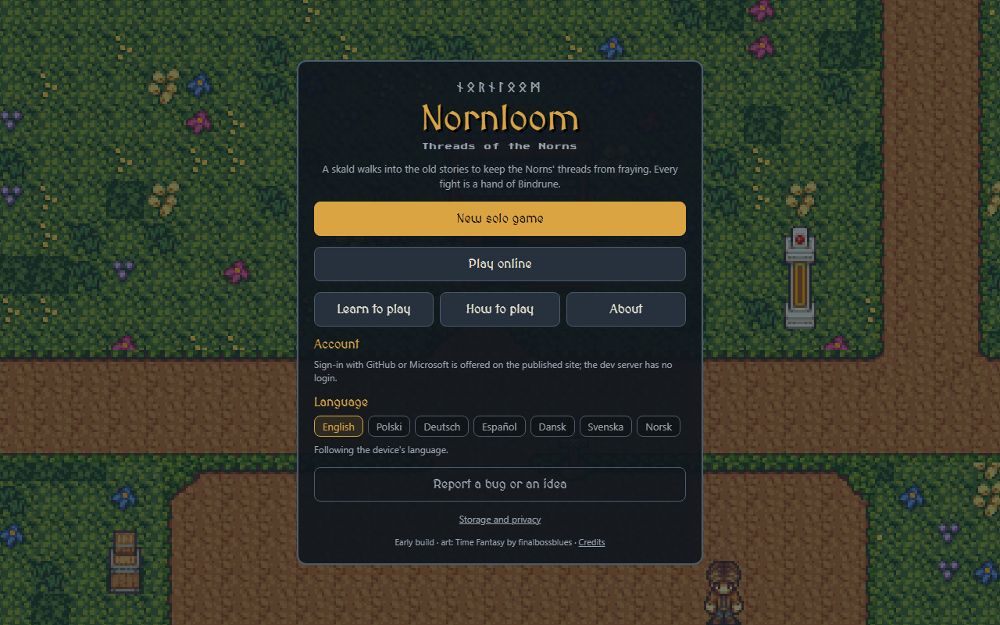
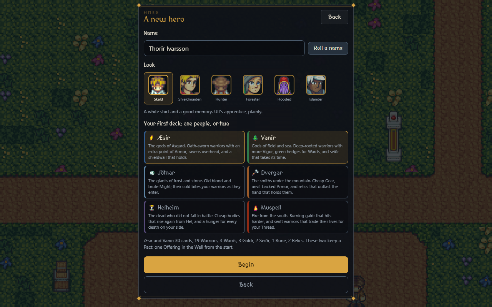
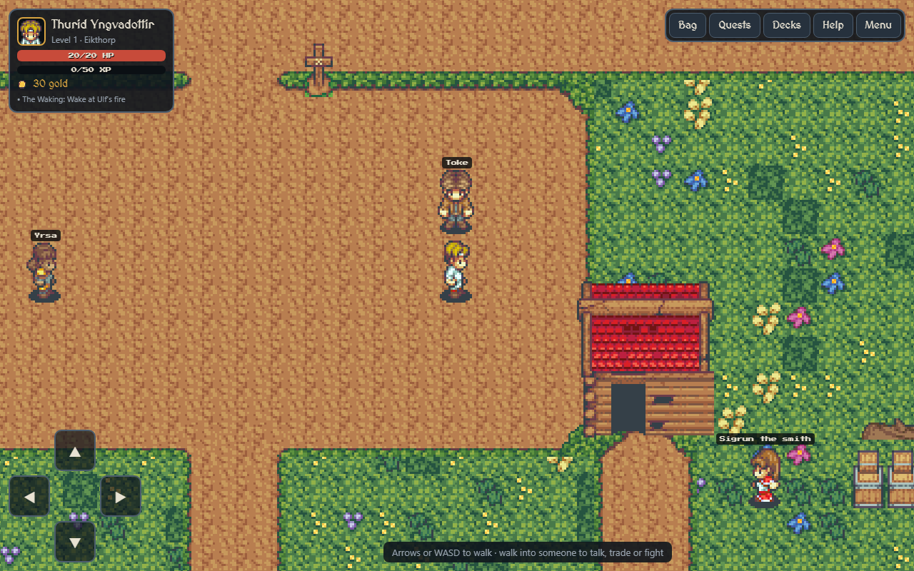
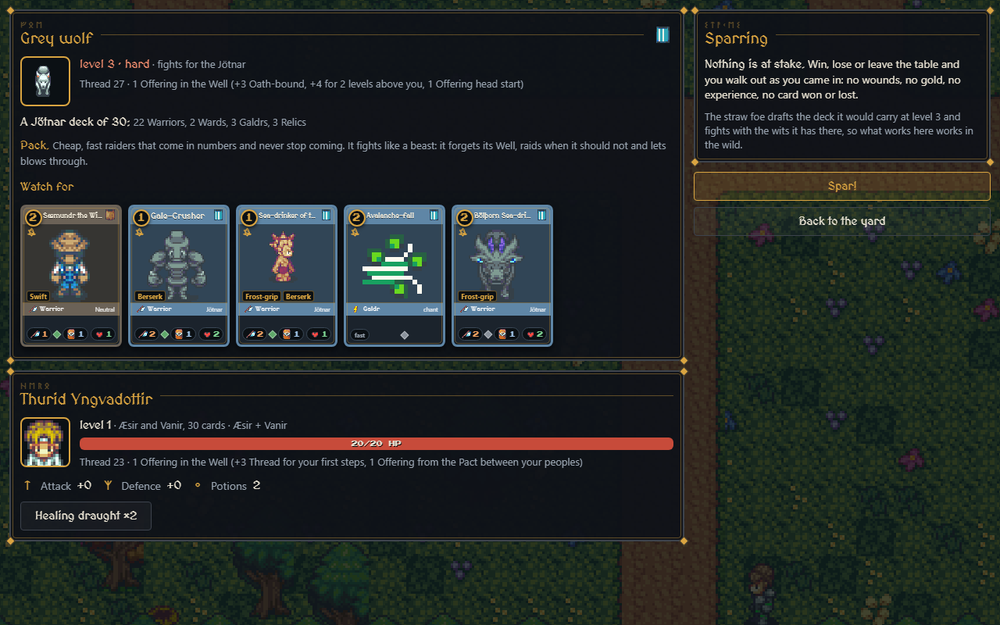
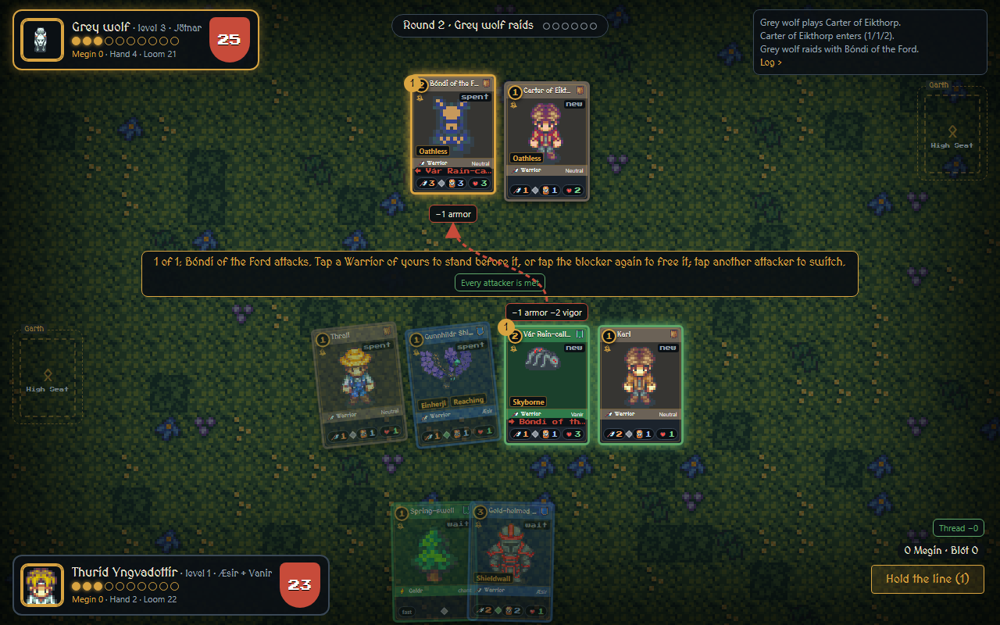
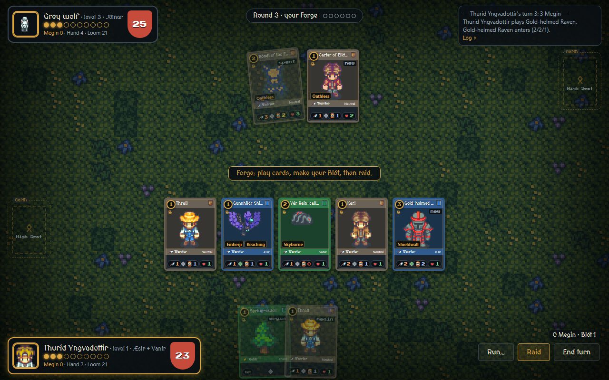
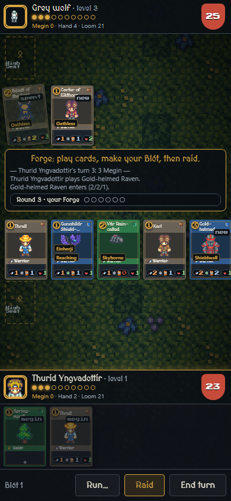
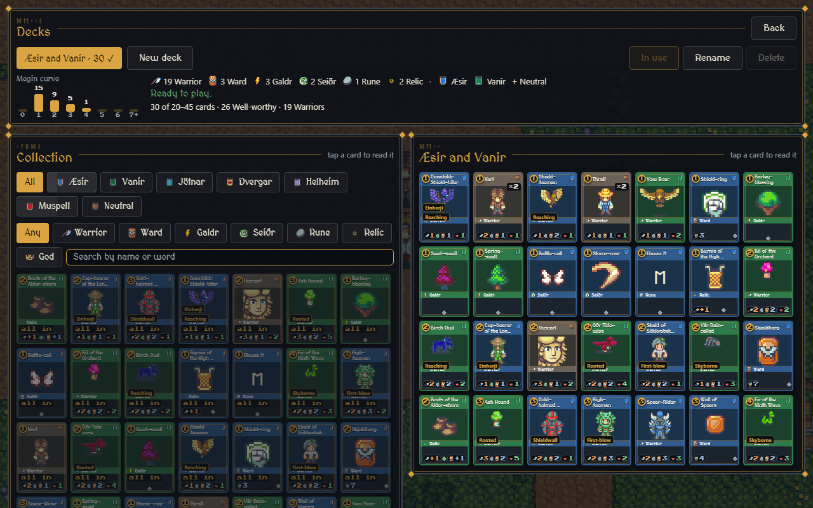
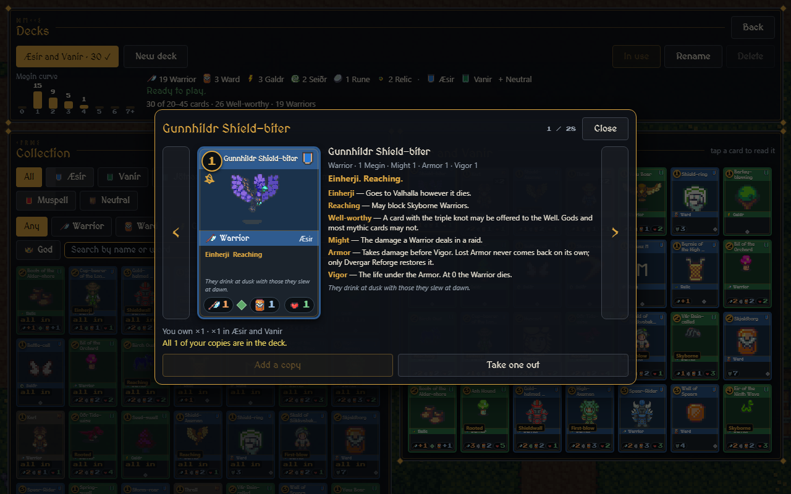

# Bindrune: the rules, the peoples and the words

Bindrune is the card game inside Nornloom. Every fight in the wild is a hand of it, the villagers play it too, and online the duels between heroes are hands of it. Two players build decks from six peoples, spend Megin, and fight until one side's Thread runs out. Warriors lose Armor for good as they fight, so winning still costs something.

This page is the handbook: the rules as the game plays them, the board and the words on it, every keyword and everything a card's text can say, the six peoples with their gods and their saga cards, the deck rules, the foes, and a dictionary at the end. The same rules, shorter, are in the game under Help, then Bindrune, and every card on the table opens a help sheet that explains its own words. Every number here is read from the game's own rules when this page is built, so when a rule changes the page changes with the next release.

## How the game looks

Nornloom is played in the browser, on a computer or a phone. You walk an overworld map, talk to villagers, and every fight opens the card table.

*The title screen, over the map of Eikthorp. New solo game makes a hero; Learn to play is Hrafn's lesson, a guided first bout.*

*A new hero: a name (typed or rolled), a look, and one or two peoples for the first deck. The six peoples say in a line what they are good at.*

*Eikthorp, the village the story starts in. The HUD shows the hero, health, experience, gold and the next thing to do; villagers with a ! have a quest, a bright ? something for you now.*

*Before a fight: the foe's level and people, its deck's shape and how it plays, the cards to watch for, both sides' starting Thread with the reasons, and what is at stake. This one is a sparring bout in Hrafn's yard, so nothing is.*

*The table at a desktop width, in the middle of a raid. The foe's Shieldwall is at the top and yours at the bottom, each side's Garth and High Seat beside it, the Well's beads and the Thread shield in the corner plates, your hand fanned along the bottom. The wolf's Bóndi attacks (the gold 1); Vár stands before it, and each card says what it will cost.*

*Your Forge: play cards, make your Blót, then raid. A hand card the rules will not take says why in its corner (megin, wait, full).*

*The same table on a phone: the rows stack, the hand scrolls, and the controls sit under your thumb.*

*Decks: the collection on the left, the deck on the right, the Megin curve and the deck's shape above. A tap opens a card to read; nothing moves until you say so.*

*A card open in the reading pop-up, with the help sheet beside it: type, cost and numbers on one line, then every keyword and board word on the card explained. Use the arrows to walk the list without closing it.*

## The numbers

| Thing | Value |
| --- | --- |
| Starting Thread | 20 each |
| Starting hand | 7 cards (6 under a Feud); the player who goes first skips the first draw |
| Hand limit at Dusk | 8; the costliest cards are discarded first |
| The Well | at most 10 Offerings |
| Megin at Dawn | one for each Offering in the Well, never less than 1 (the Breath of Ymir); unspent Megin is lost at the end of your turn, except that a Galdr may still be chanted with it on the other side's turn |
| Blóts a turn | 1, plus what Runes and effects allow; only Well-worthy cards |
| Warriors in the Shieldwall | 7 |
| Wards in the Garth | 3 |
| Runes carved | 3; a fourth scours one of your choice |
| Gear on a Warrior | 2, or 3 with Bearer |
| Gods seated | 1; seating another sends the first to Valhalla |
| Devotion shock | a seated God loses 1 Devotion whenever its player loses 5 or more Thread in one turn, and 1 at Dusk with no Warrior of its people in the Shieldwall |
| The Doom Track | starts on round 12 and advances every second round after it |
| Niflheim's Return | an empty Loom costs 3 Thread and shuffles Helheim back into it; the third time, the hand is lost |
| Oath-bound | a deck of one people alone starts with +3 Thread (+5 for Helheim or Muspell) |
| Pact and Feud | two peoples that keep a Pact start with one Offering already in the Well; two that feud start with one card fewer in hand (see the peoples) |
| Glory | Boast (2): Gain 1 Megin this turn; Mend (3): Gain 2 Thread; Ransom (4): Return a Warrior from your Valhalla to your hand; in your own main phases |
| Tempering | Tempered then Forged at the smiths, for Rune-dust by rarity: common 5/12, wrought 10/25, rare 25/60, mythic 60/150; Warriors and Wards only |
| A deck | 20 to 45 cards, at most 2 peoples besides Neutral, at most 3 Gods |
| Copies of a card | common and wrought 3, rare 2, mythic and God 1 |

## The board

Each player has the same set of places. The words are the game's own; the plain meaning follows.

| Place | What it is |
| --- | --- |
| The Loom | Your deck, face down. You draw from it every turn. When it runs empty you suffer Niflheim's Return. |
| Your hand | The cards you may play. At Dusk you discard down to 8. |
| The Well | Your Offerings, the cards you have given up with a Blót. They are counted, not kept: each pays 1 Megin every Dawn, and you never see the card again. The beads by your portrait are your Well. |
| The Shieldwall | The row where your Warriors stand. They raid from here and block here. |
| The Garth | The yard behind the Shieldwall: your Wards, your carved Runes and your Treasures stand here. |
| The High Seat | Where a God sits, one at a time. |
| Valhalla | Where your Warriors go when they die in a raid, and where a departed God goes. Æsir and Vanir cards, and a Ransom of Glory, bring them back. |
| Helheim | Where everything else goes: Warriors that die outside a raid, destroyed Wards and Relics, spent spells, discards, milled cards. Helheim cards raise from here. |
| The Void | Exiled cards. Nothing returns from the Void. |
| The stack | The cards and abilities waiting to resolve while the other side may answer. The screen calls this a chant window. |

## A hand, turn by turn

### Sitting down

Both sides start with 20 Thread and 7 cards; the one who goes first skips the first draw. The starting Thread moves with who you are: a deck of one people alone is Oath-bound and starts with more; two peoples that keep a Pact start with an Offering in the Well, two that feud with a card fewer. In the wild your gear counts too (one Thread for every 4 points of defence, up to 6; one Offering for every 5 points of attack, up to 2), artifacts may add Thread, Offerings, cards, Megin, Glory or a card of their own, a beast above your level brings extra Thread and a head start, and a hero at level 1 opens every fight with +3 Thread for its first steps (one less per level, none from level 4). The challenge screen lists all of it before the first card is played.

### The six phases

A turn runs Dawn, Draw, Forge, Raid, Feast, Dusk. The screen runs Dawn, Draw and Dusk by itself; you see Forge, Raid, Feast and End turn.

| Phase | What happens |
| --- | --- |
| Dawn | The round counts up (on the first player's Dawn), and the Doom Track may advance. If the Doom is on, you bleed Thread and, from its third step, your Wards crumble a little. Your Warriors rouse (a Frost-gripped one stays down), Unblooded ones count down toward being ready, buffs that lasted a turn end. Your Megin is set to the Offerings in your Well, at least 1. Dawn triggers fire: Warriors, Wards, Treasures and the God. |
| Draw | One card from the Loom. |
| Forge | Your first main phase. Play cards, make your Blót, Read a Rune, Wake a Treasure, Call your God, spend Glory. |
| Raid | Your attack. Declare the Warriors that raid; the other side blocks; the blows land. A Warrior that raids is spent until your next Dawn and cannot block meanwhile. |
| Feast | Your second main phase: the same as the Forge, but no second Blót. |
| Dusk | Doomed Warriors that raided die. You discard down to 8. Your seated God's Devotion is checked: with no Warrior of its people in your Shieldwall it loses 1, and if you lost 5 or more Thread this turn it loses 1 more; at 0 it departs to Valhalla and leaves its Legacy. |

### Megin, the Well and the Blót

Megin pays for everything. You get it at Dawn, one for each Offering in your Well and never less than 1, and what you do not spend is lost at the end of your turn, except that a Galdr may still be chanted with it in the other side's turn.

Once a turn you may Blót: put a Well-worthy card from your hand (the ones with the triple knot under the cost) face down into the Well as an Offering. It pays 1 Megin at once and 1 at every Dawn after; you never see the card again. The Well holds at most 10. Gods and most mythic cards are not Well-worthy. The choice of what to give the Well and what to keep is most of the game: a Well of 10 pays for anything, and a Well of 2 pays for nothing.

### Chant windows and the stack

A card played does not take effect at once. It goes on the stack, and the other side gets a chant window: they may answer with a Galdr, a Rune's Read or a fast Treasure's Wake, and the answer goes on the stack above it; you may answer the answer. Whoever holds the word may let it be, which resolves the top of the stack, last in first out, until it is empty. When nobody could answer (no Galdr they can pay for and aim, no Read, no fast Wake) the window never opens and the card resolves at once, so a quiet board plays quickly.

The Raid has two windows of its own: when the attackers are declared (the defender speaks first) and once the blocks are set (the attacker first). A raider felled before the blocks is no longer raiding; a block whose Warrior has died is dropped.

Galdr are the fast spells: playable in your own main phases and in any window, including on the other side's turn. Seiðr, Warriors, Wards, Runes, Relics and a God's Call are for your own main phases only. A counter is a Galdr that removes an opposing card from the stack outright: the card goes to its owner's Helheim and its Megin is spent for nothing. Every people has one among its saga cards (they are in the tables below), and Mistletoe cannot be countered.

On the screen the prompt says whose word it is and what waits on the table. Let it be passes; Let this turn be passes every window for the rest of the foe's turn, except that a raid still asks.

## The Raid

- Who may raid: Warriors that are roused (not spent), blooded (not new this turn, or two turns for Lumbering; Swift ignores this), not Rooted, and not Bound. Berserk Warriors must raid if they can. Raiding commits a Warrior until its next Dawn; it cannot block meanwhile.
- Blocking: one blocker per attacker; a Shieldwall Warrior may block two. Oathless Warriors cannot block. Skyborne raiders are only blocked by Skyborne or Reaching Warriors. A Gjallarbrú raider must be blocked if anything can.
- The blows: First-blow damage lands first and the dead are buried before the rest, which is simultaneous. Damage to a Warrior takes Armor first, then Vigor, and neither comes back (Pierce skips Armor; Venomous kills on any Vigor damage; Frost-grip keeps the struck Warrior down at its next Dawn; Shieldwall counts Armor double while blocking). Only Dvergar Reforge restores Armor.
- Past the Shieldwall: an unblocked raider hits a Ward if the defender has one (the weakest Ward takes it), else the Thread. Breach ignores Wards. Ram carries the damage beyond a dead blocker on to a Ward, then the Thread.
- Spells at the Thread stop only at a Barrier; Bulwarks and Halls let them through, unless the card says it ignores Bulwarks or ignores Wards.
- The kill: whoever's Warrior killed a Warrior gains Glory equal to the dead Warrior's cost. Warriors that die in the Raid go to Valhalla (Hel-bound ones to Helheim); Draugr rise once instead, stripped and Unblooded.

Before you confirm, the screen shows every Warrior's fate as the blocks change: dies, -1 armor -2 vigor, Thread -3, hits Skjaldborg. Tapping a blocker again frees it; tapping another attacker switches.

## Glory, Rune-dust and the smiths

Glory is won by the kill, one for each Megin the dead Warrior cost, and spent in your own main phases: a Boast (2) gives 1 Megin this turn, a Mend (3) gives 2 Thread, a Ransom (4) returns a Warrior from your Valhalla to your hand. What you hold when you win a fight in the wild comes home as Rune-dust, one a point (a loss or a run brings none).

The smiths take Rune-dust to temper cards. Two levels: Tempered (+1 Armor, +1 Vigor; a Ward +2 Integrity) and Forged (+1 Might on top; a Ward +2 more). The price is by rarity (common 5 then 12, wrought 10 then 25, rare 25 then 60, mythic 60 then 150); Warriors and Wards only, never Gods. The work is on the card: every copy in every deck carries it, and the card face shows a badge for it.

## The Doom Track

Every hand ends. From round 12 the Doom Track advances every second round, and each step is a piece of Ragnarök:

| Step | Name | What it does |
| --- | --- | --- |
| 1 | Unrest | Both sides lose 1 Thread at every Dawn. |
| 2 | Fimbulwinter | Both sides lose 2 Thread at every Dawn. |
| 3 | The Wolves Take Sun and Moon | Both sides lose 3 Thread at every Dawn, and every Ward loses 1 Integrity. |
| 4 | Gjallarhorn | Both sides lose 4 Thread at every Dawn, and every Ward loses 1 Integrity. |
| 5 | Surtr's Fire | Both sides lose 6 Thread at every Dawn, and every Ward burns when the step is reached. |
| 6 | Ragnarök | Every Thread is cut to 1. Two rounds later, if nobody has struck, the world sinks into the sea and whoever holds more Thread (then more Glory) wins. |

A Jötnar rite, Fimbul Gale, advances the Doom by a step on its own; Surtr's Aura bleeds the Thread by the Doom step.

## The cards

### The face

Cost ring top-left, and under it the triple knot if the card is Well-worthy. The name sits on a band in its people's colour; the people's banner is top-right. A band with an icon and a word says the type. Warriors carry three badges: Might (an axe, orange), Armor (a shield, steel; yellow when worn, red when stripped) and Vigor (a heart, green); a Ward shows Integrity, a God Devotion. A gem says the rarity: iron for common, green for wrought, blue for rare, gold for mythic, white for a God. From a certain size the rules text and a line from the source show; smaller faces show keyword chips; the smallest only art, name and numbers, and the help sheet says the rest.

### The seven types

| Type | Icon | What it is |
| --- | --- | --- |
| Warrior | axe | Might, Armor and Vigor, written M/A/V. Stands in the Shieldwall, raids and blocks. Damage takes Armor first, then Vigor, and neither comes back. New Warriors are Unblooded and cannot raid until your next Dawn (Swift may; Lumbering waits two). |
| Ward | round shield | Integrity. Stands in the Garth (at most 3) and takes the blows meant for your Thread; the weakest Ward takes each one, and they wear down. Three kinds: a Bulwark stops raiders, a Barrier stops raiders and spells alike, a Hall is thin but does something at your Dawn. |
| Rune | rune stone | Carved into the Garth (at most 3; a fourth scours one). A Static aura in force while it stands, and a Read you may use once a turn. Runes draw their own glyph as art. |
| Relic | ring | Two kinds. Gear hangs on a Warrior (2 per Warrior, 3 with Bearer) and stays until the Warrior dies; some Gear binds an enemy instead. A Treasure stands in the Garth with a Wake, an ability for once a turn. |
| Galdr | lightning | A chant: the fast spell. Played in your own turn, or in any chant window, even on the other side's turn. Counters are Galdr. |
| Seiðr | spiral | A rite: the slow spell, for your own main phases only, and usually bigger for it. |
| God | crown | Devotion. Sits in the High Seat, one at a time. Its Aura is in force while it sits, once a fight you may Call on it, and when its Devotion reaches 0 it departs to Valhalla and leaves its Legacy. Never Well-worthy, one copy per deck, at most 3 Gods in a deck. |

### How many, and where they come from

The set is 1404 cards: 104 saga cards written by hand, each citing its source in the Eddas, and a host of 1300 forged by rule from each people's own names, halls and kennings, priced against the same budget, with rules text in the same words. By type: 764 Warriors, 128 Wards, 64 Runes, 190 Relics, 156 Galdr, 94 Seiðr, 8 Gods. By rarity: 579 common, 467 wrought, 258 rare, 92 mythic, 8 god.

Traders sell every common, 75% of the wrought and 50% of the rares; the rest are spoils, won from the beaten, along with every mythic. Which cards are spoils is fixed, so a card is spoils on every device, and the card's footer says so. The one counter for spoils is the far-trader in the Jotun Fens: 4 cards a week, one of them mythic (from level 15), none dearer than 5 Megin, at 110, 300 and 800 gold, and one bargain a hero each week. The Gods and the sagas' treasures are quest rewards only: never sold, never dropped, never in a strongbox. A win in the wild pays a card from the foe's people, commons six times as often as rares and a mythic now and then; hamlet quests pay cards too; and online the market and the parcels move cards between heroes for gold.

## Keywords

A keyword is a rule a Warrior carries. There are 24; the Old Norse word behind one is given where there is one. Tapping a keyword on the table opens this same line.

| Keyword | Rule | Old Norse |
| --- | --- | --- |
| Swift | May raid the turn it enters play. | léttfœrr |
| Berserk | Must raid every turn it can. |  |
| Oathless | Cannot block. |  |
| Rooted | Cannot raid. | landvættr |
| Skyborne | Can only be blocked by Skyborne or Reaching Warriors. |  |
| Reaching | May block Skyborne Warriors. |  |
| Shieldwall | May block two attackers; its Armor counts double while blocking. | skjaldborg |
| Ram | Damage beyond what kills its blocker carries on to a Ward, then the Thread. | hamramr |
| Breach | Ignores Wards; its damage goes straight to the Thread. |  |
| Pierce | Its damage skips Armor and goes to Vigor. |  |
| Venomous | Any Vigor damage it deals kills the Warrior. | eitr |
| Gjallarbrú | Must be blocked if the defender has a Warrior that can. |  |
| Frost-grip | A Warrior it damages does not rouse at its next Dawn. |  |
| First-blow | Deals its damage before the other Warrior strikes back. | fyrstahögg |
| Doomed | Dies at the end of any turn in which it raided. |  |
| Lumbering | Waits two Dawns before it can raid, not one. |  |
| Einherji | Goes to Valhalla however it dies. |  |
| Draugr | The first time it dies it rises again, stripped of Armor and unable to raid this turn. |  |
| Hel-bound | Goes to Helheim even when it dies in a raid. |  |
| Weregild | When it dies you gain Megin equal to half its cost, to spend this turn. |  |
| Kin-caller | Other Warriors of its people you control get +1 Might. | hersir |
| Bearer | May carry three Gear instead of two. |  |
| Trickster | Loki's kind. Some cards care. |  |
| Hallowed | Cannot be the target of a Galdr or a Seiðr. |  |

## What a card's text can say

Card text is a small closed language, so every card reads the same way. A Warrior, Ward or Relic may carry a trigger; a spell, a Read, a Wake or a Call has an effect; a Rune or a God has auras.

### Triggers and abilities

| Words on the card | When it happens |
| --- | --- |
| On entry | Warriors, Wards and Relics: resolves once, as the card enters play. |
| On death | Warriors: when it dies. Wards: when it is destroyed. |
| At your Dawn | Warriors, Wards, Treasures and Gods: every one of your Dawns while it stands. |
| When hit | Wards (the pyre walls): resolves against the raider that struck it. |
| Static | Runes: an aura in force for as long as the Rune stands. |
| Read | Runes: an ability you may use once a turn, in a main phase or in a chant window. |
| Wake | Treasures: an ability you may use once a turn. A fast Wake may be used in a chant window too. |
| Aura | Gods: in force while the God sits in the High Seat. |
| Call | Gods: the God's great deed, once a fight, in your own main phase. |
| Legacy | Gods: what stays in force after the God departs. |
| Bearer gets | Gear: what the Warrior it hangs on gains, stats or keywords, for as long as it stands. |
| Bearer must have Might N | Gear too heavy for a weak hand: Mjölnir asks for Might 4. |
| Attach to an opposing Warrior | Gear that binds (Gleipnir): the bearer can neither raid nor block. |
| Returns to your hand | Gear that comes back after its bearer raids (Mjölnir), to be thrown again. |
| Nail-count | Helheim: +1 Might for every so many cards in your Helheim. |
| Counts as any people | Loki: a deck may take him as one of its own, whichever peoples it holds. |

### Effects

| Words on the card | What it does |
| --- | --- |
| Deal N damage | To an opposing Warrior, any Warrior, an opposing Ward, or your opponent's Thread. At the Thread, damage from a Galdr or a Seiðr stops only at a Barrier; damage from anything else (a Warrior's entry, a Read, a Wake) stops at any Ward, unless the card says it ignores Bulwarks (then only a Barrier stops it) or ignores Wards (nothing does). Doomstruck damage (Mistletoe) may strike a Warrior or the seated God's Devotion. |
| Sweep | N damage to every opposing Warrior, or to every Warrior on both sides; some sweeps take Wards too, some only Warriors with Armor 0 (stripped). |
| Gets +M/+A/+V | A stat change on one Warrior, all your Warriors, or an enemy's, until the end of the turn, until your next turn, or permanently when the card says so. Negative numbers strip Armor and Vigor. |
| Reforge N | Restore N Armor to a Warrior of yours (up to what it was printed with). The only way Armor comes back. |
| Sprout | A Warrior of yours gets +1 Vigor, permanently; the strongest takes it. |
| Draw N | Cards from your Loom to your hand. A few cards make the opponent draw. |
| Mill N | The top N cards of a Loom go to that player's Helheim: yours, the opponent's, or both. An empty Loom is Niflheim's Return (see the numbers). |
| Gain N Thread / opponent loses N Thread | Life, up or down, no Ward in the way. |
| Gain N Megin this turn | Spendable now, gone at the end of the turn like any Megin. |
| An extra Blót | One more Offering this turn. |
| Destroy a Ward | An opposing Ward, sometimes only one up to a given Integrity, sometimes all of them. |
| Destroy Relics | Every opposing Relic, Gear and Treasures alike; or every Relic on the table. |
| Return a Warrior from Valhalla / Helheim to play | Raised, with Armor 0 (stripped), sometimes Doomed, sometimes to your hand instead; sometimes only up to a cost. |
| Return a card from Helheim / Valhalla to your hand | Any card, or one type, sometimes only up to a cost. |
| Exile | An opposing Warrior goes to the Void. Nothing brings it back. |
| Take control | An opposing Warrior changes sides (Loki's Call). |
| Return to hand | Opposing Warriors up to a cost go back to their owner's hand. |
| Frost-grip | The target does not rouse at its next Dawn. |
| Advance the Doom Track | One step nearer Ragnarök, for both sides. |
| Reveal hand | Your opponent plays with their hand face up (Heimdallr's Watch). |
| Counter | Removes an opposing card from the stack as it is played: a Galdr, a Seiðr, either, a Warrior, or any card, sometimes only up to a cost. The card goes to Helheim and its Megin is spent for nothing. Only a Galdr can counter, and Mistletoe cannot be countered. |

### Auras

An aura is in force for as long as its Rune, seated God or Legacy stands; a foe's trait is an aura in force from the first Dawn.

| Words on the card | Examples |
| --- | --- |
| Your Warriors get +M/+A/+V | A stat grant to all of one side's Warriors, sometimes only one people's, sometimes only those with a keyword. |
| Your Warriors gain a keyword | Thor's Ram, the ravens' Skyborne, fire's Swift. |
| Cards cost 1 less | One type (Gear, Seiðr), sometimes one people's. |
| Your spells deal 1 more damage | Sowilo, Burning breath. |
| Your Wards have +N Integrity | Green hedges, Master builder, the World-tree seed. |
| A second Blót | Laguz: while the Well holds few Offerings. |
| Opposing Warriors enter play with -1 Armor | Thurisaz, Rime-bitten. |
| Whenever an opposing Warrior dies, its owner loses 1 Thread | Hagalaz, Grave-hunger. |
| Your Warriors that die go to Helheim | Hel's rule, Cold company: to be raised again. |

## The six peoples, and the road

A card belongs to one of six peoples, or to none (Neutral, the road). A deck holds at most 2 peoples besides Neutral. Each people has a colour and a banner so it can be told at a glance, its own way of fighting, its own Gods, and friends and enemies among the others.

### Pacts and feuds

Two peoples in one deck either keep a Pact (one Offering already in the Well from the start), feud (one card fewer in the opening hand), or neither. One people alone is Oath-bound and starts with more Thread.

| Pair | Relation |
| --- | --- |
| Æsir and Vanir | Pact: one Offering in the Well from the start |
| Æsir and Dvergar | Pact: one Offering in the Well from the start |
| Æsir and Helheim | Feud: one card fewer in hand |
| Æsir and Muspell | Feud: one card fewer in hand |
| Vanir and Jötnar | Pact: one Offering in the Well from the start |
| Vanir and Muspell | Feud: one card fewer in hand |
| Jötnar and Dvergar | Feud: one card fewer in hand |
| Jötnar and Helheim | Pact: one Offering in the Well from the start |
| Dvergar and Helheim | Feud: one card fewer in hand |
| Dvergar and Muspell | Pact: one Offering in the Well from the start |
| Helheim and Muspell | Feud: one card fewer in hand |

### Æsir

**The Æsir (Old Norse Æsir, singular Áss).** Say AY-seer. The gods of Asgard: Odin, Thor, Týr, Baldr, Heimdallr, and the Einherjar, the chosen dead who feast in Valhalla and fight at Ragnarök. The war-gods, the oath-keepers, the hall and the shieldwall.

*In the game's words:* The gods of Asgard. Oath-sworn warriors with an extra point of Armor, ravens overhead, and a shieldwall that holds.

**How it fights.** The line that holds. Armored Warriors, the Shieldwall keyword, Einherji that ride to Valhalla and come back, First-blow, ravens that draw cards, and Wards to stand behind. Æsir decks grind: they lose less Armor than they take, and they bring the dead back.

**On the cards.** Colour and banner: deep blue, a lightning bolt. Its forged Warriors lean on Shieldwall, Einherji, First-blow, Skyborne, Kin-caller, Reaching, and put their points into Might, Armor and Vigor about 32/40/28. Alone it is Oath-bound for +3 Thread. 221 cards in all: 21 saga cards and 200 forged.

**Its beasts, from level 40, may carry a trait:** Oath-sworn (Its Warriors get +1 Armor); Ravens overhead (Its Æsir Warriors are Skyborne).

**Gods.**

| God | Cost | Devotion | Text | Won in |
| --- | --- | --- | --- | --- |
| Týr the One-Handed | 7 | 4 | Aura: your Warriors get +0/+1/+0. Call: exile an opposing Warrior to the Void. Legacy: opposing Berserk Warriors get -1 Might. | The Binding of Fenrir (level 31) |
| Thor Vingþórr | 8 | 4 | Aura: your Warriors gain Ram. At your Dawn, deal 2 damage to an opposing Ward. Call: deal 3 damage to every opposing Warrior and Ward. Legacy: your Warriors keep Ram. | The Hall of the Outer Giant (level 31) |
| Odin Alföðr | 9 | 5 | Aura: at your Dawn, draw an extra card. Call: return all Warriors from your Valhalla to play with Armor 0. Legacy: draw an extra card at each Dawn. | Ragnarök (level 80) |

**Saga cards.** The 18 cards of the Æsir written by hand, each from a source in the Eddas; the forged host stands beside them.

| Card | Type | Cost | Rarity | Stats | Text |
| --- | --- | --- | --- | --- | --- |
| Huginn | Warrior | 1 | Common | 0/0/2 | Skyborne, Oathless. On entry, draw a card. |
| Muninn | Warrior | 1 | Common | 0/0/2 | Skyborne, Oathless. On entry, return a Warrior costing 2 or less from your Helheim to your hand. |
| Einherji Spearman | Warrior | 2 | Common | 2/2/2 | Einherji. |
| Shieldmaiden of the Wall | Warrior | 3 | Common | 2/3/2 | Shieldwall. |
| Berserker | Warrior | 3 | Common | 4/0/3 | Swift, Berserk. |
| Hersir of Glaðsheimr | Warrior | 4 | Wrought | 2/3/3 | Kin-caller: other Æsir Warriors you control get +1 Might. |
| Valkyrie Chooser | Warrior | 4 | Wrought, spoils | 3/1/3 | Skyborne, Einherji. |
| Þrúðr, Thor's Daughter | Warrior | 4 | Rare, spoils | 4/2/2 | First-blow. |
| Baldr | Warrior | 5 | Rare, quest | 3/5/4 | Hallowed: cannot be targeted by Galdr or Seiðr. Einherji. |
| Skjaldborg | Ward (Bulwark) | 2 | Common | Integrity 7 | Bulwark. |
| Tiwaz ᛏ | Rune | 1 | Common |  | Static: your Warriors get +0/+1/+0. Read: a Warrior you control gets +2/+0/+0 until your next turn. |
| Megingjörð | Relic (Gear) | 2 | Wrought |  | Bearer gets +2/+0/+0 and Bearer. |
| Járngreipr | Relic (Gear) | 2 | Wrought |  | Bearer gets +0/+2/+0. |
| Gungnir | Relic (Gear) | 5 | Rare, quest |  | Bearer gets +3/+0/+0 and Gjallarbrú. |
| Mjölnir | Relic (Gear) | 6 | Mythic, quest |  | Bearer must have Might 4 or more. Bearer gets +4/+2/+0 and Ram. After the bearer raids, return Mjölnir to your hand. |
| Hold the Shield | Galdr | 1 | Common |  | A Warrior you control gets +0/+3/+0 until your next turn. |
| Oath Broken | Galdr | 3 | Rare, spoils |  | Counter an opposing Seiðr as it is played. Its owner loses 2 Thread. |
| Call to Valhalla | Seiðr | 4 | Wrought, spoils |  | Return a Warrior from your Valhalla to play with Armor 0. |

### Vanir

**The Vanir (Old Norse Vanir).** Say VAH-neer. The gods of field, sea and seiðr: Njörðr, Freyr, Freyja, and the Ljósálfar of Álfheim beside them. Fertility, harvest, weather and the slow magic that grows things.

*In the game's words:* Gods of field and sea. Deep-rooted warriors with more Vigor, green hedges for Wards, and seiðr that takes its time.

**How it fights.** Life. Thread gained every turn, Sprout that grows a Warrior's Vigor each Dawn, Rooted bodies that will not raid but will not fall, Reaching to catch what flies, and the Seiðr rites that take their time and pay for it. A Vanir deck outlasts you.

**On the cards.** Colour and banner: green, a tree. Its forged Warriors lean on Rooted, Reaching, Skyborne, Einherji, Hallowed, Swift, and put their points into Might, Armor and Vigor about 25/28/47. Alone it is Oath-bound for +3 Thread. 214 cards in all: 14 saga cards and 200 forged.

**Its beasts, from level 40, may carry a trait:** Deep roots (Its Warriors get +2 Vigor); Green hedges (Its Wards have +3 Integrity).

**Gods.**

| God | Cost | Devotion | Text | Won in |
| --- | --- | --- | --- | --- |
| Freyja, Lady of Fólkvangr | 8 | 4 | Aura: at your Dawn, gain 1 Thread. Call: return all Warriors from your Valhalla to your hand. Legacy: gain 1 Thread at each Dawn. | The Bride of Þrymr (level 39) |

**Saga cards.** The 13 cards of the Vanir written by hand, each from a source in the Eddas; the forged host stands beside them.

| Card | Type | Cost | Rarity | Stats | Text |
| --- | --- | --- | --- | --- | --- |
| Ljósálfr Tender | Warrior | 1 | Common | 0/1/2 | At your Dawn, Sprout (a Warrior you control gets +0/+0/+1). |
| Barley-Warden | Warrior | 2 | Common | 1/1/3 | Rooted. At your Dawn, gain 1 Thread. |
| Völva of Sessrúmnir | Warrior | 3 | Wrought | 1/1/4 | Your Seiðr cost 1 less. On entry, draw a card. |
| Njörðr's Fleet | Warrior | 3 | Common | 2/2/3 | On entry, gain 2 Thread. |
| Kvasir the Wise | Warrior | 4 | Rare, quest | 2/1/4 | On entry, draw 2. |
| Hildisvíni | Warrior | 5 | Rare | 4/3/4 | Ram. Sprout at your Dawn. |
| Freyr of the Harvest | Warrior | 5 | Rare, quest | 5/2/4 | Swift. On entry, gain 2 Thread. |
| Sessrúmnir | Ward (Bulwark) | 2 | Common | Integrity 6 | Bulwark. At your Dawn, Sprout. |
| Iðunn's Orchard | Ward (Hall) | 4 | Rare, quest | Integrity 4 | Hall. At your Dawn, gain 2 Thread. |
| Laguz ᛚ | Rune | 1 | Common |  | Static: you may Blót a second card each turn while your Well has 4 or fewer Offerings. Read: gain 1 Thread. |
| Hush of the Grove | Galdr | 2 | Common |  | Counter an opposing Galdr as it is played. |
| Gerðr's Grace | Galdr | 2 | Common |  | Gain 3 Thread. |
| Seed of Yggdrasil | Seiðr | 4 | Rare |  | Your Warriors get +0/+0/+2 permanently. Draw a card. |

### Jötnar

**The Jötnar (Old Norse jötnar, singular jötunn; the giants, thurs and rime-thurs).** Say YUT-nar. The giants of frost and stone from Jötunheimr and Útgarðr: Hrungnir, Þrymr, Skaði, Hyrrokkin, and the monstrous children of Loki, Fenrir and Jörmungandr. Older than the gods, and bigger.

*In the game's words:* The giants of frost and stone. Old blood and brute Might; their cold bites your warriors as they enter.

**How it fights.** Brute Might. Big Lumbering bodies that need two Dawns to wake and then hit like an avalanche, Frost-grip that stops a Warrior rousing, Ram that carries damage through a blocker, and stones hurled at Wards. Jötnar decks start slow and end the argument.

**On the cards.** Colour and banner: ice blue, a frost crystal. Its forged Warriors lean on Lumbering, Frost-grip, Ram, Gjallarbrú, Berserk, Reaching, and put their points into Might, Armor and Vigor about 44/18/38. Alone it is Oath-bound for +3 Thread. 214 cards in all: 14 saga cards and 200 forged.

**Its beasts, from level 40, may carry a trait:** Rime-bitten (Your Warriors enter play with −1 Armor); Old blood (Its Warriors get +1 Might).

**Gods.**

| God | Cost | Devotion | Text | Won in |
| --- | --- | --- | --- | --- |
| Skaði of Þrymheimr | 7 | 5 | Aura: at your Dawn, deal 2 damage to an opposing Warrior. Call: destroy all opposing Relics. Legacy: none. | The Stolen Apples (level 15) |

**Saga cards.** The 13 cards of the Jötnar written by hand, each from a source in the Eddas; the forged host stands beside them.

| Card | Type | Cost | Rarity | Stats | Text |
| --- | --- | --- | --- | --- | --- |
| Frost-Thurs | Warrior | 3 | Common | 4/0/3 | Frost-grip. |
| Stone-Hurler | Warrior | 4 | Common | 5/1/3 | Lumbering. On entry, deal 2 damage to an opposing Ward. |
| Hyrrokkin | Warrior | 4 | Wrought | 4/1/4 | On entry, destroy an opposing Ward with Integrity 3 or less. |
| Mountain-Kin | Warrior | 5 | Common | 6/1/6 | Lumbering. |
| Hrungnir | Warrior | 6 | Rare, quest | 7/3/5 | Lumbering. On entry, deal 3 damage to an opposing Ward. |
| Fenrir | Warrior | 7 | Mythic, quest | 7/2/7 | Berserk, Venomous, Lumbering. |
| Jörmungandr | Warrior | 8 | Mythic, quest | 8/3/8 | Venomous, Lumbering. |
| Þrymheimr | Ward (Bulwark) | 3 | Common | Integrity 8 | Bulwark. |
| Thurisaz ᚦ | Rune | 1 | Common |  | Static: opposing Warriors enter play with -1 Armor. Read: deal 1 damage to a Warrior. |
| Gullfaxi | Relic (Gear) | 3 | Wrought |  | Bearer gets +2/+1/+0 and Swift. |
| Hurl It Back | Galdr | 3 | Wrought, spoils |  | Counter an opposing Warrior costing 4 or less as it is played. |
| Hurl the Whetstone | Galdr | 3 | Wrought |  | Deal 4 damage to a Warrior. |
| Fimbul Gale | Seiðr | 5 | Rare |  | All Warriors get -2 Armor permanently. Advance the Doom Track one step. |

### Dvergar

**The Dvergar (Old Norse dvergar, singular dvergr; the dwarves).** Say DVAIR-gar. The smiths under the mountain in Niðavellir and Svartálfaheimr: the sons of Ívaldi, Brokkr and Sindri who forged Mjölnir, Gungnir, Draupnir and Gleipnir, and Regin and Fáfnir of the cursed gold.

*In the game's words:* The smiths under the mountain. Cheap Gear, anvil-backed Armor, and relics that outlast the hand that holds them.

**How it fights.** Gear and Armor. Bearer Warriors that carry three Relics, Reforge that restores Armor (nothing else does), cheap Gear, Megin from the forge, Rooted and Shieldwall bodies, and Weregild that pays Megin when a Warrior falls. Dvergar decks build one unstoppable Warrior and keep it standing.

**On the cards.** Colour and banner: gold and copper, a hammer. Its forged Warriors lean on Bearer, Rooted, Shieldwall, Lumbering, Weregild, Reaching, and put their points into Might, Armor and Vigor about 28/44/28. Alone it is Oath-bound for +3 Thread. 212 cards in all: 12 saga cards and 200 forged.

**Its beasts, from level 40, may carry a trait:** Forge-fed (Its Gear costs 1 less); Anvil-backed (Its Warriors get +1 Armor).

**Saga cards.** The 12 cards of the Dvergar written by hand, each from a source in the Eddas; the forged host stands beside them.

| Card | Type | Cost | Rarity | Stats | Text |
| --- | --- | --- | --- | --- | --- |
| Forge-Hand | Warrior | 1 | Common | 1/2/1 | Bearer. |
| Deep-Delver | Warrior | 2 | Common | 1/3/2 | Rooted. At your Dawn, Reforge 1 (restore 1 Armor to a Warrior you control). |
| Ring-Smith | Warrior | 3 | Wrought | 2/2/3 | On entry, gain 2 Megin this turn. |
| Regin the Fosterer | Warrior | 4 | Rare, spoils | 2/3/3 | On entry, return a Relic from your Helheim to your hand. |
| Fáfnir | Warrior | 7 | Mythic, quest | 7/4/6 | Skyborne, Venomous. |
| Stone Bulwark | Ward (Bulwark) | 2 | Common | Integrity 8 | Bulwark. |
| Niðavellir Foundry | Ward (Hall) | 3 | Wrought, spoils | Integrity 4 | Hall. At your Dawn, Reforge 1. |
| Kenaz ᚲ | Rune | 1 | Common |  | Static: your Gear cost 1 less. Read: Reforge 1. |
| Rati the Auger | Relic (Treasure) | 2 | Wrought |  | Wake: deal 2 damage to an opposing Ward. |
| Gleipnir | Relic (Gear) | 3 | Rare, spoils |  | Attach to an opposing Warrior: it can neither attack nor block. |
| Unwrought | Galdr | 2 | Wrought |  | Counter an opposing card costing 2 or less as it is played. |
| Temper in the Fire | Galdr | 2 | Common |  | Reforge 3 on a Warrior you control. |

### Helheim

**Helheim (Old Norse Hel, the realm and its queen).** Say HEL-haym. The dead who did not fall in battle, under Hel, Loki's daughter, half living and half blue. The draugar that walk again, Níðhöggr gnawing the roots, Móðguðr on the bridge Gjallarbrú, and the corpse-shore Nástrand.

*In the game's words:* The dead who did not fall in battle. Cheap bodies that rise again from Hel, and a hunger for every death on your side.

**How it fights.** The grave that gives back. Draugr rise once when they die, Hel-bound Warriors go to Helheim even when slain in a raid so they can be raised, cheap Oathless bodies, Skyborne mist, milling and raising, and a tax on every death. A Helheim deck loses Warriors on purpose.

**On the cards.** Colour and banner: violet, a skull. Its forged Warriors lean on Draugr, Hel-bound, Oathless, Skyborne, Weregild, Venomous, and put their points into Might, Armor and Vigor about 36/14/50. Alone it is Oath-bound for +5 Thread. 215 cards in all: 15 saga cards and 200 forged.

**Its beasts, from level 40, may carry a trait:** Grave-hunger (Whenever your Warrior dies, you lose 1 Thread); Cold company (Its Warriors that die go to its Helheim, to rise again).

**Gods.**

| God | Cost | Devotion | Text | Won in |
| --- | --- | --- | --- | --- |
| Hel, Half-Living | 8 | 5 | Aura: your Warriors that die go to your Helheim. At your Dawn, return a Warrior from your Helheim to play with Armor 0. Call: return every Warrior from your Helheim to play with Armor 0. Legacy: your Warriors go to your Helheim instead of Valhalla. | The Death of Baldr (level 64) |

**Saga cards.** The 14 cards of the Helheim written by hand, each from a source in the Eddas; the forged host stands beside them.

| Card | Type | Cost | Rarity | Stats | Text |
| --- | --- | --- | --- | --- | --- |
| Draugr Riser | Warrior | 1 | Common | 1/0/1 | Draugr. |
| Draugr | Warrior | 2 | Common | 2/0/2 | Draugr. |
| Nástrand Crawler | Warrior | 2 | Common | 2/0/1 | Hel-bound. On death, your opponent loses 1 Thread. |
| Mist-Walker | Warrior | 2 | Common | 1/0/2 | Oathless, Skyborne. |
| Nail-Gatherer | Warrior | 3 | Wrought | 2/1/2 | Nail-count: gets +1/+0/+0 for every 5 cards in your Helheim. |
| Móðguðr of the Bridge | Warrior | 4 | Rare, spoils | 2/2/4 | Gjallarbrú, Rooted, Shieldwall. |
| Níðhöggr | Warrior | 7 | Mythic, spoils | 6/2/7 | Skyborne, Venomous. At your Dawn, each player puts the top card of their Loom into their Helheim. |
| Helgrindr | Ward (Bulwark) | 2 | Common | Integrity 7 | Bulwark. When Helgrindr is destroyed, return a Warrior from your Helheim to play. |
| Eljúðnir | Ward (Barrier) | 3 | Wrought | Integrity 3 | Hall, Barrier. At your Dawn, put the top card of your Loom into your Helheim and draw a card. |
| Hagalaz ᚺ | Rune | 2 | Wrought |  | Static: whenever an opposing Warrior dies, your opponent loses 1 Thread. Read: deal 1 damage to each Warrior with Armor 0. |
| Gjöll's Chain | Relic (Gear) | 2 | Wrought |  | Bearer gets +1/+0/+2 and Draugr. |
| Cold Grasp | Galdr | 1 | Common |  | An opposing Warrior gets -2/-2/-0 until end of turn. |
| Still Tongue | Galdr | 3 | Wrought |  | Counter an opposing Galdr or Seiðr as it is played. |
| Nine Nights in Hel | Seiðr | 4 | Wrought, spoils |  | Return up to 2 Warriors from your Helheim to play with Armor 0 and Doomed. |

### Muspell

**Muspell (Old Norse Múspell, Múspellsheimr; the fire-realm).** Say MOOS-pel. Fire from the south: Surtr with the flaming sword Lævateinn, and the sons of Muspell who ride over Bifröst at Ragnarök and break it behind them. The end of the world, arriving early.

*In the game's words:* Fire from the south. Burning galdr that hits harder, and swift warriors that trade their lives for your Thread.

**How it fights.** Speed and fire. Swift Warriors that raid the turn they enter, Doomed ones that die at Dusk having struck, Breach and Pierce that go past Wards and Armor, and Galdr that burn Warriors, Wards and the Thread itself. A Muspell deck wins fast or not at all.

**On the cards.** Colour and banner: red, a flame. Its forged Warriors lean on Swift, Doomed, Breach, Pierce, Berserk, Oathless, and put their points into Might, Armor and Vigor about 50/10/40. Alone it is Oath-bound for +5 Thread. 216 cards in all: 16 saga cards and 200 forged.

**Its beasts, from level 40, may carry a trait:** Burning breath (Its spells deal 1 more damage); Fire-quick (Its Muspell Warriors are Swift).

**Gods.**

| God | Cost | Devotion | Text | Won in |
| --- | --- | --- | --- | --- |
| Surtr, Flame of the End | 9 | 3 | Aura: at your Dawn, deal 1 damage plus the Doom step to your opponent's Thread, ignoring Wards. Call: destroy all Wards and every Warrior with Armor 0, and deal 5 to your opponent. Legacy: at each Dawn, deal 1 damage to your opponent's Thread, ignoring Wards. | Ragnarök (level 80) |

**Saga cards.** The 15 cards of the Muspell written by hand, each from a source in the Eddas; the forged host stands beside them.

| Card | Type | Cost | Rarity | Stats | Text |
| --- | --- | --- | --- | --- | --- |
| Ember-Kin | Warrior | 1 | Common | 2/0/1 | Swift, Doomed. |
| Cinder-Rider | Warrior | 2 | Common | 3/0/1 | Swift. |
| Ash-Walker | Warrior | 2 | Common | 2/0/2 | When this dies, deal 1 damage to each opposing Warrior. |
| Son of Muspell | Warrior | 3 | Common | 4/0/2 | Swift, Breach, Doomed. |
| Flame-Herald | Warrior | 3 | Wrought | 2/1/2 | On entry, deal 2 damage to your opponent's Thread, ignoring Bulwarks. |
| Glóð the Unquenched | Warrior | 5 | Rare | 5/1/4 | Pierce. At your Dawn, lose 1 Thread. |
| Pyre Wall | Ward (Bulwark) | 2 | Common | Integrity 5 | Bulwark. Whenever Pyre Wall is hit, deal 1 damage to the attacker. |
| Bifröst Breaking | Ward (Barrier) | 3 | Rare, spoils | Integrity 3 | Barrier. When it is destroyed, deal 5 damage to your opponent's Thread, ignoring Wards. |
| Sowilo ᛊ | Rune | 1 | Common |  | Static: your spells deal 1 more damage. Read: deal 1 damage to your opponent's Thread, ignoring Bulwarks. |
| Brand of Surtr | Relic (Gear) | 2 | Wrought, spoils |  | Bearer gets +2/+0/+0 and Breach. |
| Lævateinn | Relic (Gear) | 4 | Mythic, spoils |  | Bearer gets +5/+0/+0, Pierce and Doomed. |
| Smother | Galdr | 1 | Common |  | Counter an opposing Galdr costing 2 or less as it is played. |
| Sear | Galdr | 1 | Common |  | Deal 2 damage to a Warrior, or 2 to your opponent's Thread, ignoring Bulwarks. |
| Scorch the Wall | Galdr | 2 | Common |  | Deal 4 damage to an opposing Ward. |
| Rain of Sparks | Galdr | 3 | Rare |  | Deal 1 damage to each Warrior and Ward, and 2 to your opponent's Thread, ignoring Wards. |

### Neutral

**Neutral (the road: Midgard's own folk, beasts and things).** Thralls, karls and huscarls, messengers, the Norns, Sleipnir, Mímir's head, mistletoe: the cards that belong to no people and march for anyone.

*In the game's words:* Farmers, thralls and hirelings. They march with anyone.

**How it fights.** Fillers and answers. A Neutral card fits any deck and does not count toward its two peoples; the road's Warriors are honest bodies, and its few rares (Unravelling, The Nine Worlds, Heimdallr's Watch) are the answers every people wants.

**On the cards.** Colour and banner: wood brown, a scroll. Its forged Warriors lean on Swift, Reaching, Oathless, Shieldwall, Rooted, Weregild, and put their points into Might, Armor and Vigor about 34/30/36. 112 cards in all: 12 saga cards and 100 forged.

**Its beasts, from level 40, may carry a trait:** Hard-bitten (Its Warriors get +1 Vigor).

**Gods.**

| God | Cost | Devotion | Text | Won in |
| --- | --- | --- | --- | --- |
| Loki, Blood-Brother | 7 | 4 | Trickster. Counts as any faction. Aura: your Warriors get +1/+0/+0. Call: take control of an opposing Warrior. Legacy: none. | Flyting and Fetters (level 72) |

**Saga cards.** The 11 cards of the road written by hand, each from a source in the Eddas; the forged host stands beside them.

| Card | Type | Cost | Rarity | Stats | Text |
| --- | --- | --- | --- | --- | --- |
| Thrall | Warrior | 1 | Common | 1/1/1 | A humble worker. |
| Karl | Warrior | 1 | Common | 2/1/1 | A free farmer with an axe. |
| Huscarl | Warrior | 2 | Wrought | 3/1/2 | A jarl's sworn warrior. |
| Hermóðr the Messenger | Warrior | 3 | Wrought | 1/1/3 | Swift, Oathless. On entry, return a card from your Helheim to your hand. |
| The Three Norns | Warrior | 5 | Rare, spoils | 1/2/5 | Rooted. On entry, draw 2. |
| Heimdallr's Watch | Ward (Barrier) | 3 | Rare, quest | Integrity 4 | Hall, Barrier. Your opponent plays with their hand revealed. |
| The Nine Worlds | Ward (Bulwark) | 5 | Rare | Integrity 9 | Bulwark. At your Dawn, gain 1 Megin. |
| Mímir's Head | Relic (Treasure) | 3 | Rare, quest |  | Wake: draw a card. |
| Sleipnir | Relic (Gear) | 4 | Rare, quest |  | Bearer gets +3/+2/+3 and Swift. |
| Unravelling | Galdr | 4 | Rare, spoils |  | Counter an opposing card as it is played. |
| Mistletoe | Seiðr | 0 | Common |  | Doomstruck. Deal 1 damage to a Warrior, or 1 to the seated God's Devotion. |

## Building a deck

- 20 to 45 cards. Bigger is not better: a smaller deck draws its best cards more often.
- At most 2 peoples besides Neutral. One people alone is Oath-bound (+3 Thread, +5 for Helheim or Muspell); a pair may keep a Pact or a feud.
- Copies: 3 of a common or wrought card, 2 of a rare, 1 of a mythic or a God; at most 3 Gods.
- The editor warns when a deck has too few Well-worthy cards (the Well may starve) or too few Warriors (nothing to raid or block with), and shows the Megin curve so you can see where your costs sit.
- A hero always keeps at least one deck; a lost fight never takes a card from a deck already at 20.
- The first deck: 30 cards of the one or two peoples chosen with the hero, about nineteen Warriors, three Wards, a few spells, a Rune and a Relic or two.

## The foes

Every beast of the world fights for one people and by an archetype: the shape of its thirty, and the keywords and effects it reaches for. Every draft is different. Its level sets its strength: costlier cards every twenty levels, rarer cards by band (wrought from level 10, rares and a mythic from 25, more from 45 and 70), and a mind that fumbles at level 1 (it forgets its Well, raids when it should not, lets blows through) and plays the whole game from about level 60. The challenge screen says which before you fight.

| Archetype | What it does | Who fights this way |
| --- | --- | --- |
| Pack | Cheap, fast raiders that come in numbers and never stop coming. | Grey wolf, Wild boar, Raptor, Frost wolf, Brood of Fenrir, Fenrir, unbound |
| Raiders | Swift blades and gear that reach past your Wards for the Thread. | Outlaw, Bandit, Raider, Sellsword, Dark rider, Mounted raider |
| Shieldwall | Armoured ranks that hold the line and grind you down. | Orc warrior, Black knight, Einherjar |
| Horde | The dead keep rising: cheap bodies that come back from Helheim. | Skeleton warrior, Barrow draugr, Draugr king |
| Necromancy | Few Warriors, many rites: it drains your Thread and raises what dies. | Barrow wight, Necromancer, Barrow wisp, Lich, Garmr, hound of Hel |
| Spellfire | Chants and rites that burn Warriors and Wards alike; the Thread is next. | Dark wizard, Runecaster, Drake, Fire elemental, Living flame, Spawn of Surtr |
| Wall | Stone-slow bodies behind thick Wards; it repairs what you break. | Shore crab, Stone golem, Moss golem, Earth elemental, The Builder, unmasked, Andvari the dwarf |
| Brute | Huge, slow Warriors that break Wards and freeze what they touch. | Fen troll, Orc brute, Minotaur, Ice elemental, Þrymr, lord of the thurses, Jörmungandr, hooked |
| Growth | Rooted bodies that grow every Dawn while its Thread climbs out of reach. | Elk, Brown bear, Walking mushroom, Treant, Himinhrjótr, Hymir's ox |
| Swarm | Small venomous things, too many to block and deadly to touch. | Bog slime, Cave bat, Forest spider, Adder, Marsh frog, Giant scorpion |
| Skyborne | Wings over your Shieldwall: little can block it, and the storm follows. | Great owl, War eagle, Storm elemental, Phoenix, Hraesvelg, Suttungr in eagle shape |
| Tinker | Gear on every Warrior and a Treasure in the Garth; it mends its Armor. | Goblin, Goblin chief, Lizardman, Lizard chieftain |
| Champion | The best of its people, every kind of card, and the rare ones among them. | Demon, Champion of Hel, Loki, unbound, Surtr of the flaming sword |

From level 40 a beast may carry one of its people's traits, an aura in force from the first Dawn (they are listed under each people). The named foes of the sagas have recipes: the cards they always bring, a trait, and Thread for what they are.

| Named foe | Always brings | Trait |
| --- | --- | --- |
| The Builder, unmasked | Stone-Hurler, Þrymheimr | Master builder: Its Wards have +2 Integrity. |
| Suttungr in eagle shape | Stone-Hurler, Hurl the Whetstone | Eagle shape: Its Skyborne Warriors get +1 Might. |
| A fat, biting fly | Mistletoe | A biting fly: Your Warriors enter play with −1 Armor. |
| Þjazi in eagle shape | Hyrrokkin, Frost-Thurs | Storm-wings: Its chants and rites deal 1 more damage. |
| Andvari the dwarf | Rati the Auger, Gleipnir | Ring-wright: Its Gear costs 1 less and its Warriors get +1 Armor. |
| Þrymr, lord of the thurses | Mountain-Kin, Frost-Thurs, Fimbul Gale | Lord of the thurses: Its Jötnar Warriors get +1 Might. |
| Himinhrjótr, Hymir's ox | Mountain-Kin, Þrymheimr | Ox-strong: Its Warriors get +1 Vigor. |
| Jörmungandr, hooked | Jörmungandr, Fimbul Gale | Coils of the deep: Your Warriors enter play with −1 Armor. |
| Mökkurkálfi the clay giant | Mountain-Kin, Hrungnir, Þrymheimr | Clay and mare's heart: Its Warriors get +1 Armor. |
| Hrungnir, stone-hearted | Hrungnir, Gullfaxi, Hurl the Whetstone, Stone-Hurler | Stone heart: Its Warriors get +1 Armor. |
| Garmr, hound of Hel | Níðhöggr, Helgrindr, Nine Nights in Hel | Hound of Hel: Whenever your Warrior dies, you lose 1 Thread. |
| Loki, unbound | Loki, Blood-Brother, Fenrir, Jörmungandr, Mistletoe | Unbound: Your Warriors enter play with −1 Armor. |
| Jörmungandr, risen | Jörmungandr, Fimbul Gale, Frost-Thurs | Poison tide: Its Jötnar Warriors are Venomous. |
| Fenrir, unbound | Fenrir, Frost-Thurs | Wolf-hunger: Its Jötnar Warriors get +1 Might. |
| Surtr of the flaming sword | Surtr, Flame of the End, Lævateinn, Brand of Surtr, Son of Muspell, Sear, Scorch the Wall | The flaming sword: Its spells deal 1 more damage and its Muspell Warriors are Swift. |

Hrafn the drill-master in Eikthorp sets up sparring bouts against a straw copy of any beast at any level, with nothing at stake. The named foes are not on his list.

## Dictionary

The words of the board and the table, A to Z. Tapping a word on a card in the game shows the same line.

| Word | Meaning | Old Norse |
| --- | --- | --- |
| Armor | Takes damage before Vigor. Lost Armor never comes back on its own; only Dvergar Reforge restores it. |  |
| Barrier | A Ward that stops raiders and spells alike. |  |
| Blooded | A Warrior that has stood through a Dawn and may raid. A new Warrior is Unblooded until your next Dawn (two for Lumbering); Swift skips the wait. |  |
| Blót | Once a turn, offer a Well-worthy card from your hand to the Well. It pays 1 Megin at once and every Dawn after. | blót, sacrifice |
| Breath of Ymir | The rule that a Dawn pays at least 1 Megin, however empty the Well. |  |
| Bulwark | A Ward that stops raiders. Spells at your Thread go through. |  |
| Call | A seated God's great deed, once a fight, in your own main phase: touch the God and choose Call. |  |
| Chant window | After a card is played, when a raid is declared and once the blocks are set, the other side may answer with a Galdr or a Read before anything happens. Answers resolve last in, first out. |  |
| Committed | The state of a Warrior that has raided: spent until its next Dawn, and unable to block. The card says spent. |  |
| Counter | A chant that stops a card as it is played: the card goes to Helheim and its Megin is spent for nothing. |  |
| Dawn, Draw, Forge, Raid, Feast, Dusk | The six phases of a turn, in order. You act in Forge and Feast and in the Raid; the screen runs the rest. |  |
| Devotion | A God's hold on the High Seat. Lose 1 at Dusk with no followers of its people, and 1 whenever you lose 5 Thread in a turn. At 0 the God departs and leaves its Legacy. |  |
| Doom | From round 12 the Doom Track advances every second round: everyone bleeds Thread, Wards crumble, and at Ragnarök every Thread hangs by one strand. |  |
| Doom Track | The shared clock of Ragnarök: from round 12 it advances every second round, and each step (Unrest, Fimbulwinter, The Wolves Take Sun and Moon, Gjallarhorn, Surtr's Fire, Ragnarök) makes the hand end sooner. |  |
| Feud | Two peoples that do not get on: a deck of both starts with one card fewer in hand. |  |
| First steps | The extra Thread a new hero opens every fight with: +3 at level 1, one less per level, none from level 4. |  |
| Galdr | A chant: a fast spell. Play it in your own turn, or in any chant window, even on your opponent's turn. | galdr |
| Garth | The yard behind the Shieldwall, where Wards, Runes and Treasures stand. | garðr, an enclosure |
| Gear | A Relic hung on a Warrior; it stays until the Warrior dies. Two per Warrior, three with Bearer. |  |
| Glory | Won by the kill, one for each Megin the dead Warrior cost. Spend it in your main phases: Boast 2 for a Megin, Mend 3 for 2 Thread, Ransom 4 for a Warrior back from Valhalla. What you hold at a win comes home as Rune-dust for the smiths. | hróðr, fame |
| Hale, Wounded, Stripped | A Warrior with all its Armor; one that has lost some; one with none left. Some cards only strike, or only sweep, the stripped. |  |
| Hall | A thin Ward that does something at your Dawn. |  |
| Helheim | Where everything else that leaves play goes. Helheim cards can raise them. |  |
| High Seat | Where a played God sits, one at a time; seating another sends the first to Valhalla. Its Aura is in force while it sits. |  |
| Integrity | A Ward's life. Raiders that are not blocked hit a Ward before the Thread. |  |
| Legacy | What a God leaves in force when it departs the High Seat. |  |
| Let it be / Let this turn be | Passing in a chant window: the top of the stack resolves. Let this turn be passes every window until the foe's turn ends, except that a raid still asks. |  |
| Loom | Your deck. The name of the game comes from it: the Norns weave fate at the Well of Urðr, and the Loom is what you weave with. |  |
| Megin | What you spend; your Well pays it afresh every Dawn. What you hold at the end of your turn is yours to chant with on your opponent's. | megin, might |
| Might | The damage a Warrior deals in a raid. |  |
| Niflheim's Return | What an empty Loom costs: 3 Thread, and Helheim shuffled back into the Loom. The third time, the hand is lost. |  |
| Oath-bound | A deck of one people alone: +3 Thread at the start, +5 for Helheim or Muspell, who have no friends. |  |
| Offering | A card given to the Well by a Blót. It pays 1 Megin every Dawn and is never seen again. |  |
| Pact | Two peoples that stand together: a deck of both starts with one Offering already in the Well. |  |
| Raid | Your attack. A Warrior that raids is spent until your next Dawn and cannot block meanwhile. |  |
| Read | A Rune's ability, once a turn. Three Runes may be carved; a fourth scours one. |  |
| Round | Both players' turns, once each. The Doom Track counts rounds. |  |
| Rouse | What a spent Warrior does at your Dawn: it is ready to raid or block again. Frost-grip stops one rouse. |  |
| Rune-dust | Glory brought home from a won fight, one a point. The smiths take it to temper Warriors and Wards. |  |
| Seiðr | A rite: a slower, bigger spell for your own turn only. | seiðr |
| Sparring | A bout in Hrafn's yard against a straw copy of any beast at any level: the real rules, the real deck, and nothing won or lost. |  |
| Spoils | A card the ordinary traders never sell: won from the beaten, or now and then bought dear from the far-trader in the Jotun Fens. The card's footer says so. |  |
| Stack | The cards and abilities waiting to resolve while the other side may answer; last in, first out. The screen calls its moment a chant window. |  |
| Tempered, Forged | The two levels a smith can work a Warrior or Ward to, for Rune-dust: +1 Armor and +1 Vigor (a Ward +2 Integrity), then +1 Might (a Ward +2 more). |  |
| Thread | Your life. When it is cut to 0 the battle is lost. |  |
| Trait | A nature carried into a fight by a strong beast, a named foe or a piece of gear: an aura in force from the first Dawn. |  |
| Treasure | A Relic that stands in the Garth with a Wake: an ability you may use once a turn. |  |
| Unblooded | A Warrior in its first turn on the table: it cannot raid yet. See Blooded. |  |
| Valhalla | Where Warriors that die in a raid go. Æsir and Vanir cards can call them back. |  |
| Vigor | The life under the Armor. At 0 the Warrior dies. |  |
| Void | Where exiled cards go. Nothing comes back from the Void. |  |
| Well | Your Offerings. Each one pays 1 Megin every Dawn, up to ten. | Urðarbrunnr |
| Well-worthy | A card with the triple knot may be offered to the Well. Gods and most mythic cards may not. |  |

## Saying the names

| Written | Say |
| --- | --- |
| Nornloom | NORN-loom |
| Bindrune | BIND-roon |
| Megin | MEH-gin, hard g |
| Blót | blote |
| Seiðr | SAY-thur |
| Galdr | GAL-dur |
| Æsir | AY-seer |
| Vanir | VAH-neer |
| Jötnar | YUT-nar |
| Dvergar | DVAIR-gar |
| Mjölnir | MYUL-nir |
| Níðhöggr | NEETH-hug-ur |
| Þrymr | THRIM-ur |
| Gjallarbrú | GYAL-lar-broo |
| Einherjar | AYN-her-yar (one of them is an Einherji) |

The sources behind the cards are the Poetic Edda (Bellows, 1923) and Snorri Sturluson's Prose Edda (Brodeur, 1916); every saga card's flavor line names its chapter. Nothing here is invented: no god, realm or named being appears that the sources do not have, and where a card is the game's own its line says so.
