# The Skald's Road

*A walkthrough of every saga in Nornloom, step by step.*

Groa reads the Norns' threads and they are fraying: the old stories are being forgotten, and every story forgotten brings the Wolf's day nearer. You are a skald with a memory that keeps everything. Walk into the stories, live them at the gods' side, and bring them back to be told.

This book walks the same road. Every step says where to go, who is waiting there and what they say, what to fight, and what you are paid at the end. The skald in these pages is called Sigrun; in the game every line says your own hero's name.

How to read a step:

- Where tells you the land (its name shows under your hero's name in the top corner) and a bearing from the step before, counted in steps on the map. The line in italics is the hint the game itself gives in the quest log.
- Walk into someone to talk to them. People with something for you have a mark over their heads. Foes of the sagas only stand in the world while their part of the story is playing.
- Every riddle has its answer folded away under it. A wrong answer costs nothing; you can try again.
- Level is the level the quest is offered at. The lands further out are locked until you are strong enough to walk into them.
- The waystone in every land carries you home to Eikthorp for a small toll, which is why the way to a new saga is counted from Eikthorp.

Every name, line, level and reward below comes from the game's own data. The book is regenerated when the game changes, so it follows the version that is live.

## Contents

- [The Waking](#the-waking)
- [Act 0: The Hanged God](#act-0-the-hanged-god)
  - [The Hanged God](#the-hanged-god)
- [Act 1: The Young World](#act-1-the-young-world)
  - [The Builder's Price](#the-builders-price)
  - [The Mead of Poetry](#the-mead-of-poetry)
  - [The Dwarves' Wager](#the-dwarves-wager)
  - [The Stolen Apples](#the-stolen-apples)
  - [The Binding of Fenrir](#the-binding-of-fenrir)
- [Act 2: Thor's Journeys](#act-2-thors-journeys)
  - [The Hall of the Outer Giant](#the-hall-of-the-outer-giant)
  - [The Bride of Þrymr](#the-bride-of-þrymr)
  - [The Kettle and the Serpent](#the-kettle-and-the-serpent)
  - [Thor and Hrungnir](#thor-and-hrungnir)
- [Act 3: Twilight](#act-3-twilight)
  - [The Death of Baldr](#the-death-of-baldr)
  - [Flyting and Fetters](#flyting-and-fetters)
- [Act 4: The Doom of the Gods](#act-4-the-doom-of-the-gods)
  - [Ragnarök](#ragnarök)
- [The side sagas](#the-side-sagas)
  - [The Rune Stones of Midgard](#the-rune-stones-of-midgard)
  - [The War of the Æsir and Vanir](#the-war-of-the-æsir-and-vanir)
  - [The Otter's Ransom](#the-otters-ransom)
  - [Freyr's Longing](#freyrs-longing)
  - [Riddles of the Wise Giant](#riddles-of-the-wise-giant)
- [Village work](#village-work)
- [The hamlets](#the-hamlets)

## Prologue

### The Waking

*Level 1 · given by Groa the völva in Eikthorp · 4 steps*

You wake on Ulf's bench in Eikthorp with a verse still in your mouth. Nothing here is a fight yet. Four people, four conversations, from one end of the village to the other, and at the end of it an old woman with thread in her lap who has been waiting all night.

**1. Wake at Ulf's fire**

Where: Ulf the skald, in Eikthorp. About 30 steps south-east of Groa the völva. *Ulf is at his fire by the mead tent, at the south end of the village.*

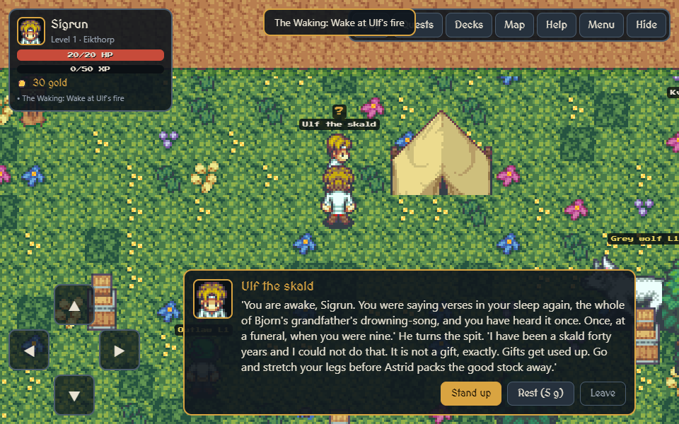

> 'You are awake, Sigrun. You were saying verses in your sleep again, the whole of Bjorn's grandfather's drowning-song, and you have heard it once. Once, at a funeral, when you were nine.' He turns the spit. 'I have been a skald forty years and I could not do that. It is not a gift, exactly. Gifts get used up. Go and stretch your legs before Astrid packs the good stock away.'

Then press "Stand up".

**2. Take a deck from Astrid at the trading post**

Where: Astrid the trader, in Eikthorp. About 40 steps north of Ulf the skald. *Astrid's post is at the north end of the village, by the well.*

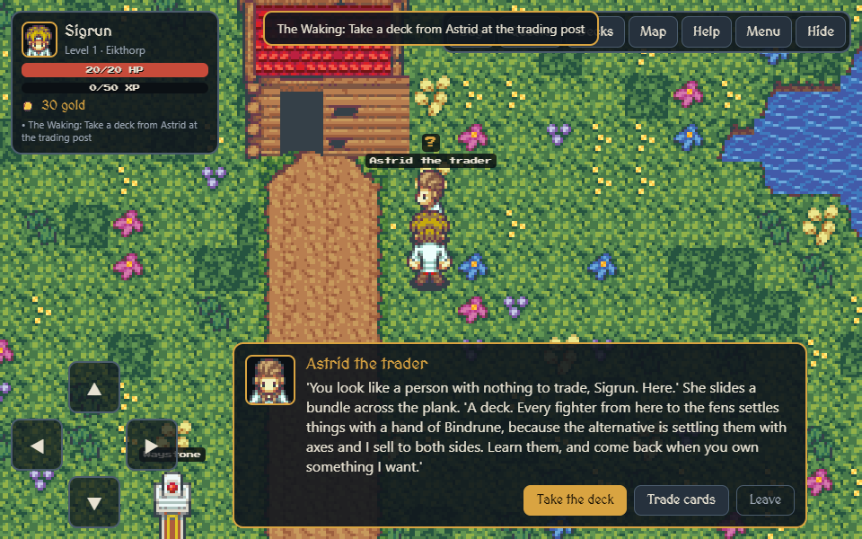

> 'You look like a person with nothing to trade, Sigrun. Here.' She slides a bundle across the plank. 'A deck. Every fighter from here to the fens settles things with a hand of Bindrune, because the alternative is settling them with axes and I sell to both sides. Learn them, and come back when you own something I want.'

Then press "Take the deck".

**3. Look at the well behind Astrid's post**

Where: Skuld, a Norn, in Eikthorp. About 12 steps south-east of Astrid the trader. *The well is behind Astrid's post, on the east side of the village. Someone is standing at it.*

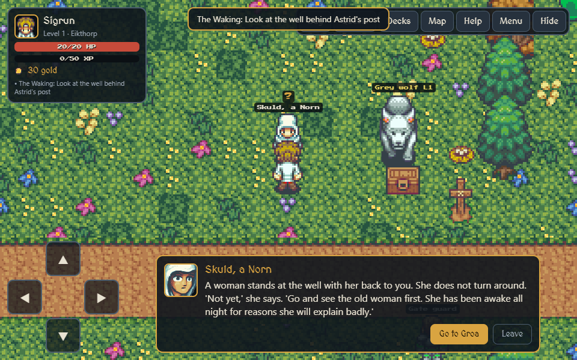

> A woman stands at the well with her back to you. She does not turn around. 'Not yet,' she says. 'Go and see the old woman first. She has been awake all night for reasons she will explain badly.'

Then press "Go to Groa".

**4. Sit with Groa at her hut**

Where: Groa the völva, in Eikthorp. About 40 steps west of Skuld, a Norn. *Groa's hut is at the west end of the village, by the west lane.*

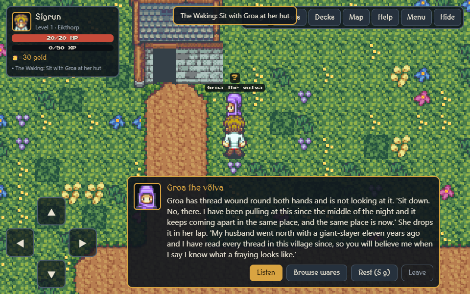

> Groa has thread wound round both hands and is not looking at it. 'Sit down. No, there. I have been pulling at this since the middle of the night and it keeps coming apart in the same place, and the same place is now.' She drops it in her lap. 'My husband went north with a giant-slayer eleven years ago and I have read every thread in this village since, so you will believe me when I say I know what a fraying looks like.'

Then press "Listen".

> 'Take these for the road, Sigrun; you will want them. Now sit still, because the next part is the part that matters.'

Reward: 20 gold, 10 XP, Healing draught.

*The Norns live at a well under a root of Yggdrasil and water the tree from it. The fraying threads, the skald and Eikthorp are the game's invention. Source: Poetic Edda, Völuspá st. 19–20; Prose Edda, Gylfaginning ch. 15–16.*

## Act 0: The Hanged God

Levels 1 to 4, Eikthorp and Ashgrove Meadows. Home, a well, a pond, and the first of the stories.

### The Hanged God

*Level 1 · given by Groa the völva in Eikthorp · 7 steps*

The first story is the oldest one Odin tells about himself. A Norn at the well sends you east into the meadows, where an old man with one eye is looking for a tree to hang from. Keep the beasts off him for nine nights and he comes down with the runes.

**Taking it up.** Find Groa the völva in Eikthorp.

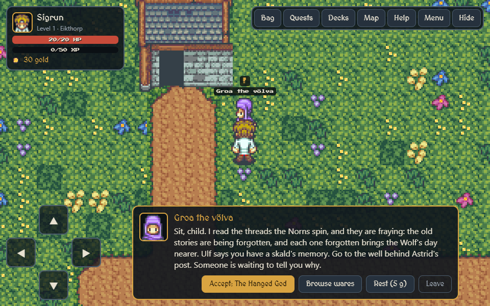

> Sit, child. I read the threads the Norns spin, and they are fraying: the old stories are being forgotten, and each one forgotten brings the Wolf's day nearer. Ulf says you have a skald's memory. Go to the well behind Astrid's post. Someone is waiting to tell you why.

**1. Speak with Skuld at the well behind the trading post**

Where: Skuld, a Norn, in Eikthorp. About 40 steps east of Groa the völva. *Skuld waits by the well behind Astrid's post. Norns do not wait forever.*

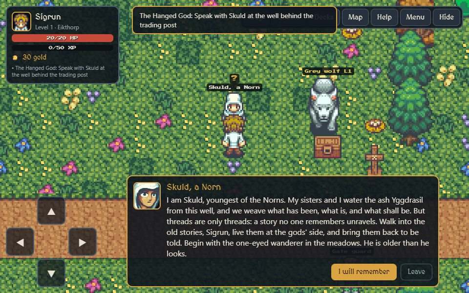

> I am Skuld, youngest of the Norns. My sisters and I water the ash Yggdrasil from this well, and we weave what has been, what is, and what shall be. But threads are only threads: a story no one remembers unravels. Walk into the old stories, Sigrun, live them at the gods' side, and bring them back to be told. Begin with the one-eyed wanderer in the meadows. He is older than he looks.

Then press "I will remember".

**2. Answer the Wanderer's riddle in Ashgrove Meadows**

Where: The Wanderer, in Ashgrove Meadows. About 30 steps east of Skuld, a Norn. *The Wanderer stands in the meadows east of the gate. Answer him well.*

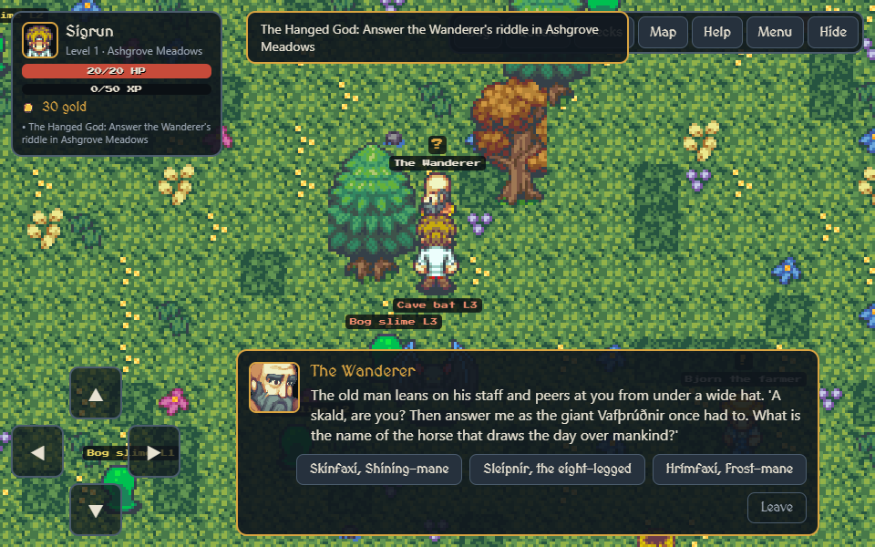

> The old man leans on his staff and peers at you from under a wide hat. 'A skald, are you? Then answer me as the giant Vafþrúðnir once had to. What is the name of the horse that draws the day over mankind?'

- Skinfaxi, Shining-mane
- Sleipnir, the eight-legged
- Hrímfaxi, Frost-mane

The answer

Skinfaxi, Shining-mane.

> 'Skinfaxi. His mane lights the sky. Hrímfaxi draws the night, and the froth from his bit is the dew.' The old man's one eye glitters. 'Good. Now walk with me to the pond. Something there wants to talk to you.'

**3. Speak with Mímir's head at the meadow pond**

Where: Mímir's head, in Ashgrove Meadows. About 40 steps south-east of The Wanderer. *Mímir's head lies in the reeds by the meadow pond, south of Bjorn's farm.*

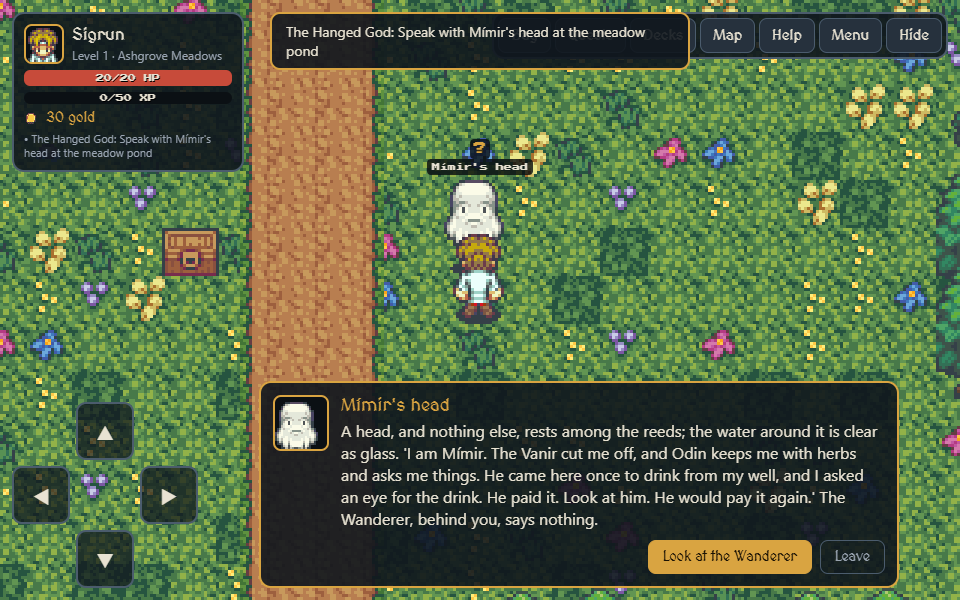

> A head, and nothing else, rests among the reeds; the water around it is clear as glass. 'I am Mímir. The Vanir cut me off, and Odin keeps me with herbs and asks me things. He came here once to drink from my well, and I asked an eye for the drink. He paid it. Look at him. He would pay it again.' The Wanderer, behind you, says nothing.

Then press "Look at the Wanderer".

**4. Return to the Wanderer**

Where: The Wanderer, in Ashgrove Meadows. About 40 steps north-west of Mímir's head. *The Wanderer has gone back to the grove in the meadows. He has a rope.*

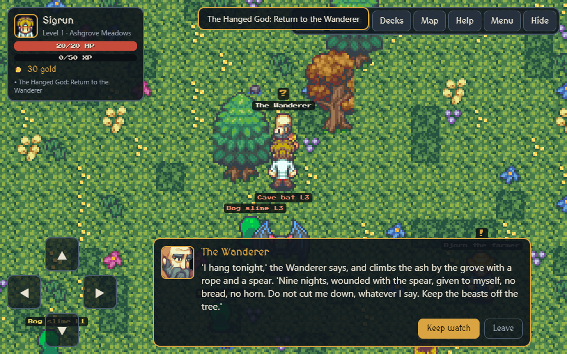

> 'I hang tonight,' the Wanderer says, and climbs the ash by the grove with a rope and a spear. 'Nine nights, wounded with the spear, given to myself, no bread, no horn. Do not cut me down, whatever I say. Keep the beasts off the tree.'

Then press "Keep watch".

**5. Keep the night watch: drive off 3 creatures in the meadows**

Where: Ashgrove Meadows. Right beside The Wanderer. *The Wanderer hangs in the tree. Keep the creatures of the meadows away from him: three of them, at least.*

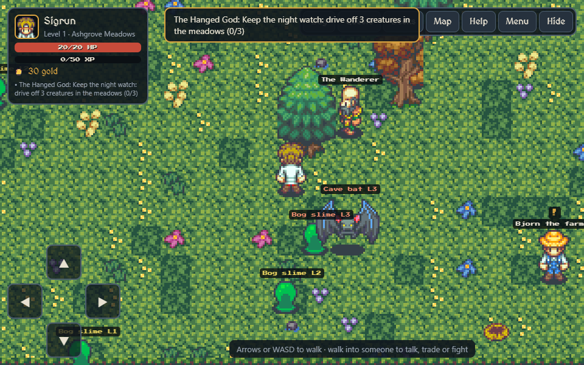

Win 3 fights against anything that roams Ashgrove Meadows.

**6. Cut the Wanderer down on the ninth night**

Where: The Wanderer, in Ashgrove Meadows. Right beside where you fought. *Nine nights are up. Go back to the tree.*

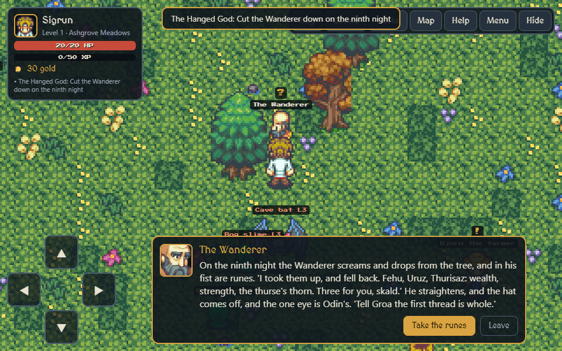

> On the ninth night the Wanderer screams and drops from the tree, and in his fist are runes. 'I took them up, and fell back. Fehu, Uruz, Thurisaz: wealth, strength, the thurse's thorn. Three for you, skald.' He straightens, and the hat comes off, and the one eye is Odin's. 'Tell Groa the first thread is whole.'

Then press "Take the runes".

**7. Retell the story to Groa**

Where: Groa the völva, in Eikthorp. About 70 steps west of The Wanderer. *Tell me the story, so it is remembered.*

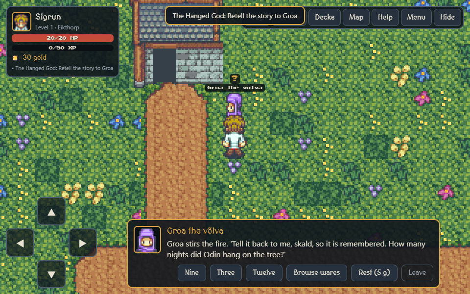

> Groa stirs the fire. 'Tell it back to me, skald, so it is remembered. How many nights did Odin hang on the tree?'

- Nine
- Three
- Twelve

The answer

Nine.

> 'Nine nights, wounded with a spear, himself to himself. So Hávamál says. Well told.'

> The first thread holds, Sigrun. Keep the runes close; the Wanderer will find you again where the stories fray. He always does.

Reward: 86 gold, 118 XP, the card Mímir's Head, Talisman of three runes.

*Odin hangs nine nights on the windy tree, spear-wounded, 'given to Odin, myself to myself', and takes up the runes. His eye lies in Mímir's well. The skald and the fraying threads are the game's invention. Source: Poetic Edda, Hávamál st. 138–141; Völuspá st. 28; Prose Edda, Gylfaginning ch. 15.*

## Act 1: The Young World

Levels 5 to 31. The gods are young, the treasures are new, and every trouble has Loki somewhere in it. The road leaves the hand-built lands south and east, then north into the dwarves' fields.

### The Builder's Price

*Level 5 · given by Odin the Wanderer in Barrow Hills · after The Hanged God · 5 steps*

The gods hired a stranger to wall Asgard in a single winter and promised him things that were not theirs to give. The wall is almost done. Somewhere in the Barrow Hills a stallion is doing most of the work, and Loki has an idea about that.

**Taking it up.** Find Odin the Wanderer in Barrow Hills, about 50 steps south of Eikthorp.

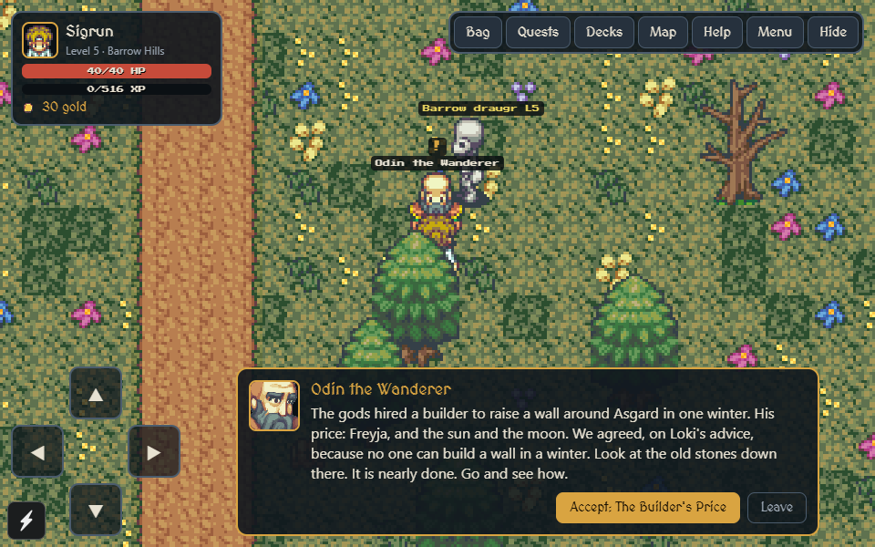

> The gods hired a builder to raise a wall around Asgard in one winter. His price: Freyja, and the sun and the moon. We agreed, on Loki's advice, because no one can build a wall in a winter. Look at the old stones down there. It is nearly done. Go and see how.

**1. Watch the Builder at work by the old wall**

Where: The Builder, in Barrow Hills. About 20 steps south of Odin the Wanderer. *The Builder works at the ruined wall in the south of the hills. Do not get in his way.*

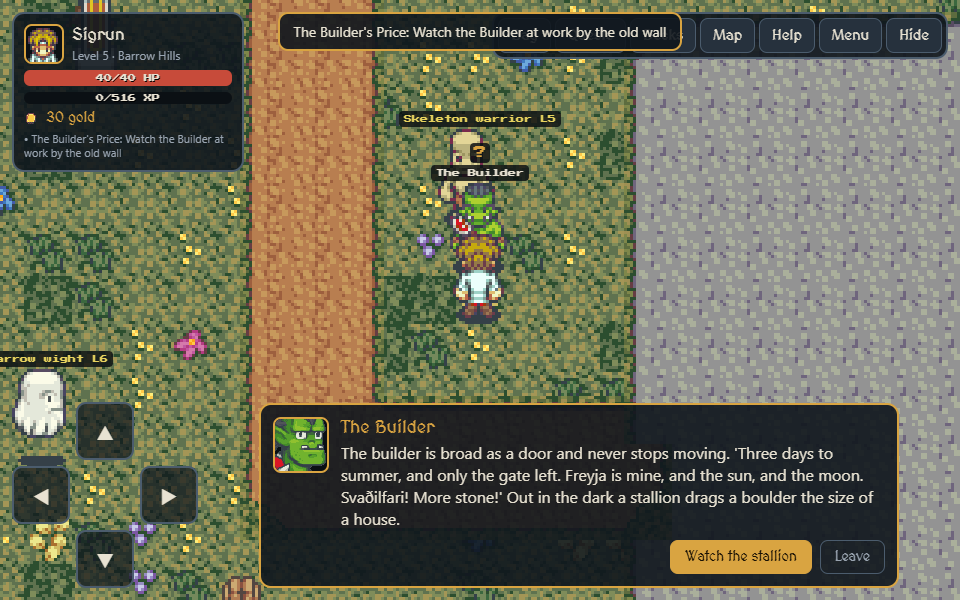

> The builder is broad as a door and never stops moving. 'Three days to summer, and only the gate left. Freyja is mine, and the sun, and the moon. Svaðilfari! More stone!' Out in the dark a stallion drags a boulder the size of a house.

Then press "Watch the stallion".

**2. Tell Odin what is building the wall**

Where: Odin the Wanderer, in Barrow Hills. About 20 steps north of The Builder. *Come back and tell me what you saw at the wall.*

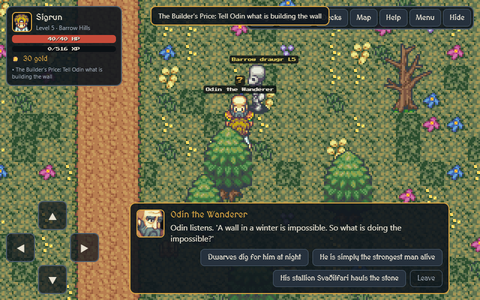

> Odin listens. 'A wall in a winter is impossible. So what is doing the impossible?'

- Dwarves dig for him at night
- He is simply the strongest man alive
- His stallion Svaðilfari hauls the stone

The answer

His stallion Svaðilfari hauls the stone.

> 'The horse. The gods let him use it, on Loki's word. So Loki will lose him the horse, or lose his head. He is hiding somewhere in these hills. Find him.'

**3. Find Loki hiding in the hills**

Where: Loki, a sly stranger, in Barrow Hills. About 40 steps south of Odin the Wanderer. *Loki hides somewhere among the mounds in the south-west. He is good at it.*

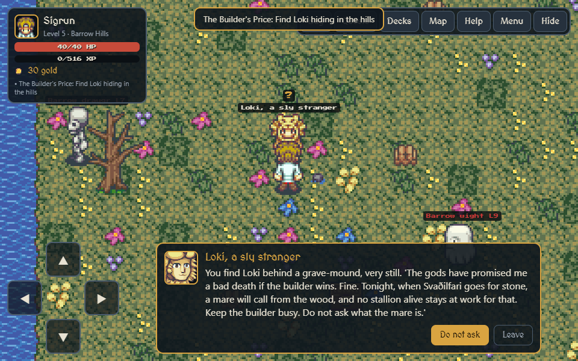

> You find Loki behind a grave-mound, very still. 'The gods have promised me a bad death if the builder wins. Fine. Tonight, when Svaðilfari goes for stone, a mare will call from the wood, and no stallion alive stays at work for that. Keep the builder busy. Do not ask what the mare is.'

Then press "Do not ask".

**4. Face the Builder when his stallion is gone**

Where: The Builder, unmasked, level 8, in Barrow Hills. About 30 steps east of Loki, a sly stranger. *The mare has drawn Svaðilfari into the wood. The builder has no horse and no wall, and a giant's temper. Face him by the ruins; Thor is on his way from the east.*

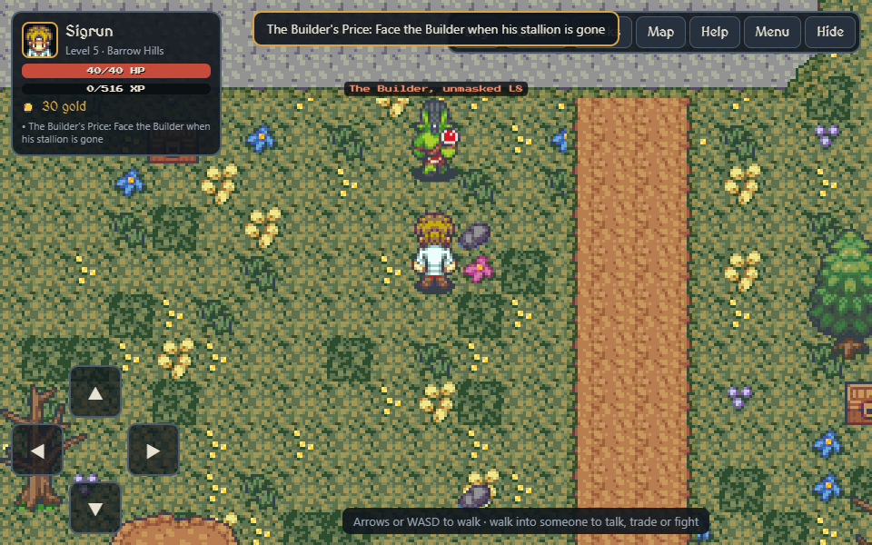

A fight of Bindrune against The Builder, unmasked, level 8. This foe is only here while this step of the story is playing. Walk into it when you are ready.

**5. Retell the story to Odin**

Where: Odin the Wanderer, in Barrow Hills. About 40 steps north of The Builder, unmasked. *Tell it back to me, skald.*

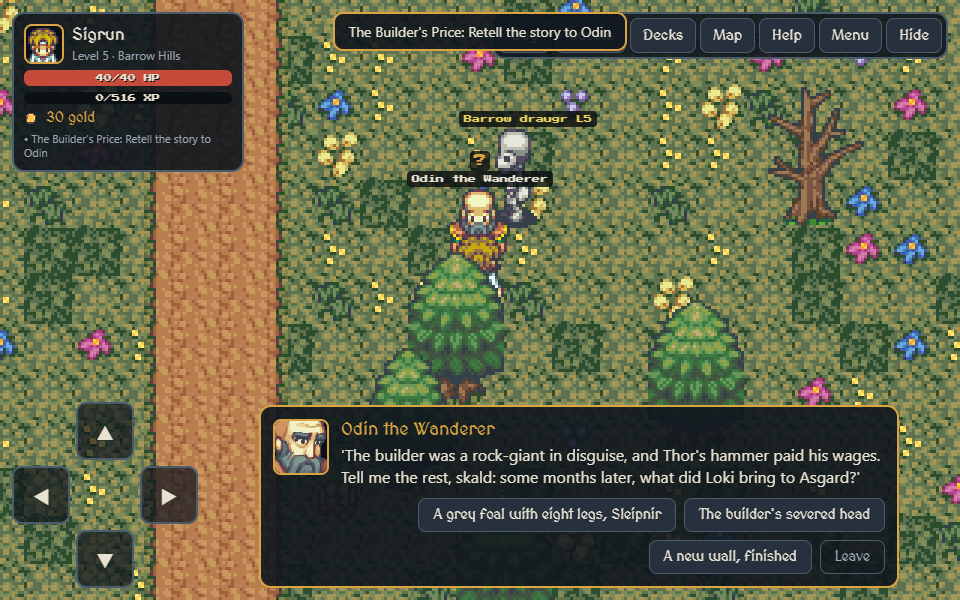

> 'The builder was a rock-giant in disguise, and Thor's hammer paid his wages. Tell me the rest, skald: some months later, what did Loki bring to Asgard?'

- A grey foal with eight legs, Sleipnir
- The builder's severed head
- A new wall, finished

The answer

A grey foal with eight legs, Sleipnir.

> 'Sleipnir, best of horses, my own. Loki was the mare. The gods broke an oath that winter, and Völuspá does not forgive it.'

> Sleipnir carries me now over sea and sky. Take his likeness, and remember: the gods kept the wall and lost their honour.

Reward: 133 gold, 470 XP, the card Sleipnir.

*Oaths mattered enormously to the Norse. The gods break the spirit of theirs here, and Völuspá treats it as a stain: 'who had mixed the air with venom?' Source: Prose Edda, Gylfaginning ch. 42; Völuspá st. 25–26.*

### The Mead of Poetry

*Level 8 · given by Ulf the skald in Eikthorp · after The Builder's Price · 8 steps*

Kvasir, who could answer anything, went to dinner with two dwarves and did not come back. Follow his trail from the fens to a giant's farm and into a mountain, where the mead made from him is kept, and watch Odin steal it.

**Taking it up.** Find Ulf the skald in Eikthorp.

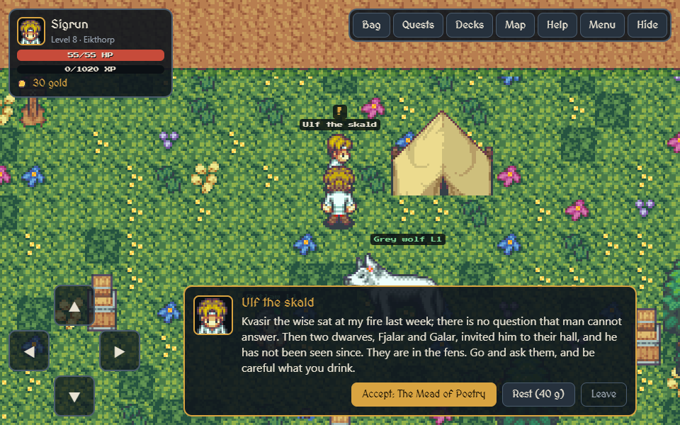

> Kvasir the wise sat at my fire last week; there is no question that man cannot answer. Then two dwarves, Fjalar and Galar, invited him to their hall, and he has not been seen since. They are in the fens. Go and ask them, and be careful what you drink.

**1. Question Fjalar the dwarf in the fens**

Where: Fjalar the dwarf, in Jotun Fens. About 50 steps south-east of Ulf the skald. *Fjalar and Galar keep a hall in the western fens. Ask them what became of Kvasir.*

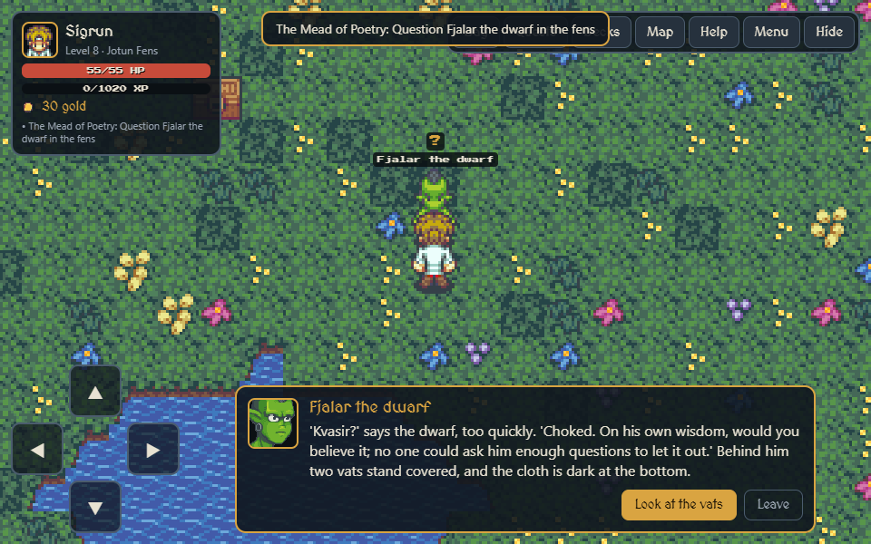

> 'Kvasir?' says the dwarf, too quickly. 'Choked. On his own wisdom, would you believe it; no one could ask him enough questions to let it out.' Behind him two vats stand covered, and the cloth is dark at the bottom.

Then press "Look at the vats".

**2. Learn where the mead went**

Where: Suttungr the giant, in Jotun Fens. About 30 steps north-east of Fjalar the dwarf. *Suttungr the giant took the mead from the dwarves. He is the largest thing in the fens.*

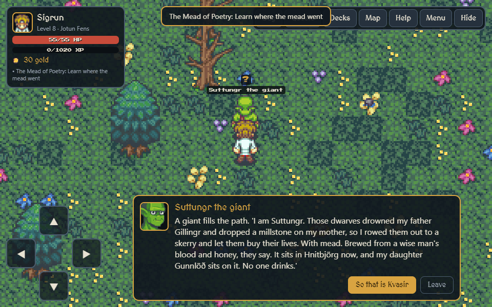

> A giant fills the path. 'I am Suttungr. Those dwarves drowned my father Gillingr and dropped a millstone on my mother, so I rowed them out to a skerry and let them buy their lives. With mead. Brewed from a wise man's blood and honey, they say. It sits in Hnitbjörg now, and my daughter Gunnlöð sits on it. No one drinks.'

Then press "So that is Kvasir".

**3. Meet Bölverk at Baugi's farm**

Where: Bölverk, a farmhand, in Jotun Fens. About 20 steps east of Suttungr the giant. *A one-eyed farmhand called Bölverk works for the giant Baugi in the eastern fens. You know that eye.*

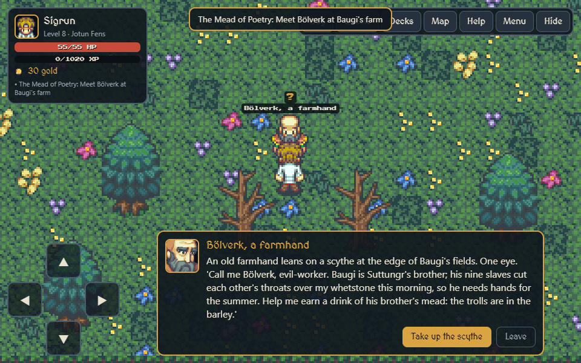

> An old farmhand leans on a scythe at the edge of Baugi's fields. One eye. 'Call me Bölverk, evil-worker. Baugi is Suttungr's brother; his nine slaves cut each other's throats over my whetstone this morning, so he needs hands for the summer. Help me earn a drink of his brother's mead: the trolls are in the barley.'

Then press "Take up the scythe".

**4. Work Bölverk's summer: clear 3 trolls from Baugi's fields**

Where: Jotun Fens. About 16 steps south-east of Bölverk, a farmhand. *The summer's work is trolls in the barley. Three should satisfy Baugi.*

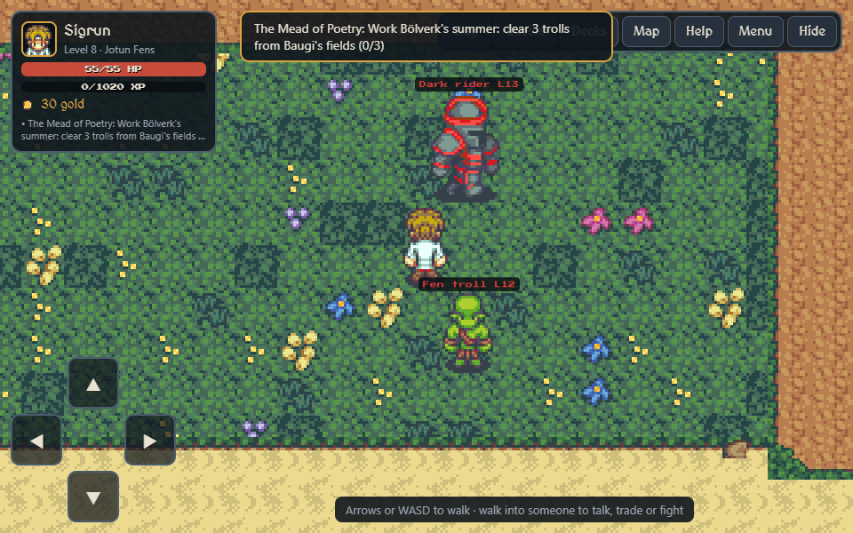

Win 3 fights against fen trolls.

Fen trolls roam here; walk into one to fight it.

**5. Collect Bölverk's wages**

Where: Bölverk, a farmhand, in Jotun Fens. About 16 steps north-west of where you fought. *The summer is done. Bölverk wants his drink.*

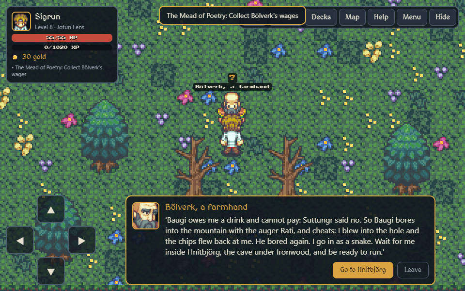

> 'Baugi owes me a drink and cannot pay: Suttungr said no. So Baugi bores into the mountain with the auger Rati, and cheats: I blew into the hole and the chips flew back at me. He bored again. I go in as a snake. Wait for me inside Hnitbjörg, the cave under Ironwood, and be ready to run.'

Then press "Go to Hnitbjörg".

**6. Enter Hnitbjörg, the cave under Ironwood, and find Gunnlöð**

Where: Gunnlöð, in Hnitbjorg, the cave in Ironwood. Go down into the cave. Its door is about 50 steps north-east of Bölverk, a farmhand. *Hnitbjörg is the cave under Ironwood. Gunnlöð keeps the mead inside.*

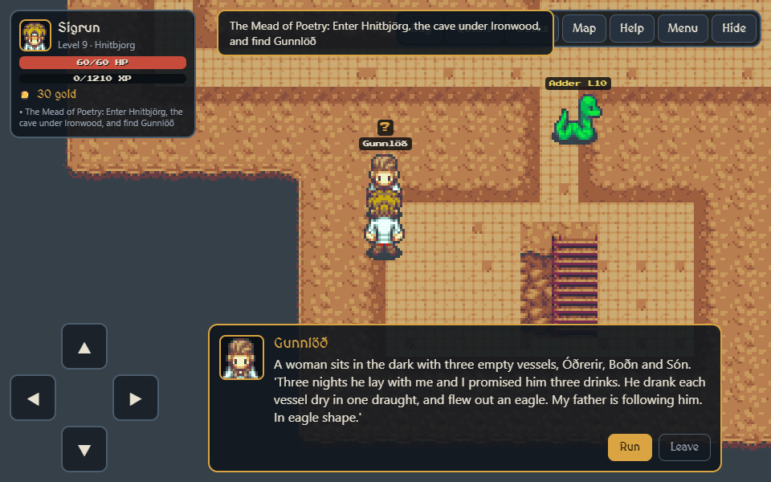

> A woman sits in the dark with three empty vessels, Óðrerir, Boðn and Són. 'Three nights he lay with me and I promised him three drinks. He drank each vessel dry in one draught, and flew out an eagle. My father is following him. In eagle shape.'

Then press "Run".

**7. Hold off Suttungr in eagle shape while Odin reaches Asgard**

Where: Suttungr in eagle shape, level 11, in Ironwood. About 7 steps east of Gunnlöð. *Suttungr chases Odin as an eagle over the east of Ironwood. Bring the eagle down before it reaches him.*

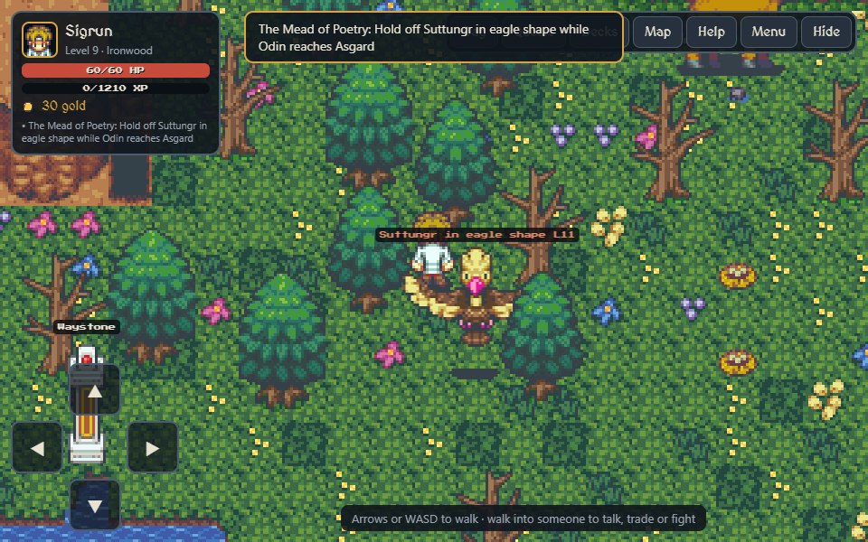

A fight of Bindrune against Suttungr in eagle shape, level 11. This foe is only here while this step of the story is playing. Walk into it when you are ready.

**8. Retell the story to Ulf**

Where: Ulf the skald, in Eikthorp. About 130 steps west of Suttungr in eagle shape. *Sit. Tell it.*

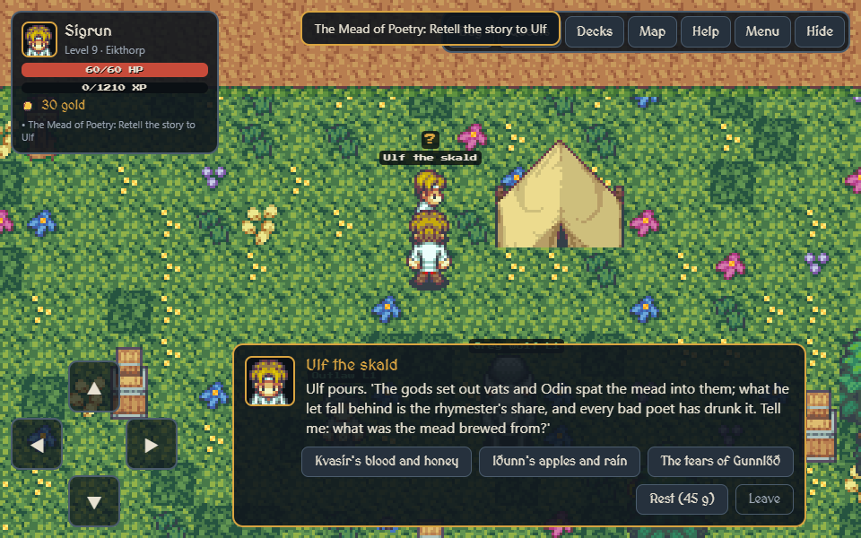

> Ulf pours. 'The gods set out vats and Odin spat the mead into them; what he let fall behind is the rhymester's share, and every bad poet has drunk it. Tell me: what was the mead brewed from?'

- Kvasir's blood and honey
- Iðunn's apples and rain
- The tears of Gunnlöð

The answer

Kvasir's blood and honey.

> 'Blood and honey. That is why poetry is called Kvasir's blood. Well told; you may have a real drink now.'

> Kvasir lives on in every good verse. A drop of the mead for you, then, and the story stays told.

Reward: 239 gold, 1324 XP, the card Kvasir the Wise, Draught of Óðrerir.

*Poetry was a divine gift. The kennings 'Kvasir's blood' and 'Óðrerir's sea' for poetry are real, and the rhymester's share explains bad verse. The vial is the game's invention. Source: Prose Edda, Skáldskaparmál ch. 1 (G57); Hávamál st. 104–110.*

### The Dwarves' Wager

*Level 12 · given by Thor in Nidavellir · after The Mead of Poetry · 7 steps*

Loki cut off Sif's hair for a joke and has to replace it. He goes to the dwarves, bets his head that they cannot outdo their rivals, and then cheats. Most of the gods' treasures come out of this one afternoon at the forge.

**Taking it up.** Find Thor in Nidavellir, about 180 steps east of Eikthorp.

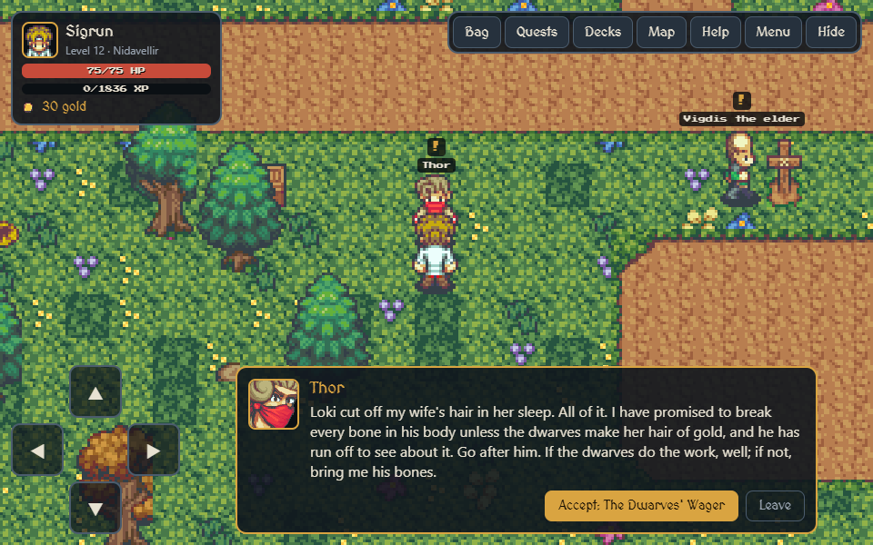

> Loki cut off my wife's hair in her sleep. All of it. I have promised to break every bone in his body unless the dwarves make her hair of gold, and he has run off to see about it. Go after him. If the dwarves do the work, well; if not, bring me his bones.

**1. Speak with Sif**

Where: Sif, in Nidavellir. About 8 steps north of Thor. *Sif is in the hamlet, hiding her head. Speak with her, then find Loki.*

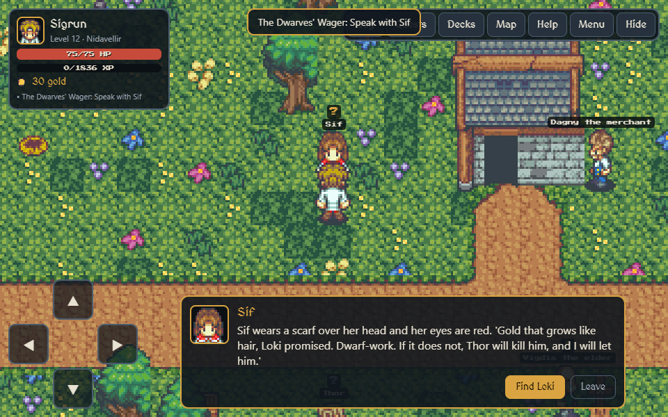

> Sif wears a scarf over her head and her eyes are red. 'Gold that grows like hair, Loki promised. Dwarf-work. If it does not, Thor will kill him, and I will let him.'

Then press "Find Loki".

**2. Find Loki at the forges of Niðavellir**

Where: Loki, in Nidavellir. About 20 steps south-east of Sif. *Loki is somewhere near the dwarves' forges, talking too much.*

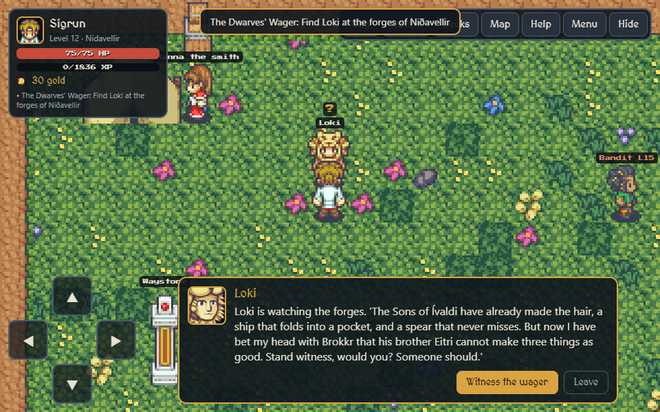

> Loki is watching the forges. 'The Sons of Ívaldi have already made the hair, a ship that folds into a pocket, and a spear that never misses. But now I have bet my head with Brokkr that his brother Eitri cannot make three things as good. Stand witness, would you? Someone should.'

Then press "Witness the wager".

**3. Stand witness to the wager**

Where: Brokkr the dwarf, in Nidavellir. About 11 steps north of Loki. *Brokkr is at the bellows and Eitri at the fire. The wager needs a witness.*

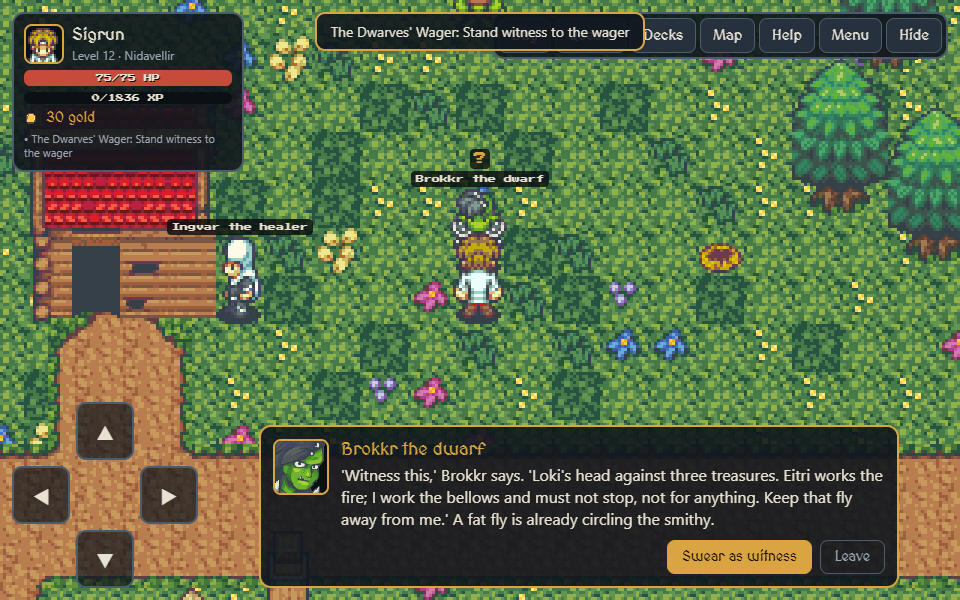

> 'Witness this,' Brokkr says. 'Loki's head against three treasures. Eitri works the fire; I work the bellows and must not stop, not for anything. Keep that fly away from me.' A fat fly is already circling the smithy.

Then press "Swear as witness".

**4. Keep the fly off Brokkr while the treasures are forged**

Where: A fat, biting fly, level 15, in Nidavellir. About 4 steps north of Brokkr the dwarf. *The fly bit Eitri's hand as he pulled out the boar, then Brokkr's neck as he took out the ring. Catch it, north of the forge, before the hammer is done.*

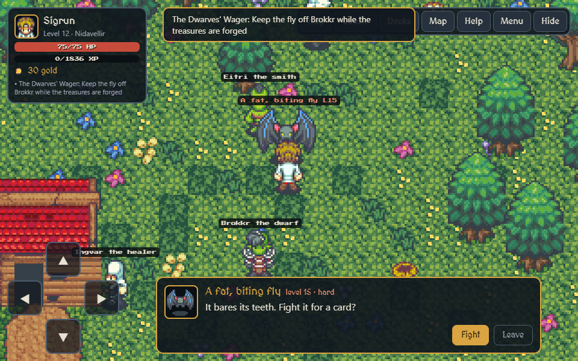

A fight of Bindrune against A fat, biting fly, level 15. This foe is only here while this step of the story is playing. Walk into it when you are ready.

**5. Speak with Eitri about the hammer**

Where: Eitri the smith, in Nidavellir. Right beside a fat, biting fly. *Eitri has the last treasure out of the fire. See what the fly did to it.*

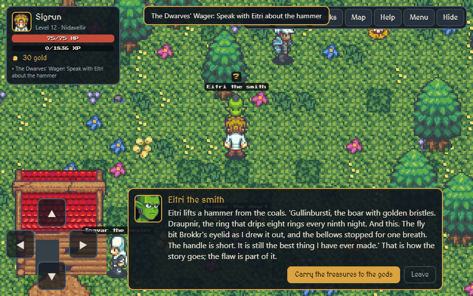

> Eitri lifts a hammer from the coals. 'Gullinbursti, the boar with golden bristles. Draupnir, the ring that drips eight rings every ninth night. And this. The fly bit Brokkr's eyelid as I drew it out, and the bellows stopped for one breath. The handle is short. It is still the best thing I have ever made.' That is how the story goes; the flaw is part of it.

Then press "Carry the treasures to the gods".

**6. Judge Loki's loophole**

Where: Loki, in Nidavellir. About 16 steps south of Eitri the smith. *Brokkr wants Loki's head. Loki has a point about his neck. You are the witness.*

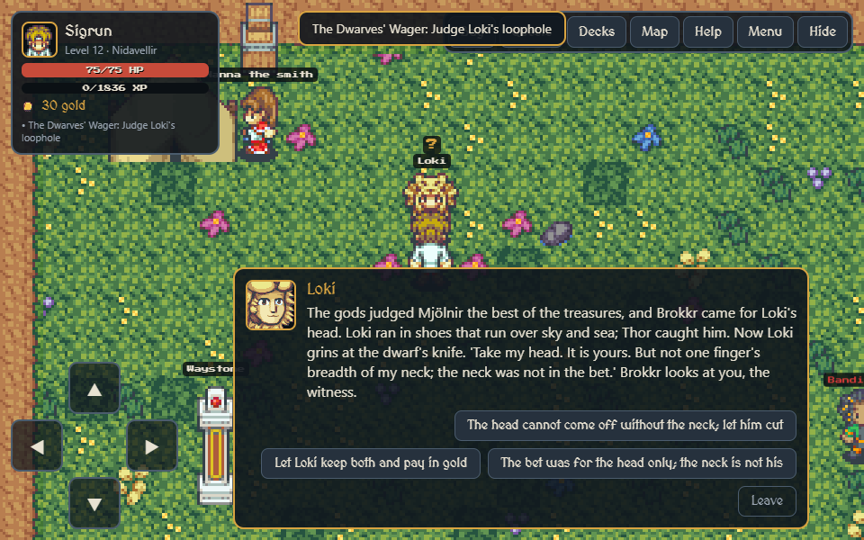

> The gods judged Mjölnir the best of the treasures, and Brokkr came for Loki's head. Loki ran in shoes that run over sky and sea; Thor caught him. Now Loki grins at the dwarf's knife. 'Take my head. It is yours. But not one finger's breadth of my neck; the neck was not in the bet.' Brokkr looks at you, the witness.

- The head cannot come off without the neck; let him cut
- Let Loki keep both and pay in gold
- The bet was for the head only; the neck is not his

The answer

The bet was for the head only; the neck is not his.

> Brokkr snarls, but a witness is a witness. He takes an awl and a thong called Vartari and sews Loki's lips shut instead. Loki tears them open later. He always does.

**7. Retell the story to Thor**

Where: Thor, in Nidavellir. About 20 steps west of Loki. *Tell me why my hammer's handle is short.*

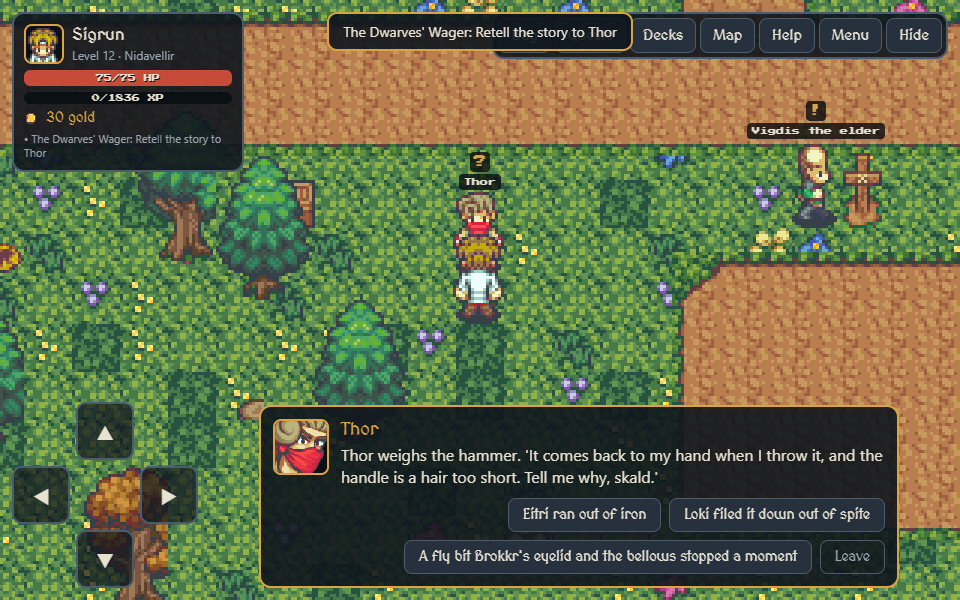

> Thor weighs the hammer. 'It comes back to my hand when I throw it, and the handle is a hair too short. Tell me why, skald.'

- Eitri ran out of iron
- Loki filed it down out of spite
- A fly bit Brokkr's eyelid and the bellows stopped a moment

The answer

A fly bit Brokkr's eyelid and the bellows stopped a moment.

> 'The fly was Loki, of course. He gave us Mjölnir trying to spoil it. That is Loki.'

> Sif's hair grows again, of gold, and the giants have learned to fear my hammer. A lock of the gold for the witness, and Mjölnir's likeness. Loki keeps his neck.

Reward: 292 gold, 1974 XP, the card Mjölnir, Lock of Sif's hair.

*Almost every famous treasure of the gods comes from this one story: Gungnir, Skíðblaðnir, Gullinbursti, Draupnir and Mjölnir. 'Sif's hair' is a kenning for gold. Source: Prose Edda, Skáldskaparmál (the treasures of the gods, G43 / ch. 35).*

### The Stolen Apples

*Level 15 · given by Odin the Wanderer in Thrymheim · after The Dwarves' Wager · 8 steps*

An eagle that was not an eagle dragged Loki across the north until he promised to hand over Iðunn and her apples. Now the gods are going grey. Get the truth out of Loki, bring the apples back, and see what a giant's daughter asks as her price.

**Taking it up.** Find Odin the Wanderer in Thrymheim, about 190 steps east of Eikthorp.

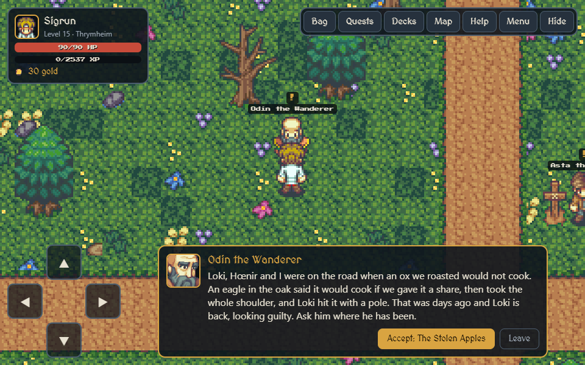

> Loki, Hœnir and I were on the road when an ox we roasted would not cook. An eagle in the oak said it would cook if we gave it a share, then took the whole shoulder, and Loki hit it with a pole. That was days ago and Loki is back, looking guilty. Ask him where he has been.

**1. Ask Loki where he has been**

Where: Loki, in Thrymheim. About 11 steps south of Odin the Wanderer. *Loki is at the camp, south of here. He was dragged half across the world and it has done nothing for his honesty.*

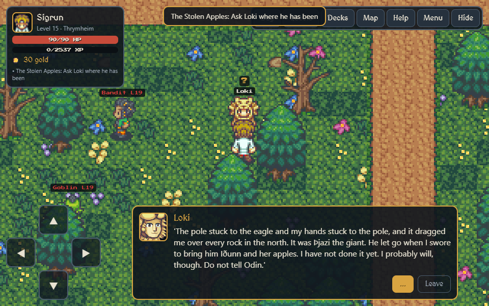

> 'The pole stuck to the eagle and my hands stuck to the pole, and it dragged me over every rock in the north. It was Þjazi the giant. He let go when I swore to bring him Iðunn and her apples. I have not done it yet. I probably will, though. Do not tell Odin.'

Then press "...".

**2. Speak with Iðunn before she follows Loki**

Where: Iðunn, in Thrymheim. About 12 steps east of Loki. *Iðunn is about to follow Loki into the wood. It is her story; she will go.*

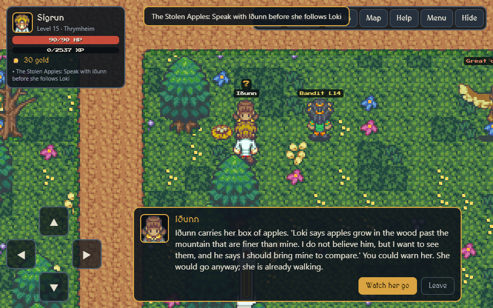

> Iðunn carries her box of apples. 'Loki says apples grow in the wood past the mountain that are finer than mine. I do not believe him, but I want to see them, and he says I should bring mine to compare.' You could warn her. She would go anyway; she is already walking.

Then press "Watch her go".

**3. Return to Odin, grown grey**

Where: Odin the Wanderer, in Thrymheim. About 12 steps north-west of Iðunn. *The gods are ageing by the hour. Odin wants Loki.*

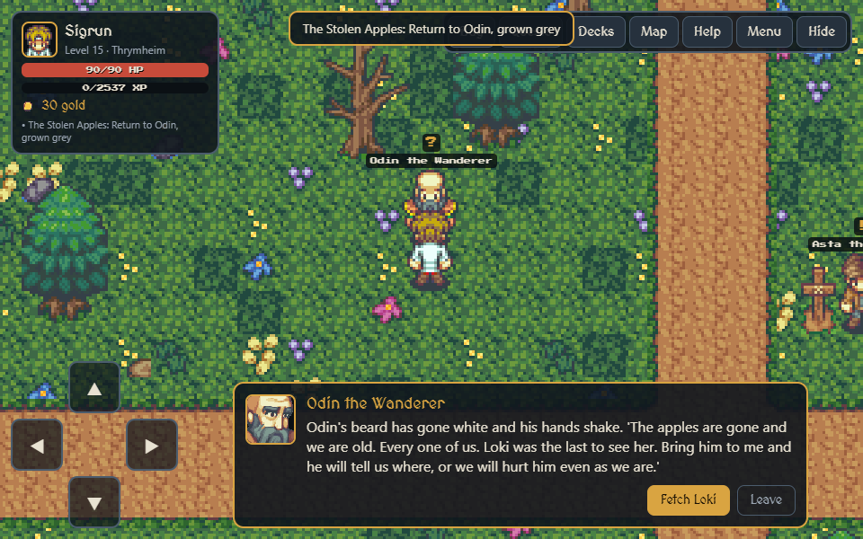

> Odin's beard has gone white and his hands shake. 'The apples are gone and we are old. Every one of us. Loki was the last to see her. Bring him to me and he will tell us where, or we will hurt him even as we are.'

Then press "Fetch Loki".

**4. Make Loki confess**

Where: Loki, in Thrymheim. About 11 steps south of Odin the Wanderer. *Loki is at the camp. Everyone is old and it is his fault.*

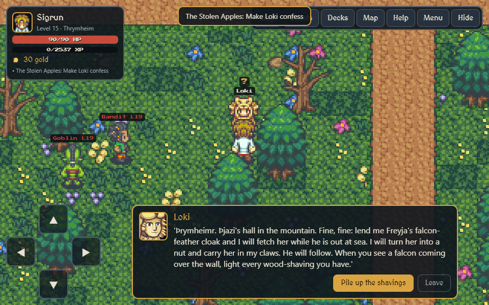

> 'Þrymheimr. Þjazi's hall in the mountain. Fine, fine: lend me Freyja's falcon-feather cloak and I will fetch her while he is out at sea. I will turn her into a nut and carry her in my claws. He will follow. When you see a falcon coming over the wall, light every wood-shaving you have.'

Then press "Pile up the shavings".

**5. Burn the eagle at the wall: bring down Þjazi**

Where: Þjazi in eagle shape, level 19, in Thrymheim. About 15 steps north-east of Loki. *The falcon is over the wall with a nut in its claws, and the eagle behind it cannot stop in time. The shavings are lit. Finish Þjazi, north-east of the camp.*

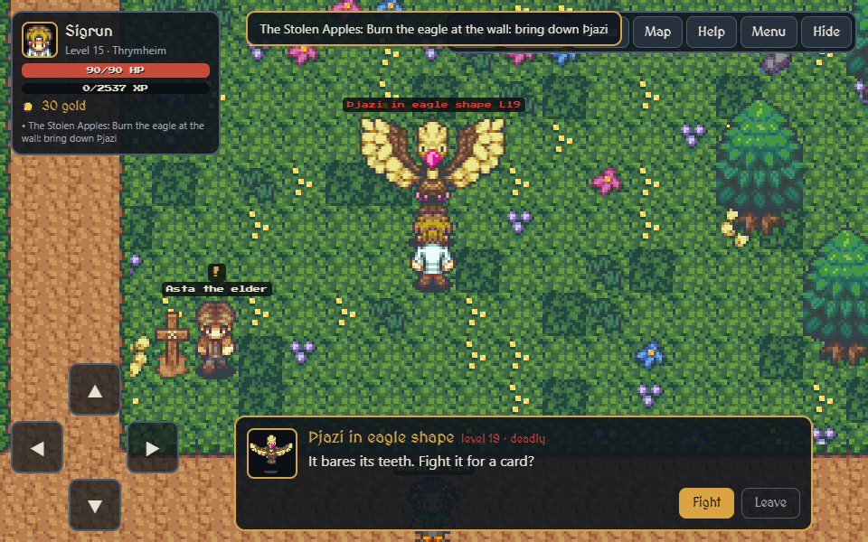

A fight of Bindrune against Þjazi in eagle shape, level 19. This foe is only here while this step of the story is playing. Walk into it when you are ready.

**6. Take an apple from Iðunn**

Where: Iðunn, in Thrymheim. About 8 steps south-west of Þjazi in eagle shape. *Iðunn is back with her box. Go and eat something.*

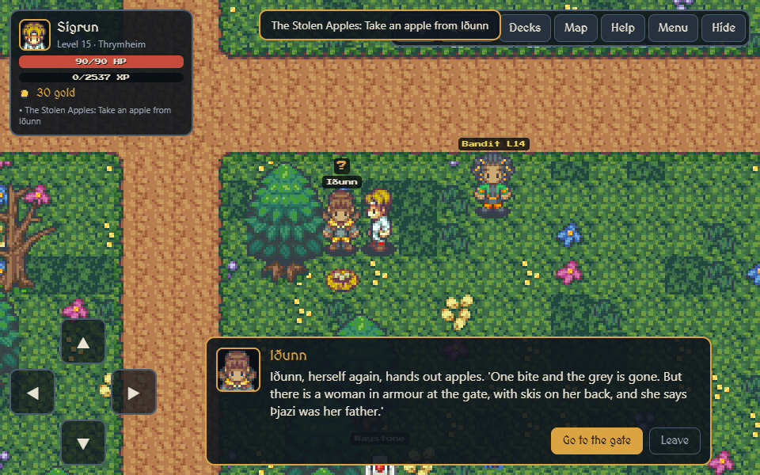

> Iðunn, herself again, hands out apples. 'One bite and the grey is gone. But there is a woman in armour at the gate, with skis on her back, and she says Þjazi was her father.'

Then press "Go to the gate".

**7. See Skaði's price paid**

Where: Skaði, in helm and mail, in Thrymheim. About 13 steps north-west of Iðunn. *Skaði stands at the north gate demanding a price for Þjazi. The gods will pay it strangely.*

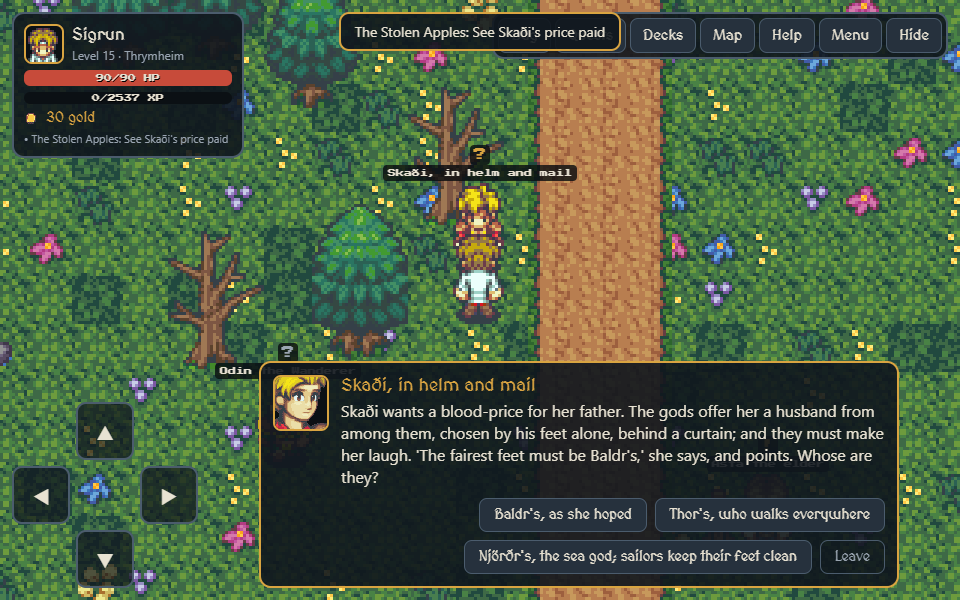

> Skaði wants a blood-price for her father. The gods offer her a husband from among them, chosen by his feet alone, behind a curtain; and they must make her laugh. 'The fairest feet must be Baldr's,' she says, and points. Whose are they?

- Baldr's, as she hoped
- Thor's, who walks everywhere
- Njörðr's, the sea god; sailors keep their feet clean

The answer

Njörðr's, the sea god; sailors keep their feet clean.

> Njörðr of the sea. Skaði is furious, and then Loki ties his beard to a goat's beard and they tug each other about the hall until she laughs in spite of herself. Odin sets Þjazi's eyes in the sky as two stars. The price is paid.

**8. Retell the story to Odin**

Where: Odin the Wanderer, in Thrymheim. About 4 steps south-west of Skaði, in helm and mail. *Tell it back, skald.*

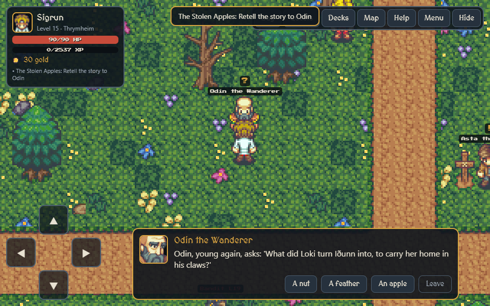

> Odin, young again, asks: 'What did Loki turn Iðunn into, to carry her home in his claws?'

- A nut
- A feather
- An apple

The answer

A nut.

> 'A nut. And Þjazi burned at the wall, and his daughter married the sea. Told well.'

> The apples are back in Asgard and the gods are young. Three of them for you; eat them when you have to, not when you want to.

Reward: 368 gold, 2859 XP, the card Iðunn's Orchard, the card Skaði of Þrymheimr, 3 × Apple of Iðunn.

*The gods are not immortal by nature: their youth depends on Iðunn's apples. Þjazi's eyes became stars; Skaði chose Njörðr by his feet. Source: Prose Edda, Skáldskaparmál ch. 1 (G56); Haustlöng by Þjóðólfr of Hvinir.*

### The Binding of Fenrir

*Level 31 · given by Týr in Runelund · after The Stolen Apples · 10 steps*

The wolf the gods are raising grows faster than any chain they make. The dwarves can make a fetter out of six things that do not exist, if someone brings them the six things. One god will have to put his hand in the wolf's mouth.

**Taking it up.** Find Týr in Runelund, about 270 steps south of Eikthorp.

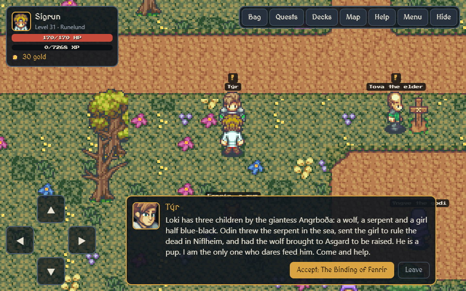

> Loki has three children by the giantess Angrboða: a wolf, a serpent and a girl half blue-black. Odin threw the serpent in the sea, sent the girl to rule the dead in Niflheim, and had the wolf brought to Asgard to be raised. He is a pup. I am the only one who dares feed him. Come and help.

**1. Feed Fenrir with Týr**

Where: Fenrir, a pup, in Runelund. About 4 steps south of Týr. *Fenrir is west of the hamlet with Týr. Bring meat.*

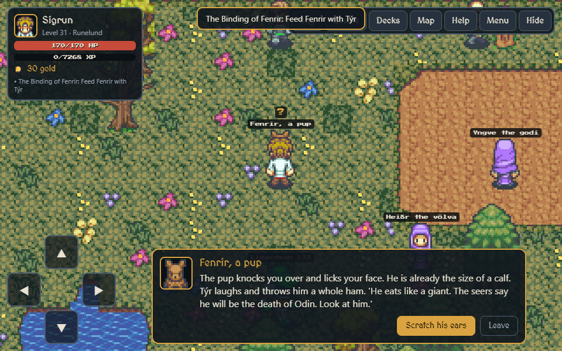

> The pup knocks you over and licks your face. He is already the size of a calf. Týr laughs and throws him a whole ham. 'He eats like a giant. The seers say he will be the death of Odin. Look at him.'

Then press "Scratch his ears".

**2. See Fenrir break the chains**

Where: Fenrir, grown, in Runelund. Right beside Fenrir, a pup. *The gods are testing chains on the wolf, west of the hamlet. Go and watch how that ends.*

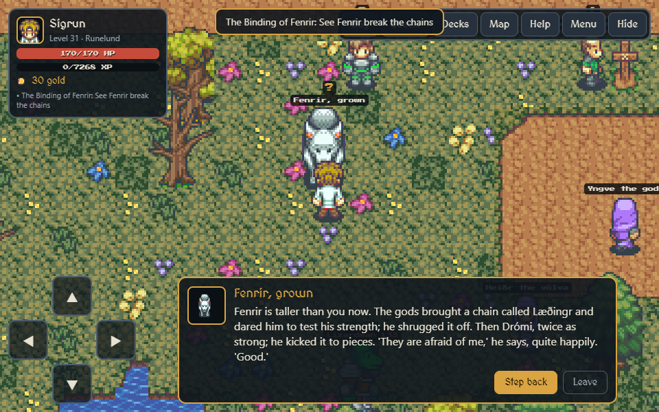

> Fenrir is taller than you now. The gods brought a chain called Læðingr and dared him to test his strength; he shrugged it off. Then Drómi, twice as strong; he kicked it to pieces. 'They are afraid of me,' he says, quite happily. 'Good.'

Then press "Step back".

**3. Speak with Skírnir about a third fetter**

Where: Skírnir, in Runelund. About 20 steps east of Fenrir, grown. *Skírnir, east of the hamlet, needs the six impossible things for the dwarves. Start with the bears.*

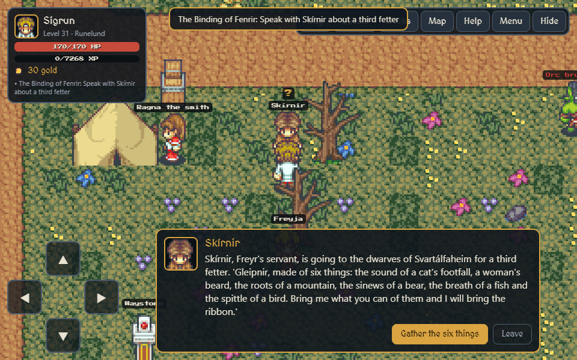

> Skírnir, Freyr's servant, is going to the dwarves of Svartálfaheim for a third fetter. 'Gleipnir, made of six things: the sound of a cat's footfall, a woman's beard, the roots of a mountain, the sinews of a bear, the breath of a fish and the spittle of a bird. Bring me what you can of them and I will bring the ribbon.'

Then press "Gather the six things".

**4. The sinews of a bear: hunt 2 brown bears**

Where: Draugvik. About 50 steps north of Skírnir. *Bears for the sinews. There are none this far south; try the woods north of here, Isastrand and Draugvik.*

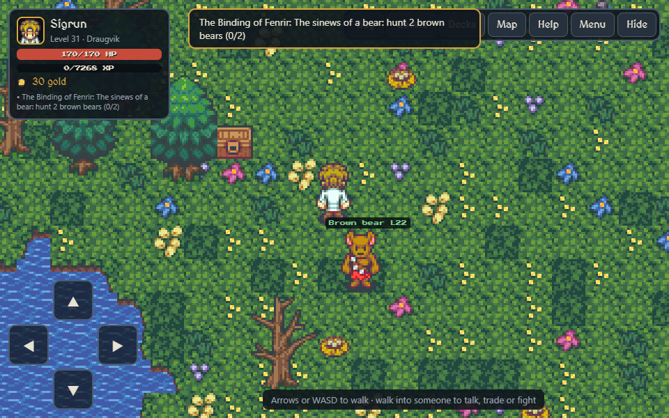

Win 2 fights against brown bears.

Brown bears roam here; walk into one to fight it.

**5. The sound of a cat's footfall: ask Freyja**

Where: Freyja, in Runelund. About 60 steps south of where you fought. *Freyja's cats, east of the hamlet, can tell you about the sound of their steps, or the lack of it.*

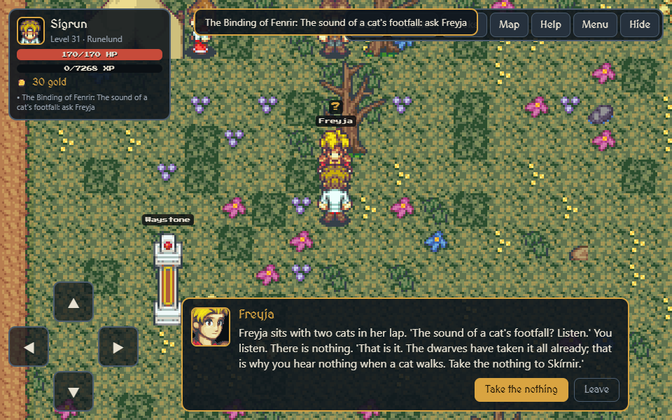

> Freyja sits with two cats in her lap. 'The sound of a cat's footfall? Listen.' You listen. There is nothing. 'That is it. The dwarves have taken it all already; that is why you hear nothing when a cat walks. Take the nothing to Skírnir.'

Then press "Take the nothing".

**6. A woman's beard: ask Heiðr the völva**

Where: Heiðr the völva, in Runelund. About 17 steps west of Freyja. *Heiðr the völva, south of the hamlet, knows about beards. Ask her.*

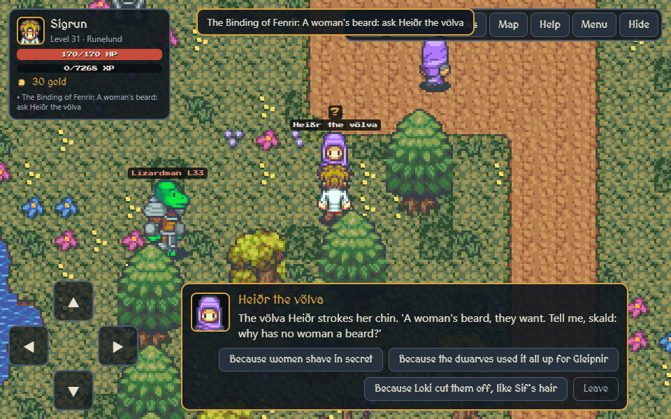

> The völva Heiðr strokes her chin. 'A woman's beard, they want. Tell me, skald: why has no woman a beard?'

- Because women shave in secret
- Because the dwarves used it all up for Gleipnir
- Because Loki cut them off, like Sif's hair

The answer

Because the dwarves used it all up for Gleipnir.

> 'So Snorri says: that is why the six things no longer exist, and why you have never seen them. Take my answer to Skírnir; it weighs nothing.'

**7. The roots of a mountain: open a strongbox buried in Runelund**

Where: Runelund. About 15 steps south-west of Heiðr the völva. *Something under Runelund keeps the roots of a mountain in a strongbox. Dig it out; it will be guarded.*

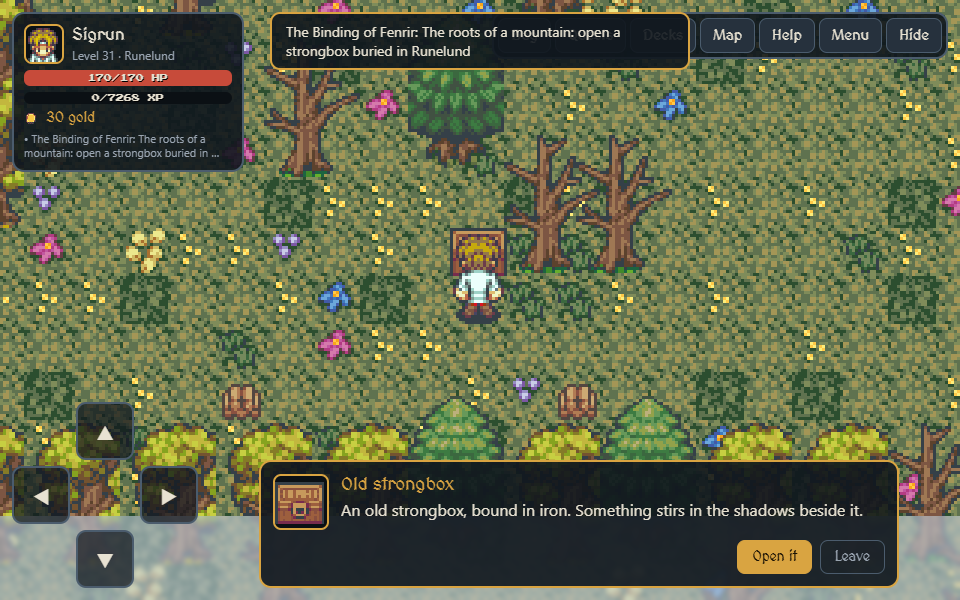

Open a strongbox in Runelund. Whatever guards it fights first.

**8. Bring the six things to Skírnir**

Where: Skírnir, in Runelund. About 20 steps north-east of the strongbox. *Skírnir has the ribbon. Take it from him, then go east to the island Lyngvi.*

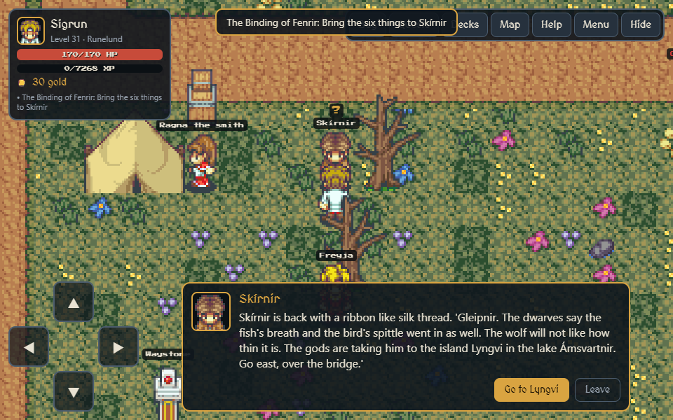

> Skírnir is back with a ribbon like silk thread. 'Gleipnir. The dwarves say the fish's breath and the bird's spittle went in as well. The wolf will not like how thin it is. The gods are taking him to the island Lyngvi in the lake Ámsvartnir. Go east, over the bridge.'

Then press "Go to Lyngvi".

**9. Cross to Lyngvi and see the wolf bound**

Where: Fenrir, on Lyngvi. About 50 steps east of Skírnir. *Lyngvi is the island east of Runelund. The wolf is waiting for the gods there.*

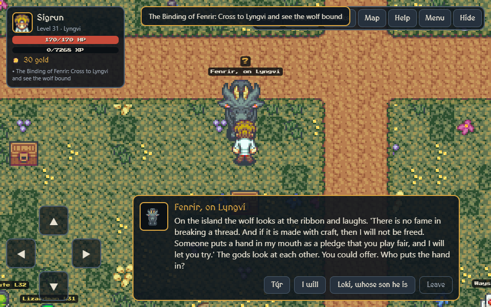

> On the island the wolf looks at the ribbon and laughs. 'There is no fame in breaking a thread. And if it is made with craft, then I will not be freed. Someone puts a hand in my mouth as a pledge that you play fair, and I will let you try.' The gods look at each other. You could offer. Who puts the hand in?

- Týr
- I will
- Loki, whose son he is

The answer

Týr.

> Týr steps forward and lays his right hand in the wolf's jaws. The ribbon holds. The gods laugh; Týr does not. Fenrir bites. They wedge a sword between his jaws and tie the ribbon to a rock sunk deep in the earth, and the river Ván runs from his mouth.

**10. Retell the story to Týr**

Where: Týr, in Runelund. About 70 steps west of Fenrir, on Lyngvi. *Tell it back, so it is worth the hand.*

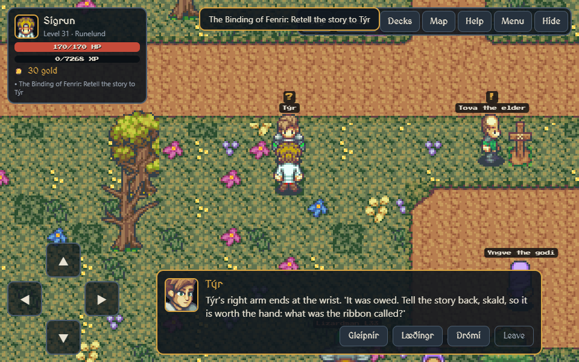

> Týr's right arm ends at the wrist. 'It was owed. Tell the story back, skald, so it is worth the hand: what was the ribbon called?'

- Gleipnir
- Læðingr
- Drómi

The answer

Gleipnir.

> 'Gleipnir. Læðingr and Drómi broke; the thin one held. Remember that when something looks weak.'

> The wolf lies bound until the end of things, and I feed no more pups. The dwarves made two lengths of ribbon; the second is yours. It will hold anything.

Reward: 728 gold, 8372 XP, the card Fenrir, the card Týr the One-Handed, Gleipnir.

*Týr's day is Tuesday. His sacrifice is about honour: the gods played the wolf false, and someone had to pay for it. The second ribbon is the game's invention. Source: Prose Edda, Gylfaginning ch. 34.*

## Act 2: Thor's Journeys

Levels 31 to 62. Four journeys with Thor, into giants' halls and out onto the sea, each funnier than the last and each a little more dangerous.

### The Hall of the Outer Giant

*Level 31 · given by Thor in Helmark · after The Binding of Fenrir · 11 steps*

Thor goes east to Jötunheim with Loki, a farmer's two children and a pair of goats he eats every night. It ends in a giant's hall where every contest is rigged and nothing is what it looks like. The riddles here are the tricks: name them.

**Taking it up.** Find Thor in Helmark, about 200 steps south-east of Eikthorp.

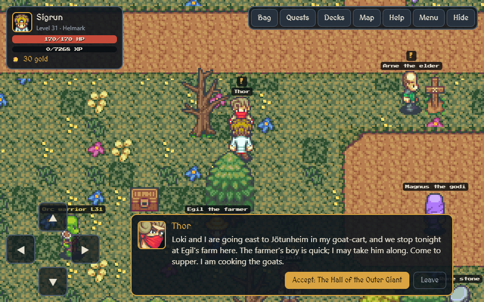

> Loki and I are going east to Jötunheim in my goat-cart, and we stop tonight at Egil's farm here. The farmer's boy is quick; I may take him along. Come to supper. I am cooking the goats.

**1. Have supper at Egil's farm**

Where: Þjálfi, in Helmark. About 7 steps south of Thor. *Supper is at Egil's farm, west of the hamlet. Watch the boy.*

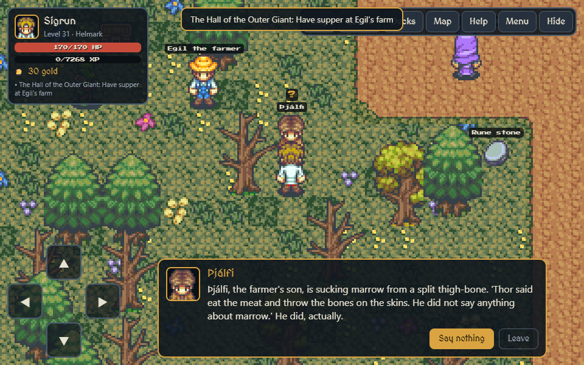

> Þjálfi, the farmer's son, is sucking marrow from a split thigh-bone. 'Thor said eat the meat and throw the bones on the skins. He did not say anything about marrow.' He did, actually.

Then press "Say nothing".

**2. See what Thor does about the lame goat**

Where: Egil the farmer, in Helmark. Right beside Þjálfi. *Thor found the split bone. Egil is trying to bargain.*

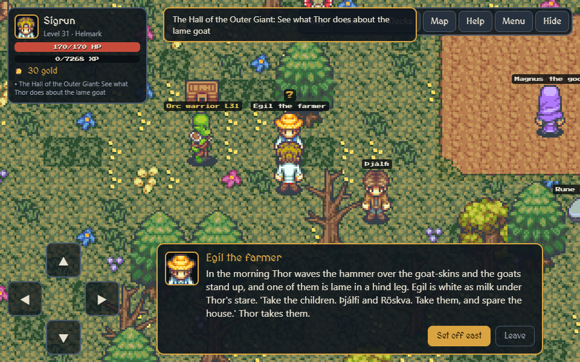

> In the morning Thor waves the hammer over the goat-skins and the goats stand up, and one of them is lame in a hind leg. Egil is white as milk under Thor's stare. 'Take the children. Þjálfi and Röskva. Take them, and spare the house.' Thor takes them.

Then press "Set off east".

**3. Follow the road east to the giant Skrýmir in Nottvang**

Where: Skrýmir, in Nottvang. About 70 steps north-east of Egil the farmer. *The road east passes through Nottvang, beyond Eldmose. Something enormous is sleeping there.*

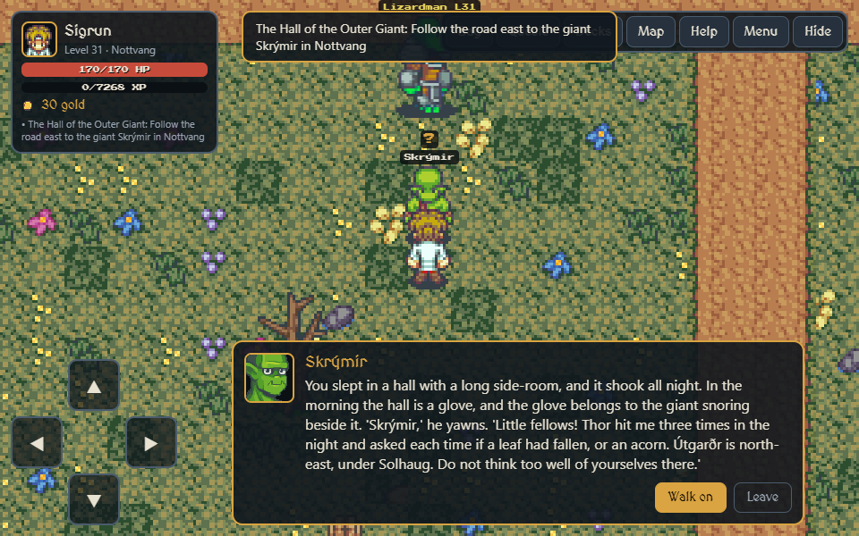

> You slept in a hall with a long side-room, and it shook all night. In the morning the hall is a glove, and the glove belongs to the giant snoring beside it. 'Skrýmir,' he yawns. 'Little fellows! Thor hit me three times in the night and asked each time if a leaf had fallen, or an acorn. Útgarðr is north-east, under Solhaug. Do not think too well of yourselves there.'

Then press "Walk on".

**4. Enter Útgarðr, the hall under Solhaug**

Where: Solhaug. About 150 steps north-east of Skrýmir. *Útgarðr is a hall under the mound in Solhaug, north of Gullskog. Nothing in it is what it looks like.*

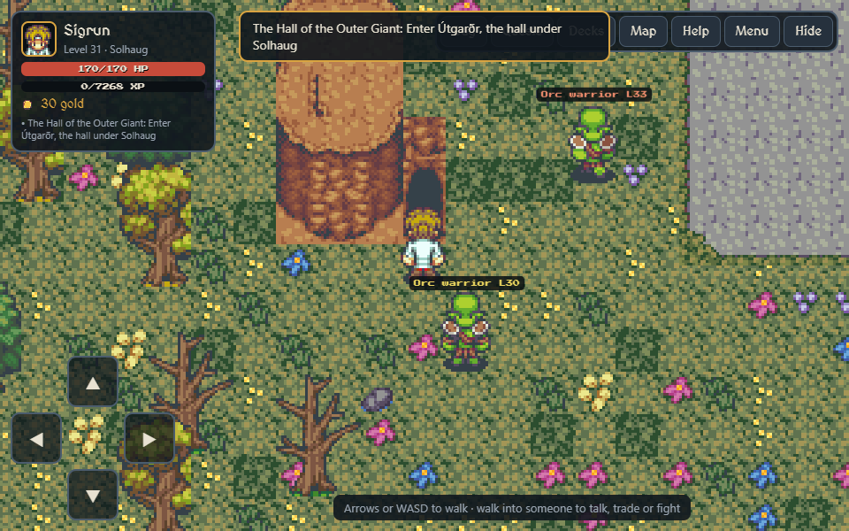

Walk into Utgard.

**5. The eating contest: who is Logi?**

Where: Logi, in Utgard, the cave in Solhaug. Go down into the cave. *The contests are in the deepest hall of Útgarðr. Each one hides a trick.*

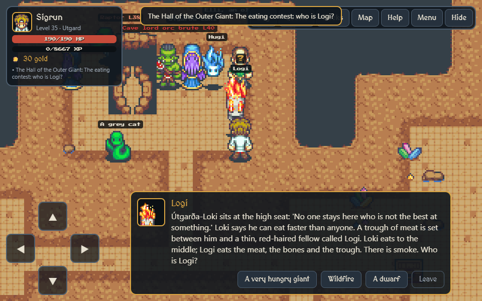

> Útgarða-Loki sits at the high seat: 'No one stays here who is not the best at something.' Loki says he can eat faster than anyone. A trough of meat is set between him and a thin, red-haired fellow called Logi. Loki eats to the middle; Logi eats the meat, the bones and the trough. There is smoke. Who is Logi?

- A very hungry giant
- Wildfire
- A dwarf

The answer

Wildfire.

> Fire. Nothing eats faster than fire, and it eats the trough too. Keep your eyes open; the rest of the hall is like this.

**6. The race: what is Hugi?**

Where: Hugi, in Utgard, the cave in Solhaug. Right beside Logi. *The contests are in the deepest hall of Útgarðr. Each one hides a trick.*

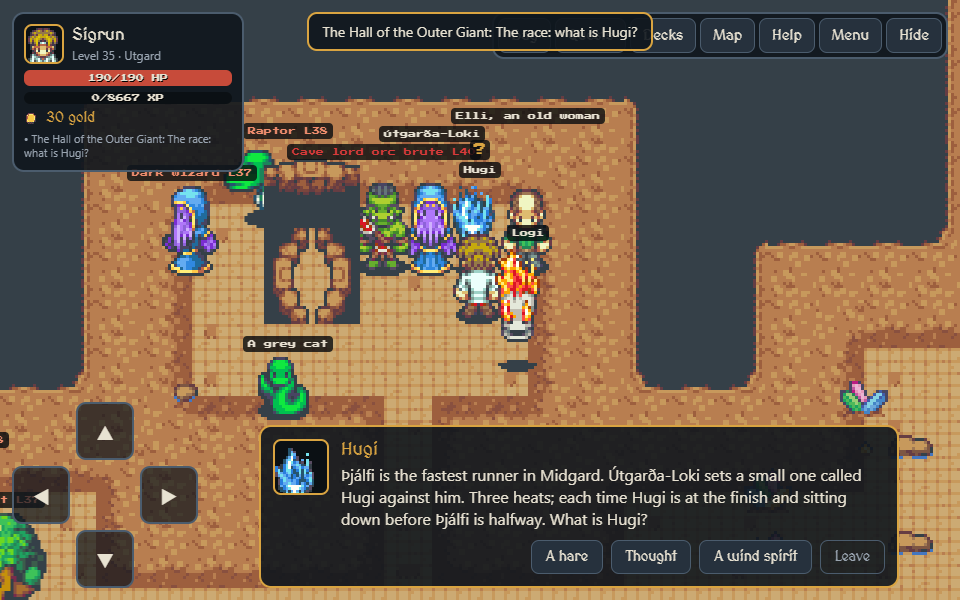

> Þjálfi is the fastest runner in Midgard. Útgarða-Loki sets a small one called Hugi against him. Three heats; each time Hugi is at the finish and sitting down before Þjálfi is halfway. What is Hugi?

- A hare
- Thought
- A wind spirit

The answer

Thought.

> Thought. Nothing runs against thought.

**7. The drinking horn: where does it end?**

Where: Útgarða-Loki, in Utgard, the cave in Solhaug. Right beside Hugi. *The contests are in the deepest hall of Útgarðr. Each one hides a trick.*

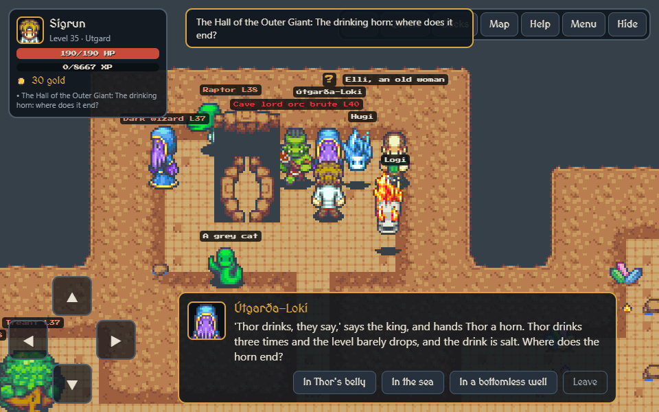

> 'Thor drinks, they say,' says the king, and hands Thor a horn. Thor drinks three times and the level barely drops, and the drink is salt. Where does the horn end?

- In Thor's belly
- In the sea
- In a bottomless well

The answer

In the sea.

> In the sea, and Thor's three draughts are the ebb tide. That is why the sea has tides, says Snorri.

**8. The cat: what is it?**

Where: A grey cat, in Utgard, the cave in Solhaug. Right beside Útgarða-Loki. *The contests are in the deepest hall of Útgarðr. Each one hides a trick.*

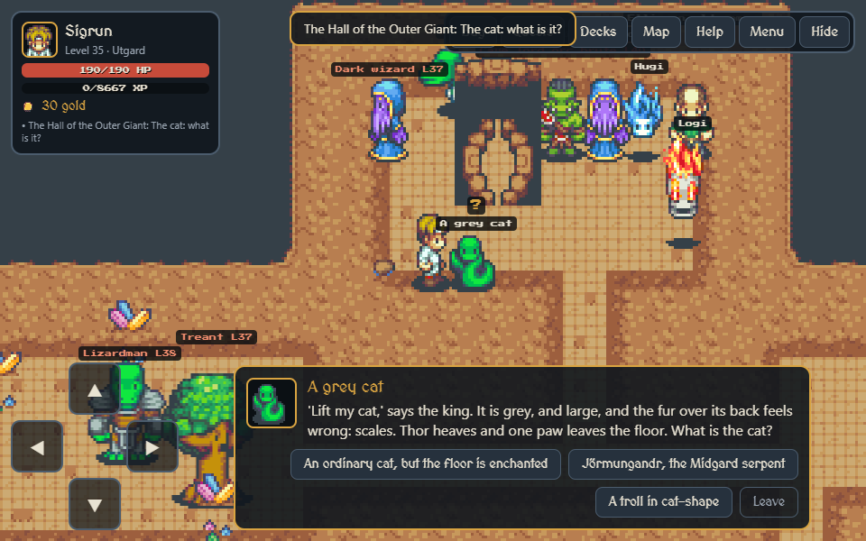

> 'Lift my cat,' says the king. It is grey, and large, and the fur over its back feels wrong: scales. Thor heaves and one paw leaves the floor. What is the cat?

- An ordinary cat, but the floor is enchanted
- Jörmungandr, the Midgard serpent
- A troll in cat-shape

The answer

Jörmungandr, the Midgard serpent.

> The Midgard serpent, whose length girdles the world. Lifting one paw meant lifting the serpent nearly out of the sea.

**9. The wrestling: who is Elli?**

Where: Elli, an old woman, in Utgard, the cave in Solhaug. About 5 steps north-east of a grey cat. *The contests are in the deepest hall of Útgarðr. Each one hides a trick.*

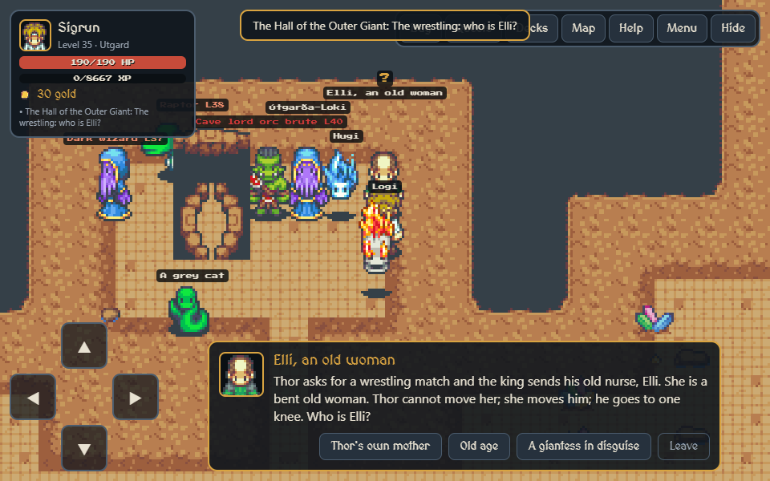

> Thor asks for a wrestling match and the king sends his old nurse, Elli. She is a bent old woman. Thor cannot move her; she moves him; he goes to one knee. Who is Elli?

- Thor's own mother
- Old age
- A giantess in disguise

The answer

Old age.

> Old age, which brings everyone to their knee at last. Thor did better than anyone, they say: only one knee.

**10. Hear Útgarða-Loki's confession**

Where: Útgarða-Loki, in Utgard, the cave in Solhaug. Right beside Elli, an old woman. *Útgarða-Loki is walking you out of his hall. Listen to him.*

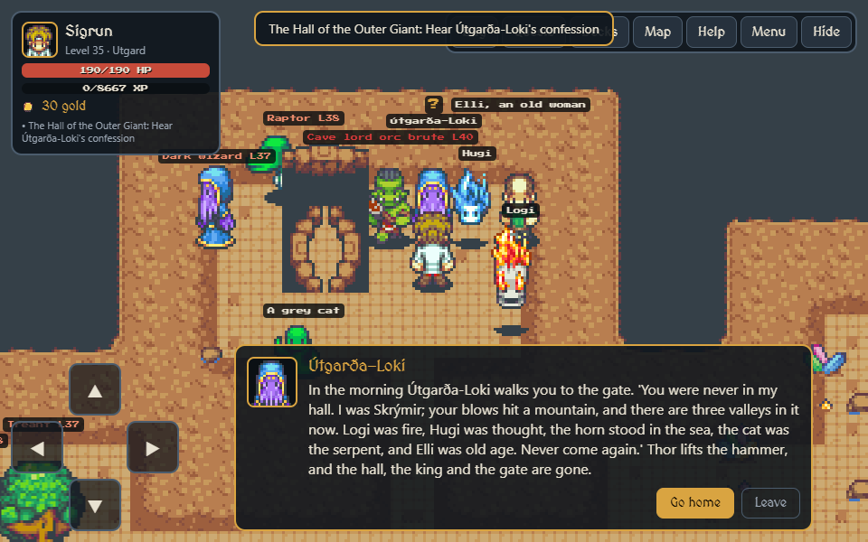

> In the morning Útgarða-Loki walks you to the gate. 'You were never in my hall. I was Skrýmir; your blows hit a mountain, and there are three valleys in it now. Logi was fire, Hugi was thought, the horn stood in the sea, the cat was the serpent, and Elli was old age. Never come again.' Thor lifts the hammer, and the hall, the king and the gate are gone.

Then press "Go home".

**11. Retell the story to Thor**

Where: Thor, in Helmark. About 210 steps south-west of Útgarða-Loki. *Tell it back, and tell it kindly.*

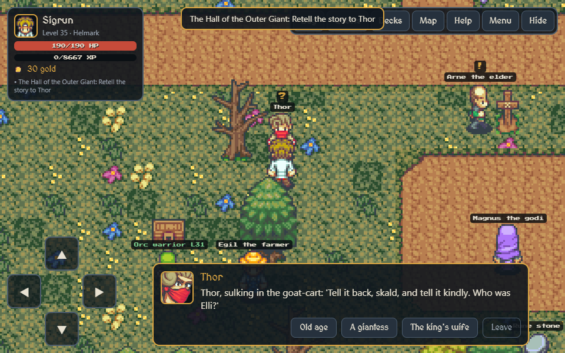

> Thor, sulking in the goat-cart: 'Tell it back, skald, and tell it kindly. Who was Elli?'

- Old age
- A giantess
- The king's wife

The answer

Old age.

> 'Old age. No one beats her. Not even me. Especially not you.'

> Illusions! I would like to hit that giant once, properly. Here: my belt of strength. Wear it and remember which contests are worth entering.

Reward: 814 gold, 9806 XP, the card Thor Vingþórr, Megingjörð.

*Útgarða-Loki is not Loki. The tale explains the tides and mountain valleys, and it is the funniest thing Snorri wrote. Thor lending his belt is the game's invention. Source: Prose Edda, Gylfaginning ch. 44–47.*

### The Bride of Þrymr

*Level 39 · given by Thor in Thursnes · after The Hall of the Outer Giant · 10 steps*

Thor wakes up without his hammer. A giant has it and wants Freyja as his wife in exchange. Freyja's answer is short. Heimdallr's plan is worse, and Thor will have to wear a veil for it.

**Taking it up.** Find Thor in Thursnes, about 310 steps south-east of Eikthorp.

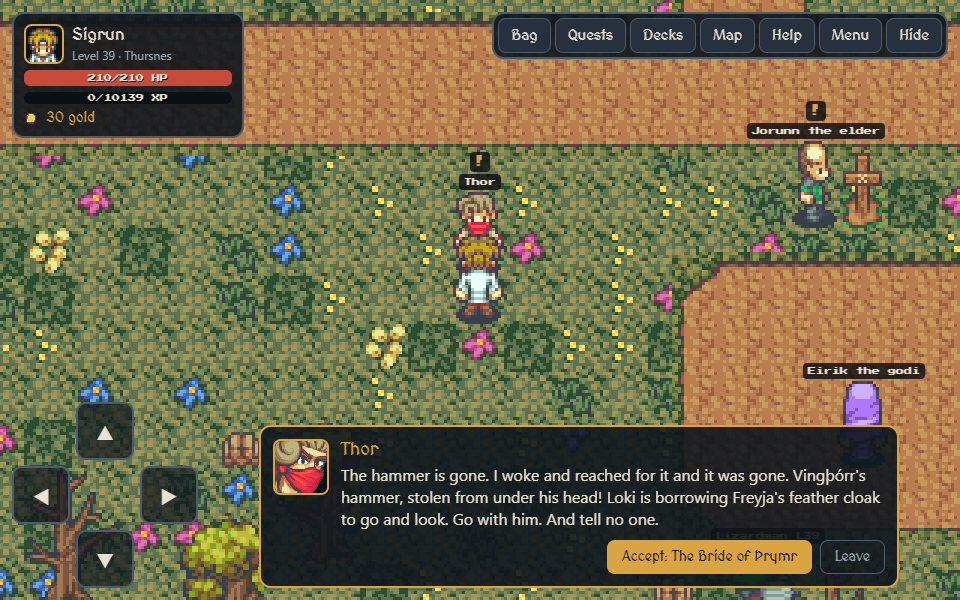

> The hammer is gone. I woke and reached for it and it was gone. Vingþórr's hammer, stolen from under his head! Loki is borrowing Freyja's feather cloak to go and look. Go with him. And tell no one.

**1. Hear what Loki found**

Where: Loki, in Thursnes. About 4 steps south of Thor. *Loki has flown to Jötunheim and back. He is west of the hamlet, out of breath.*

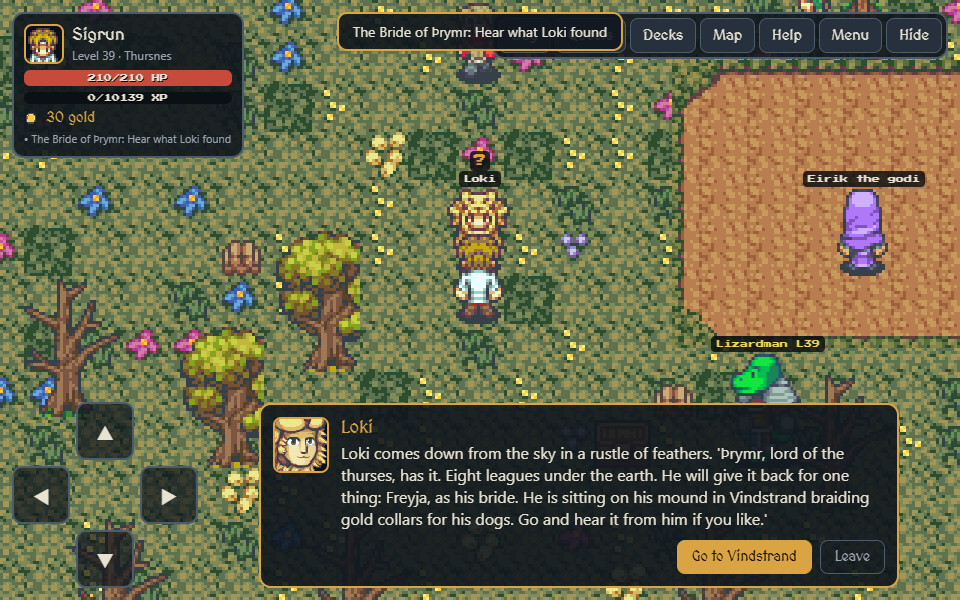

> Loki comes down from the sky in a rustle of feathers. 'Þrymr, lord of the thurses, has it. Eight leagues under the earth. He will give it back for one thing: Freyja, as his bride. He is sitting on his mound in Vindstrand braiding gold collars for his dogs. Go and hear it from him if you like.'

Then press "Go to Vindstrand".

**2. Hear Þrymr's terms on his mound in Vindstrand**

Where: Þrymr, lord of the thurses, in Vindstrand. About 120 steps south-west of Loki. *Þrymr sits on a mound in Vindstrand, west across the hills. He wants to tell you his terms himself.*

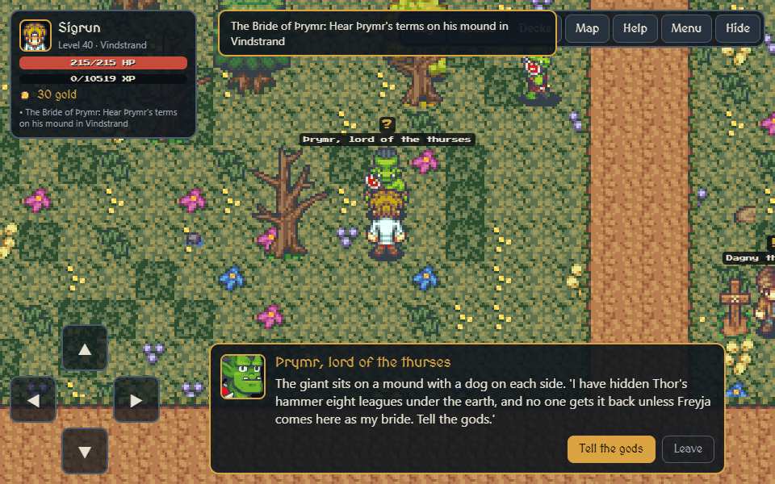

> The giant sits on a mound with a dog on each side. 'I have hidden Thor's hammer eight leagues under the earth, and no one gets it back unless Freyja comes here as my bride. Tell the gods.'

Then press "Tell the gods".

**3. Ask Freyja**

Where: Freyja, in Thursnes. About 150 steps north-east of Þrymr, lord of the thurses. *Somebody has to ask Freyja. Everybody would rather it was you.*

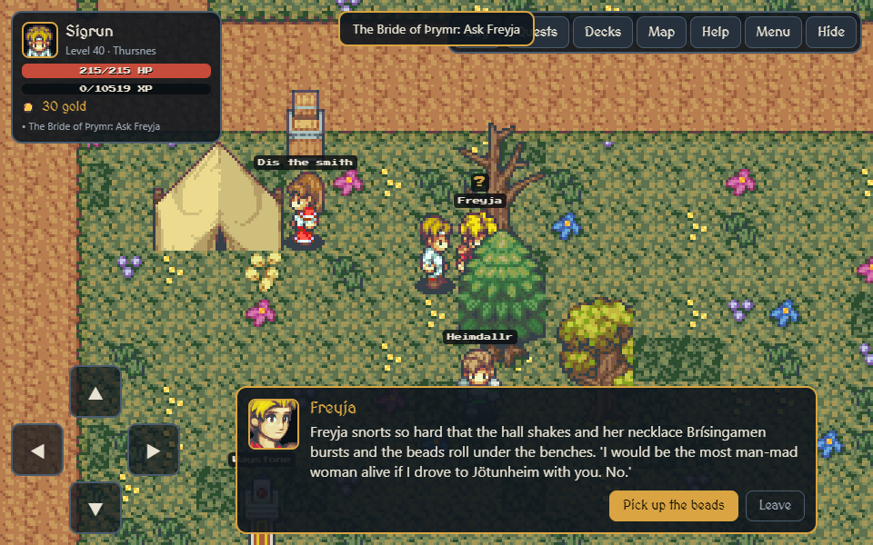

> Freyja snorts so hard that the hall shakes and her necklace Brísingamen bursts and the beads roll under the benches. 'I would be the most man-mad woman alive if I drove to Jötunheim with you. No.'

Then press "Pick up the beads".

**4. Gather the beads of Brísingamen: open the strongbox in Thursnes they were swept into**

Where: Thursnes. About 19 steps west of Freyja. *The beads were swept into a strongbox by a helpful thrall. Find it; something guards it now.*

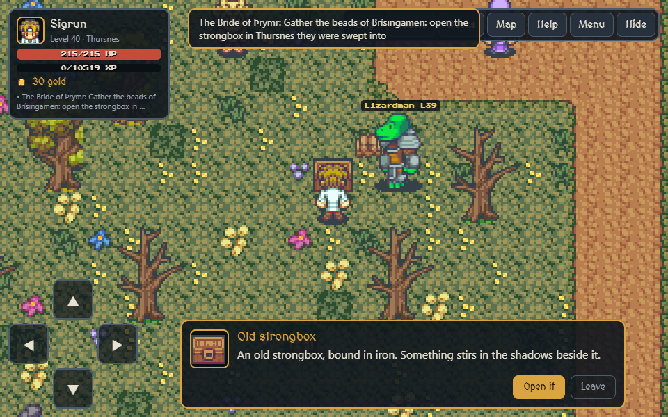

Open a strongbox in Thursnes. Whatever guards it fights first.

**5. Hear Heimdallr's plan**

Where: Heimdallr, in Thursnes. About 19 steps east of the strongbox. *The council is deciding who wears the veil. Heimdallr has an idea; Thor hates it.*

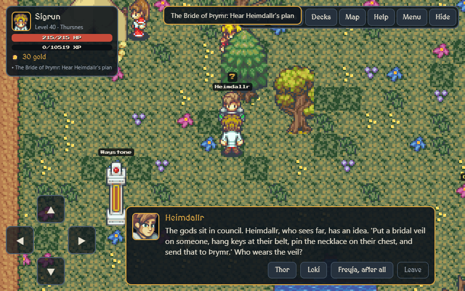

> The gods sit in council. Heimdallr, who sees far, has an idea. 'Put a bridal veil on someone, hang keys at their belt, pin the necklace on their chest, and send that to Þrymr.' Who wears the veil?

- Thor
- Loki
- Freyja, after all

The answer

Thor.

> 'Thor. Wide skirts, the bridal linen, the veil, and Brísingamen on his chest. Loki goes as the bridesmaid.' Thor says he will be called unmanly. Loki says he will be called hammerless.

**6. Dress the bride**

Where: Thor, in Thursnes. About 20 steps west of Heimdallr. *Thor is being dressed. Do not laugh where he can see you.*

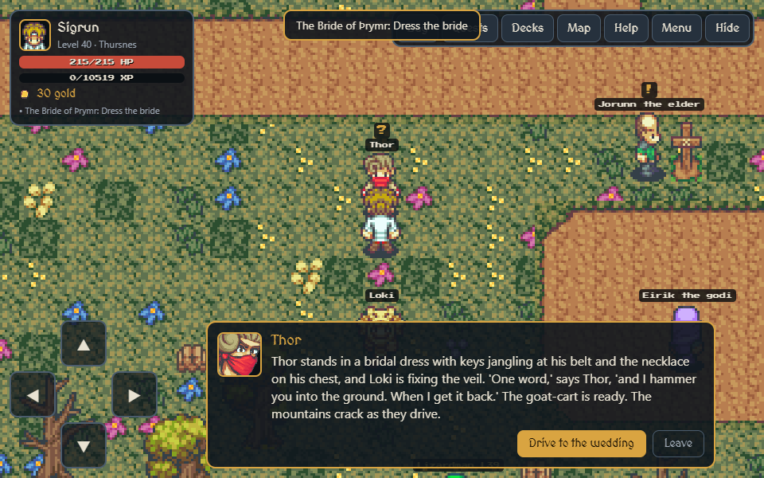

> Thor stands in a bridal dress with keys jangling at his belt and the necklace on his chest, and Loki is fixing the veil. 'One word,' says Thor, 'and I hammer you into the ground. When I get it back.' The goat-cart is ready. The mountains crack as they drive.

Then press "Drive to the wedding".

**7. The wedding feast: cover for the bride**

Where: Þrymr, at his wedding, in Vindstrand. About 120 steps south-west of Thor. *You are serving at Þrymr's feast in Vindstrand. The bride is eating far too much.*

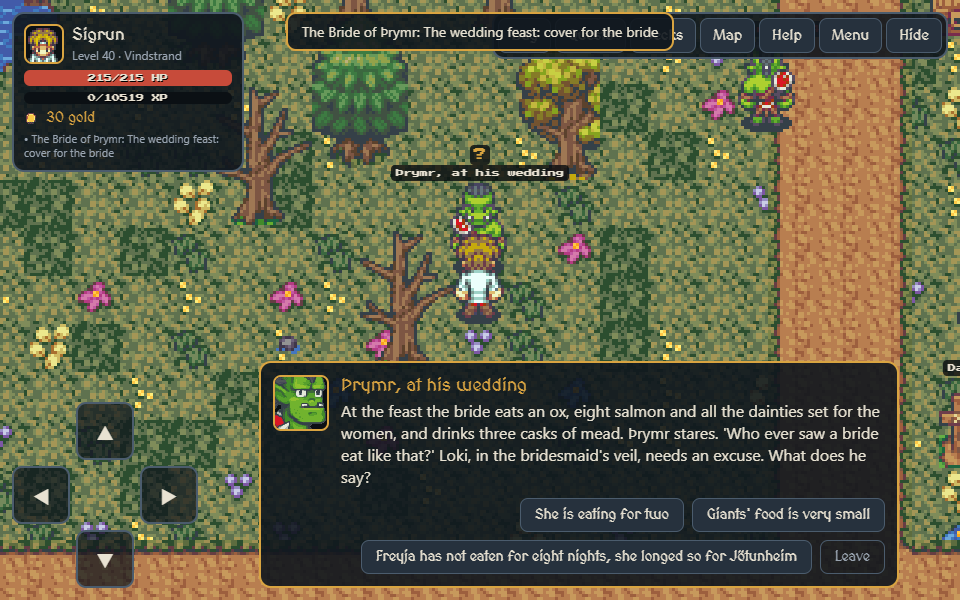

> At the feast the bride eats an ox, eight salmon and all the dainties set for the women, and drinks three casks of mead. Þrymr stares. 'Who ever saw a bride eat like that?' Loki, in the bridesmaid's veil, needs an excuse. What does he say?

- She is eating for two
- Giants' food is very small
- Freyja has not eaten for eight nights, she longed so for Jötunheim

The answer

Freyja has not eaten for eight nights, she longed so for Jötunheim.

> Þrymr melts at that. Then he lifts the veil to kiss her and springs back down the hall: the bride's eyes burn like fire.

**8. The bride's burning eyes**

Where: Þrymr, at his wedding, in Vindstrand. Stay where you are. *Þrymr has seen the bride's eyes. Loki needs another excuse.*

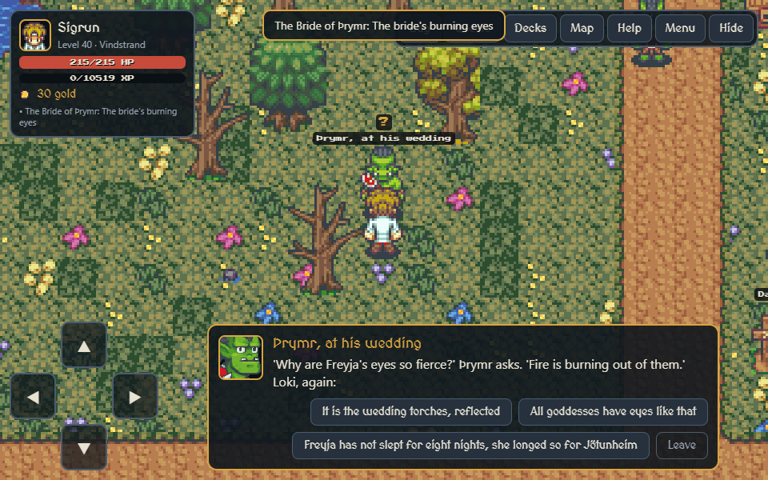

> 'Why are Freyja's eyes so fierce?' Þrymr asks. 'Fire is burning out of them.' Loki, again:

- It is the wedding torches, reflected
- All goddesses have eyes like that
- Freyja has not slept for eight nights, she longed so for Jötunheim

The answer

Freyja has not slept for eight nights, she longed so for Jötunheim.

> Þrymr's sister asks for the bridal gift. Þrymr calls for the hammer to hallow the bride, and it is laid in her lap.

**9. The hammer is in the bride's lap. Fight!**

Where: Þrymr, lord of the thurses, level 44, in Vindstrand. Right beside Þrymr, at his wedding. *Thor has Mjölnir in his hands and the veil on his head. Help him clear the hall in Vindstrand.*

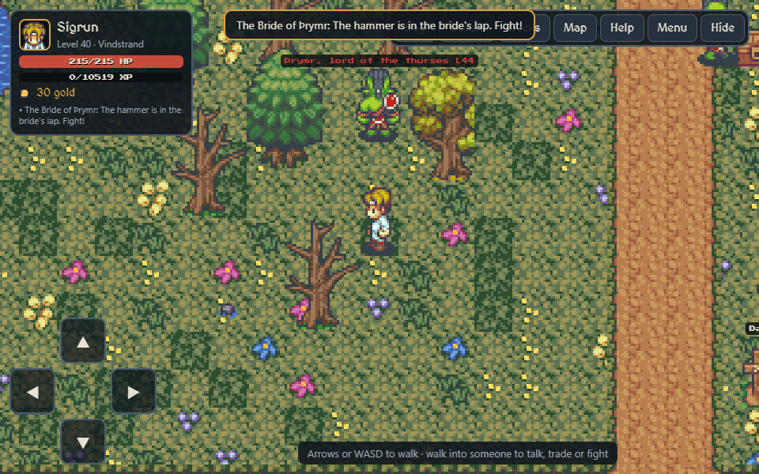

A fight of Bindrune against Þrymr, lord of the thurses, level 44. This foe is only here while this step of the story is playing. Walk into it when you are ready.

**10. Retell the story to Thor**

Where: Thor, in Thursnes. About 120 steps north-east of Þrymr, lord of the thurses. *Tell it, and leave out the dress.*

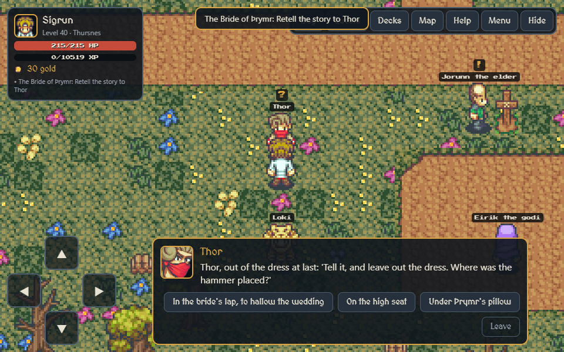

> Thor, out of the dress at last: 'Tell it, and leave out the dress. Where was the hammer placed?'

- In the bride's lap, to hallow the wedding
- On the high seat
- Under Þrymr's pillow

The answer

In the bride's lap, to hallow the wedding.

> 'In my lap. Then in Þrymr's skull, and his sister's, and every giant's in the hall. That is the part to tell.'

> Freyja says a skald who crawled under benches for her beads may keep the necklace she strung from the spare ones. Nobody speaks of the dress.

Reward: 915 gold, 11992 XP, the card Freyja, Lady of Fólkvangr, the card Heimdallr's Watch, Brísingamen.

*Thor's-hammer amulets were common in the Viking Age, and this poem suggests the hammer was used to bless brides. The spare necklace is the game's invention. Source: Poetic Edda, Þrymskviða.*

### The Kettle and the Serpent

*Level 47 · given by Ægir, the sea giant in Hlesey · after The Bride of Þrymr · 7 steps*

Ægir will brew for the gods if they bring him a kettle a league deep. The only one is in Hymir's hall beyond the ice-rivers, and getting it means a fishing trip with Thor that nobody else would take.

**Taking it up.** Find Ægir, the sea giant, in Hlesey, about 380 steps east of Eikthorp.

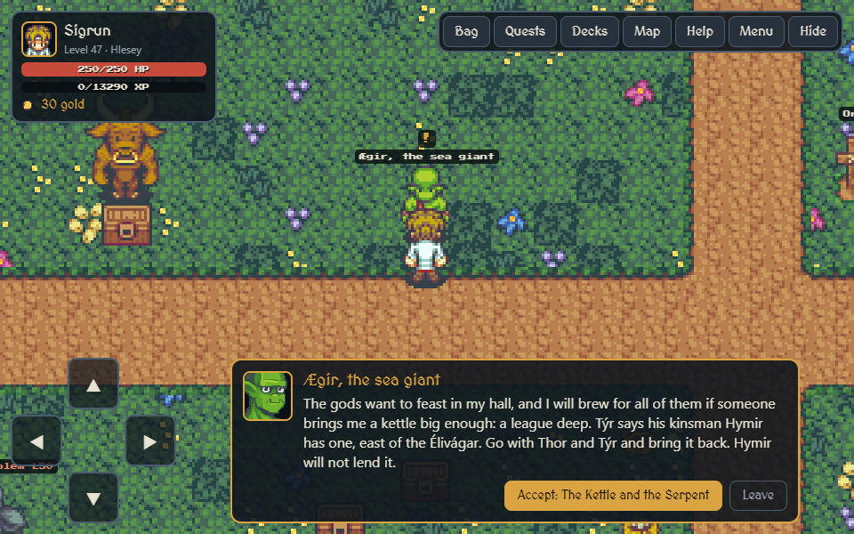

> The gods want to feast in my hall, and I will brew for all of them if someone brings me a kettle big enough: a league deep. Týr says his kinsman Hymir has one, east of the Élivágar. Go with Thor and Týr and bring it back. Hymir will not lend it.

**1. Speak with Týr about Hymir**

Where: Týr, in Hlesey. About 6 steps south-east of Ægir, the sea giant. *Týr is on the shore. He knows the way to Hymir's hall.*

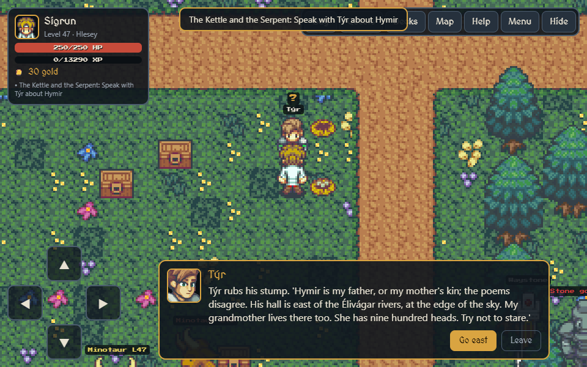

> Týr rubs his stump. 'Hymir is my father, or my mother's kin; the poems disagree. His hall is east of the Élivágar rivers, at the edge of the sky. My grandmother lives there too. She has nine hundred heads. Try not to stare.'

Then press "Go east".

**2. Find Hymir's hall east of the Élivágar**

Where: Hymir's wife, Týr's mother, in Elivagar. About 130 steps north-east of Týr. *Hymir's hall is in Elivagar, the frozen river-land north-east of Hlesey. His wife will hide you.*

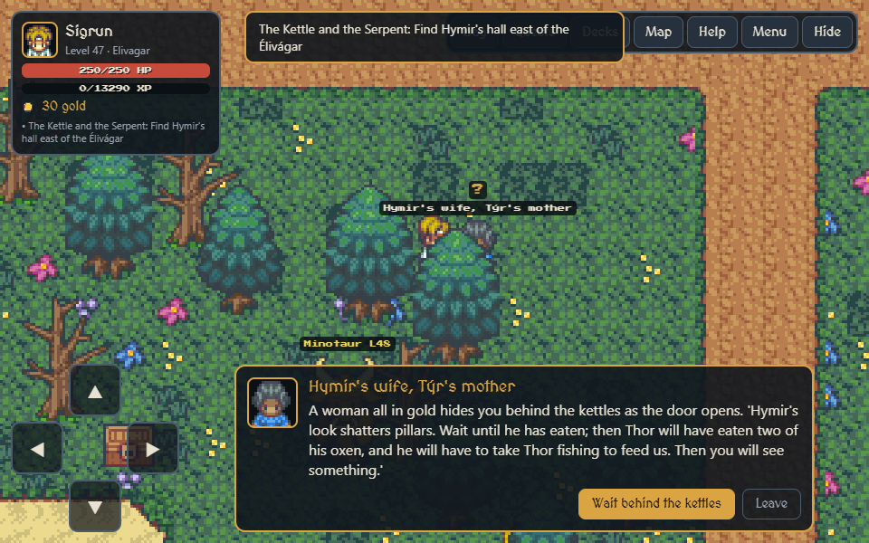

> A woman all in gold hides you behind the kettles as the door opens. 'Hymir's look shatters pillars. Wait until he has eaten; then Thor will have eaten two of his oxen, and he will have to take Thor fishing to feed us. Then you will see something.'

Then press "Wait behind the kettles".

**3. Bait: take the head of Hymir's ox Himinhrjótr**

Where: Himinhrjótr, Hymir's ox, level 48, in Elivagar. About 13 steps north-east of Hymir's wife, Týr's mother. *Thor needs bait. Hymir's ox Himinhrjótr grazes north-east of the hall, and Thor wants its head.*

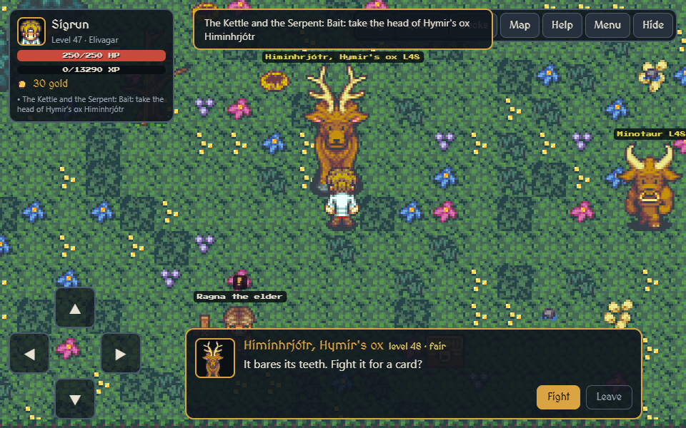

A fight of Bindrune against Himinhrjótr, Hymir's ox, level 48. This foe is only here while this step of the story is playing. Walk into it when you are ready.

**4. The fishing: hold the line against Jörmungandr**

Where: Jörmungandr, hooked, level 52, in Elivagar. About 13 steps south of Himinhrjótr, Hymir's ox. *Thor has rowed farther than Hymir dared, and the ox-head is on the hook. Something under the boat, by the south-east shore, has taken it. Hold on.*

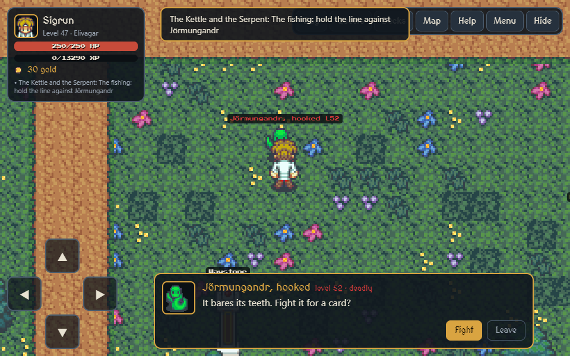

A fight of Bindrune against Jörmungandr, hooked, level 52. This foe is only here while this step of the story is playing. Walk into it when you are ready.

**5. The unbreakable cup**

Where: Hymir's wife, Týr's mother, in Elivagar. About 14 steps west of Jörmungandr, hooked. *Hymir's cup will not break. His wife knows where to aim it.*

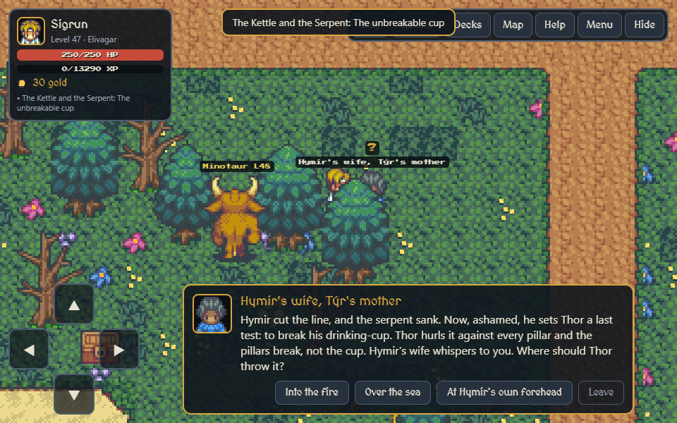

> Hymir cut the line, and the serpent sank. Now, ashamed, he sets Thor a last test: to break his drinking-cup. Thor hurls it against every pillar and the pillars break, not the cup. Hymir's wife whispers to you. Where should Thor throw it?

- Into the fire
- Over the sea
- At Hymir's own forehead

The answer

At Hymir's own forehead.

> The cup shatters on Hymir's skull, the hardest thing in the hall. 'Take the kettle,' the giant says, 'if you can lift it.' Thor puts it on his head like a hat and walks out.

**6. Carry the kettle home: beat off 3 of Hymir's giants on the road**

Where: Elivagar. About 4 steps south-west of Hymir's wife, Týr's mother. *Hymir's kin are following you out of Elivagar with the kettle. Three of them at least.*

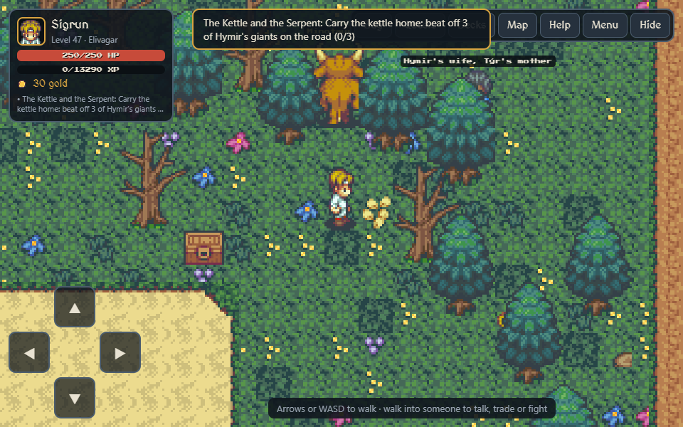

Win 3 fights against anything that roams Elivagar.

**7. Retell the story to Ægir**

Where: Ægir, the sea giant, in Hlesey. About 120 steps south-west of where you fought. *Tell me about the fishing.*

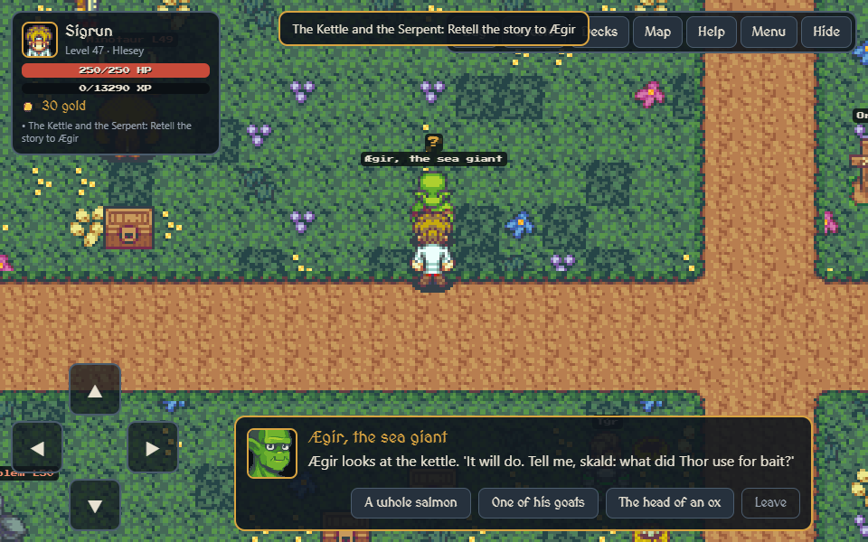

> Ægir looks at the kettle. 'It will do. Tell me, skald: what did Thor use for bait?'

- A whole salmon
- One of his goats
- The head of an ox

The answer

The head of an ox.

> 'Himinhrjótr's head. And the serpent bit. The picture-stones at Altuna and Gosforth show it, feet through the boat and all.'

> Brew for the gods, then. Thor left his iron gloves on my bench; he has another pair. Wear them and you will hold anything, even a hooked serpent.

Reward: 894 gold, 12141 XP, the card Jörmungandr, Járngreipr.

*Picture-stones in Sweden, England and Denmark show Thor's fishing centuries before Snorri wrote. In Snorri, Hymir cuts the line; the serpent lives to meet Thor again at Ragnarök. Source: Poetic Edda, Hymiskviða; Prose Edda, Gylfaginning ch. 48.*

### Thor and Hrungnir

*Level 55 · given by Odin in Eldnes · after The Kettle and the Serpent · 8 steps*

Odin raced a giant to the gates of Asgard and won, and the giant followed him in and got drunk. Thor comes home to find him threatening everyone, and a duel is set on the border. There is a clay giant, a whetstone, and a charm that does not get finished.

**Taking it up.** Find Odin in Eldnes, about 380 steps south-east of Eikthorp.

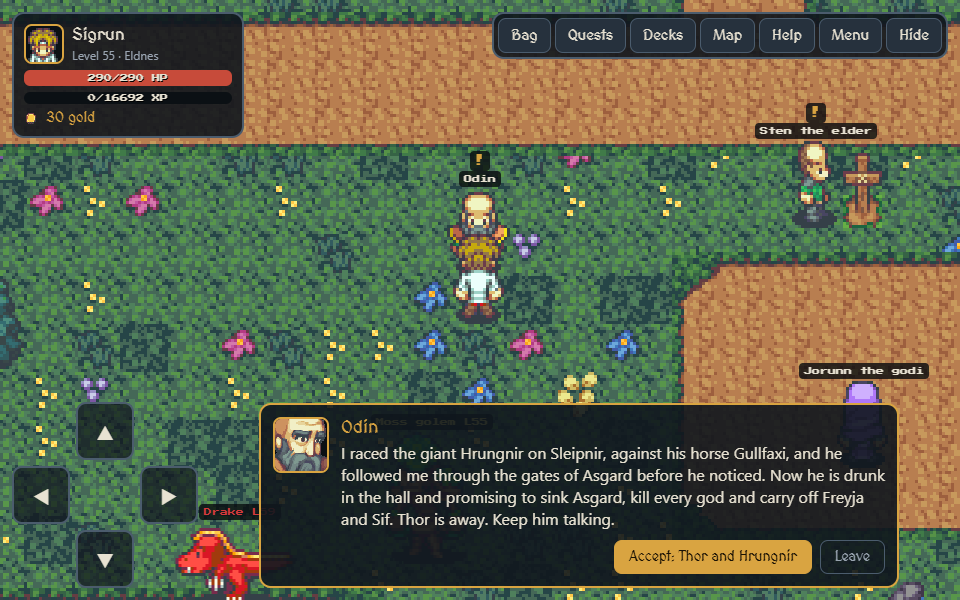

> I raced the giant Hrungnir on Sleipnir, against his horse Gullfaxi, and he followed me through the gates of Asgard before he noticed. Now he is drunk in the hall and promising to sink Asgard, kill every god and carry off Freyja and Sif. Thor is away. Keep him talking.

**1. Keep Hrungnir busy in the hall**

Where: Hrungnir, drunk, in Eldnes. About 4 steps south of Odin. *Hrungnir is west of the hamlet drinking. Keep him drinking.*

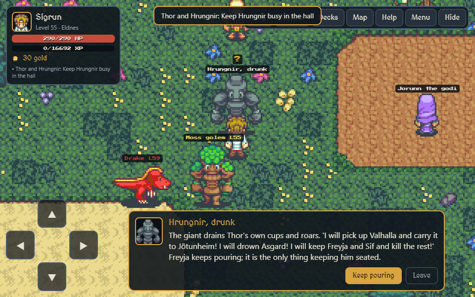

> The giant drains Thor's own cups and roars. 'I will pick up Valhalla and carry it to Jötunheim! I will drown Asgard! I will keep Freyja and Sif and kill the rest!' Freyja keeps pouring; it is the only thing keeping him seated.

Then press "Keep pouring".

**2. Decide with Odin**

Where: Odin, in Eldnes. About 4 steps north of Hrungnir, drunk. *I want a decision. There is only one good one.*

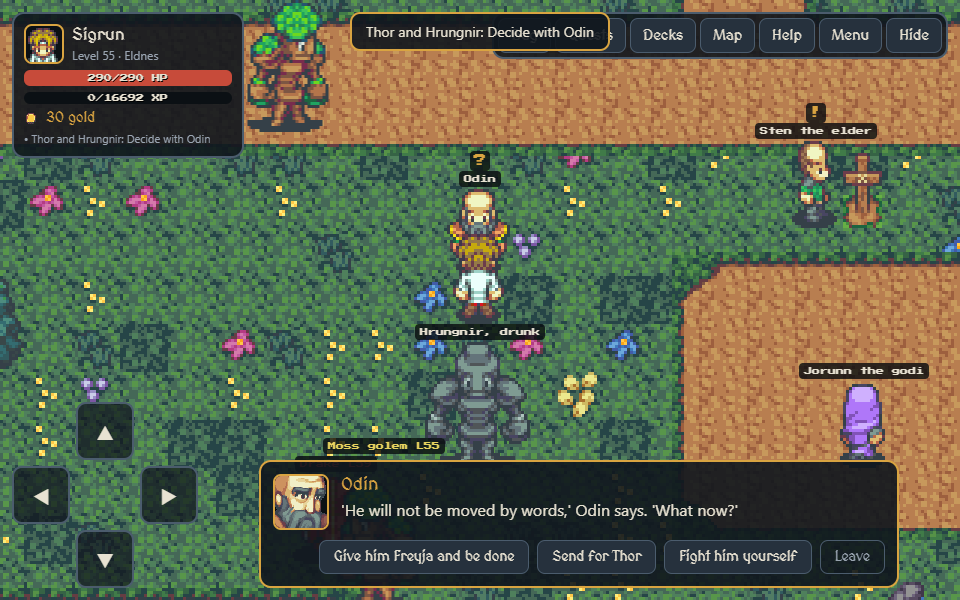

> 'He will not be moved by words,' Odin says. 'What now?'

- Give him Freyja and be done
- Send for Thor
- Fight him yourself

The answer

Send for Thor.

> Thor arrives with the hammer raised. Hrungnir, unarmed, claims guest-right; so they agree to a duel at Grjótúnagarðar, the stone-fenced yards, and the giant rides home to arm.

**3. Hear Þjálfi's plan**

Where: Þjálfi, Thor's servant, in Eldnes. About 20 steps east of Odin. *Þjálfi has a trick for the duel. He is east of the hamlet, tying his shoes.*

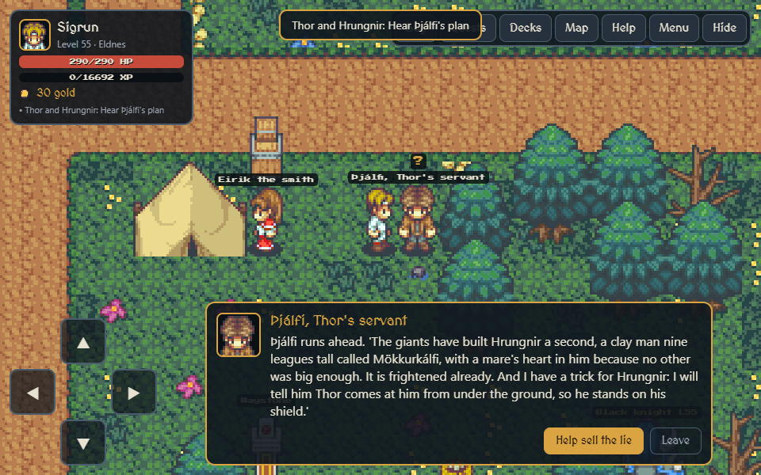

> Þjálfi runs ahead. 'The giants have built Hrungnir a second, a clay man nine leagues tall called Mökkurkálfi, with a mare's heart in him because no other was big enough. It is frightened already. And I have a trick for Hrungnir: I will tell him Thor comes at him from under the ground, so he stands on his shield.'

Then press "Help sell the lie".

**4. The duel at Grjótúnagarðar: fight Mökkurkálfi with Þjálfi**

Where: Mökkurkálfi the clay giant, level 58, in Grjotunagard. About 190 steps north-east of Þjálfi, Thor's servant. *Grjótúnagarðar lies north of here, past Hlesey and Elivagar. Þjálfi takes the clay giant; the clay giant is already wetting himself, says Snorri.*

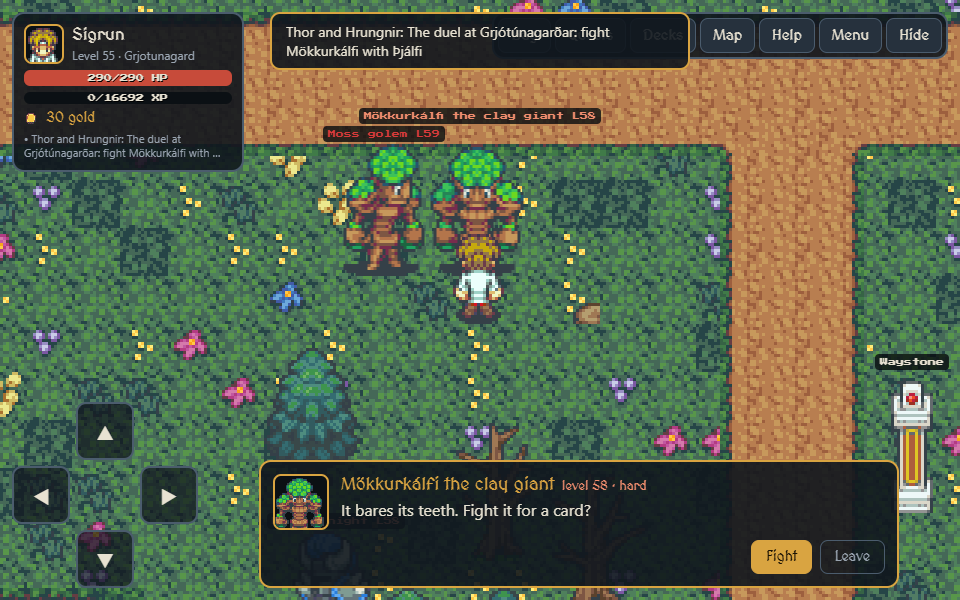

A fight of Bindrune against Mökkurkálfi the clay giant, level 58. This foe is only here while this step of the story is playing. Walk into it when you are ready.

**5. Hrungnir stands on his shield. Face him with Thor**

Where: Hrungnir, stone-hearted, level 60, in Grjotunagard. About 12 steps north-east of Mökkurkálfi the clay giant. *Hrungnir is on his shield with his whetstone raised, in the north of Grjótúnagarðar. Thor's hammer is in the air. Help finish it.*

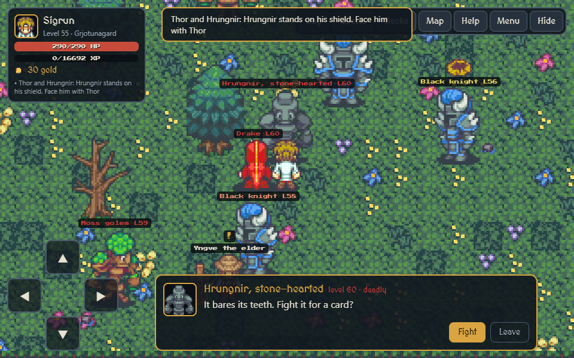

A fight of Bindrune against Hrungnir, stone-hearted, level 60. This foe is only here while this step of the story is playing. Walk into it when you are ready.

**6. Get Hrungnir's leg off Thor**

Where: Odin, in Eldnes. About 200 steps south-west of Hrungnir, stone-hearted. *Thor lies under Hrungnir's leg and no god can shift it.*

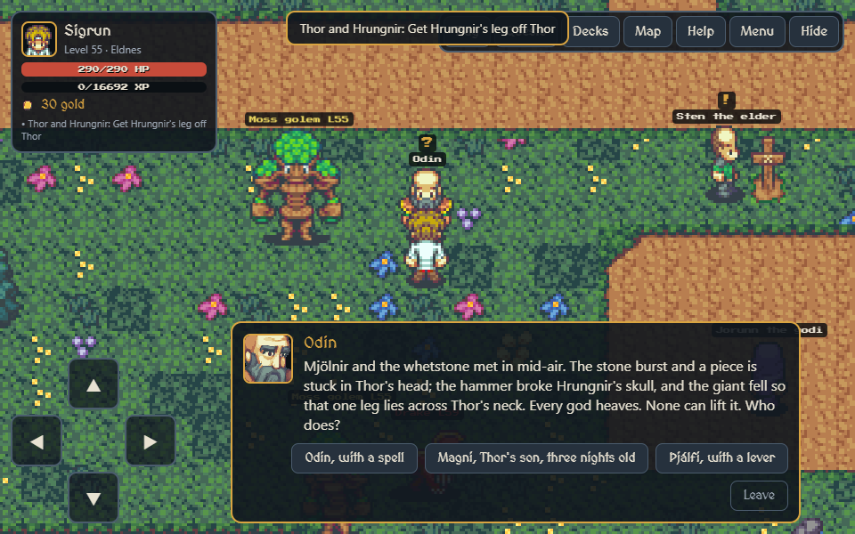

> Mjölnir and the whetstone met in mid-air. The stone burst and a piece is stuck in Thor's head; the hammer broke Hrungnir's skull, and the giant fell so that one leg lies across Thor's neck. Every god heaves. None can lift it. Who does?

- Odin, with a spell
- Magni, Thor's son, three nights old
- Þjálfi, with a lever

The answer

Magni, Thor's son, three nights old.

> Magni, three nights old, throws the leg off and says he wishes he had come sooner: he would have punched the giant to Hel. Thor gives him Gullfaxi, and Odin sulks about it.

**7. Groa's charm**

Where: Groa, come north, in Eldnes. About 20 steps east of Odin. *Groa is east of the hamlet singing over Thor. Do not interrupt her. Thor will.*

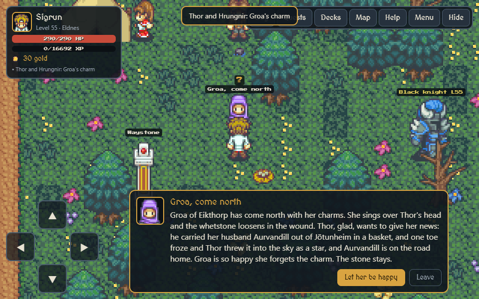

> Groa of Eikthorp has come north with her charms. She sings over Thor's head and the whetstone loosens in the wound. Thor, glad, wants to give her news: he carried her husband Aurvandill out of Jötunheim in a basket, and one toe froze and Thor threw it into the sky as a star, and Aurvandill is on the road home. Groa is so happy she forgets the charm. The stone stays.

Then press "Let her be happy".

**8. Retell the story to Odin**

Where: Odin, in Eldnes. About 20 steps west of Groa, come north. *Tell it back, skald.*

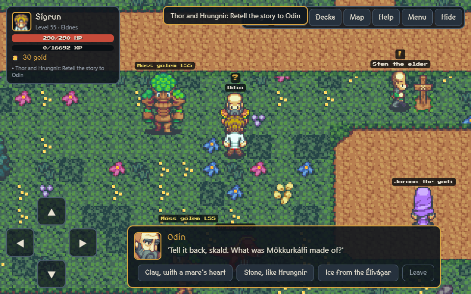

> 'Tell it back, skald. What was Mökkurkálfi made of?'

- Clay, with a mare's heart
- Stone, like Hrungnir
- Ice from the Élivágar

The answer

Clay, with a mare's heart.

> 'Clay, and it was frightened to death. Hrungnir was the stone: stone head, stone heart, stone shield. Well told.'

> A piece of the whetstone flew wide and fell at my feet; take it. And never throw a whetstone across a floor: Snorri says the one in Thor's head moves when you do.

Reward: 1122 gold, 16946 XP, the card Hrungnir, Shard of Hrungnir's whetstone.

*Aurvandill's toe became a star (which one is debated), and Gróa's forgotten charm is why whetstones must not be thrown across floors. Groa of Eikthorp being that Gróa is the game's invention. Source: Prose Edda, Skáldskaparmál ch. 17 (G24); Haustlöng.*

## Act 3: Twilight

Levels 64 to 79. Baldr dies, and Loki stops being funny.

### The Death of Baldr

*Level 64 · given by Odin in Breidablik · after Thor and Hrungnir · 13 steps*

Baldr dreams of his death. Everything in the world swears not to harm him, except one plant too young to ask. This is where the stories stop being funny. Ride to Hel's bridge, count who weeps, and find the one who will not.

**Taking it up.** Find Odin in Breidablik, about 500 steps east of Eikthorp.

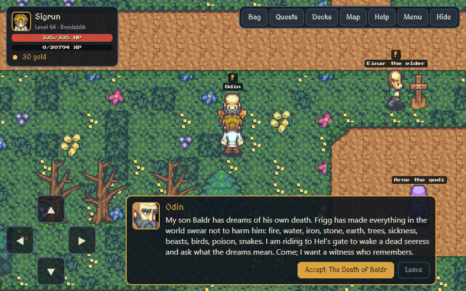

> My son Baldr has dreams of his own death. Frigg has made everything in the world swear not to harm him: fire, water, iron, stone, earth, trees, sickness, beasts, birds, poison, snakes. I am riding to Hel's gate to wake a dead seeress and ask what the dreams mean. Come; I want a witness who remembers.

**1. Hear Baldr's dreams at Breiðablik**

Where: Baldr the Bright, in Breidablik. About 20 steps east of Odin. *Baldr is east of the hall. Hear him out before we ride.*

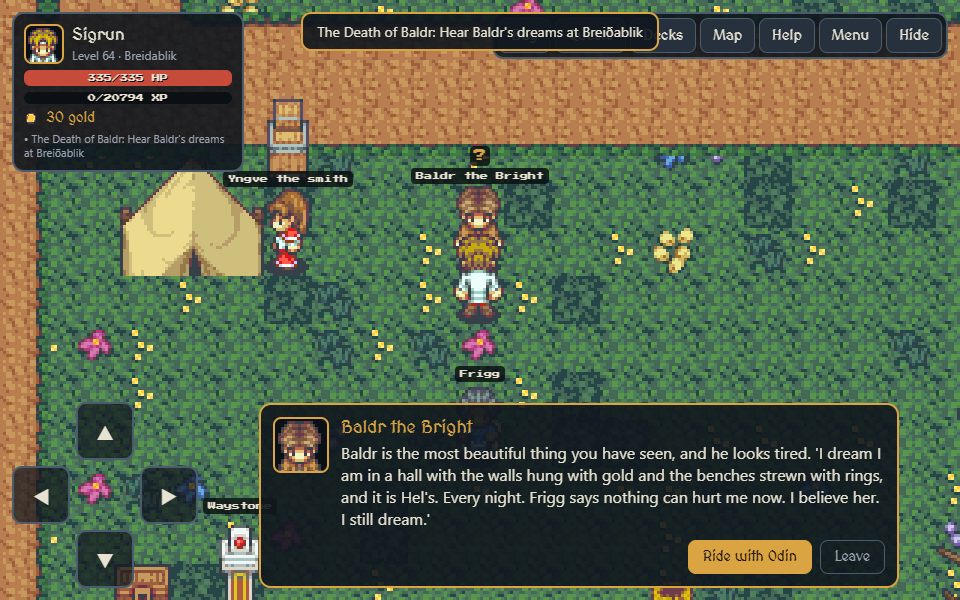

> Baldr is the most beautiful thing you have seen, and he looks tired. 'I dream I am in a hall with the walls hung with gold and the benches strewn with rings, and it is Hel's. Every night. Frigg says nothing can hurt me now. I believe her. I still dream.'

Then press "Ride with Odin".

**2. Find the dead völva in Nottskog**

Where: A dead völva, in Nottskog. About 70 steps south-west of Baldr the Bright. *The seeress lies in a grave in Nottskog, the night-wood west of Breiðablik. Odin will wake her.*

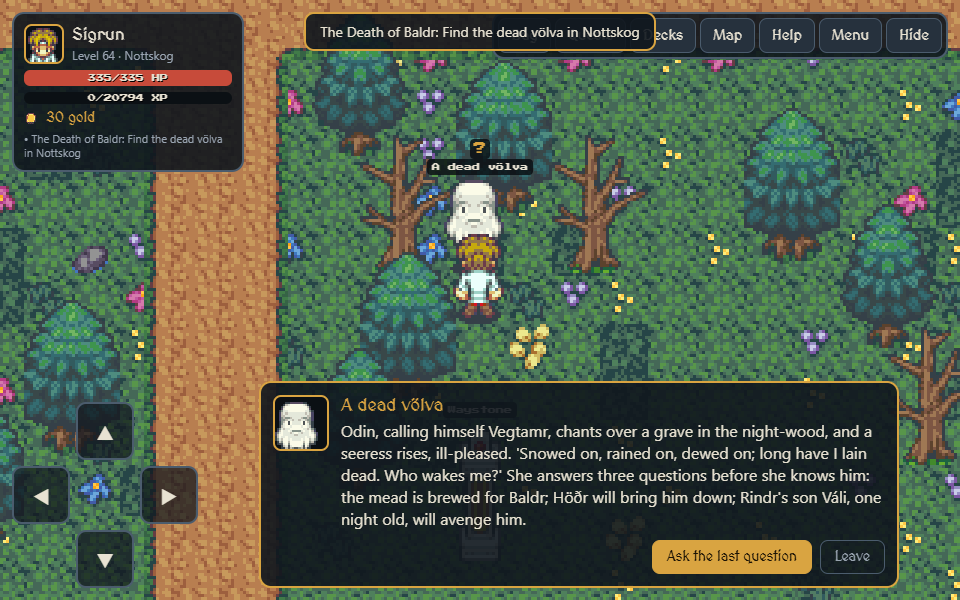

> Odin, calling himself Vegtamr, chants over a grave in the night-wood, and a seeress rises, ill-pleased. 'Snowed on, rained on, dewed on; long have I lain dead. Who wakes me?' She answers three questions before she knows him: the mead is brewed for Baldr; Höðr will bring him down; Rindr's son Váli, one night old, will avenge him.

Then press "Ask the last question".

**3. Who will be Baldr's bane?**

Where: A dead völva, in Nottskog. Stay where you are. *The völva has answered. Say it back.*

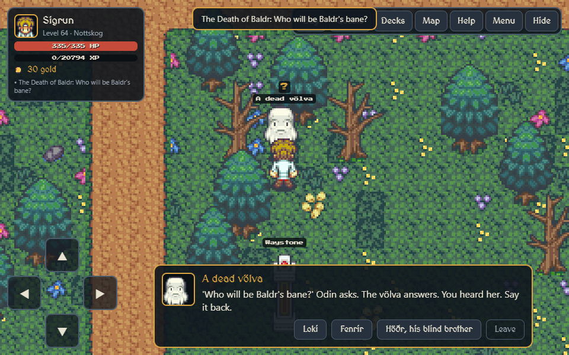

> 'Who will be Baldr's bane?' Odin asks. The völva answers. You heard her. Say it back.

- Loki
- Fenrir
- Höðr, his blind brother

The answer

Höðr, his blind brother.

> 'Höðr. Now go home, Odin; I know you by the way you ask. No one wakes me again until Loki slips his bonds and the gods' doom comes.'

**4. Report to Frigg**

Where: Frigg, in Breidablik. About 70 steps north-east of a dead völva. *Frigg is east of the hall, counting oaths.*

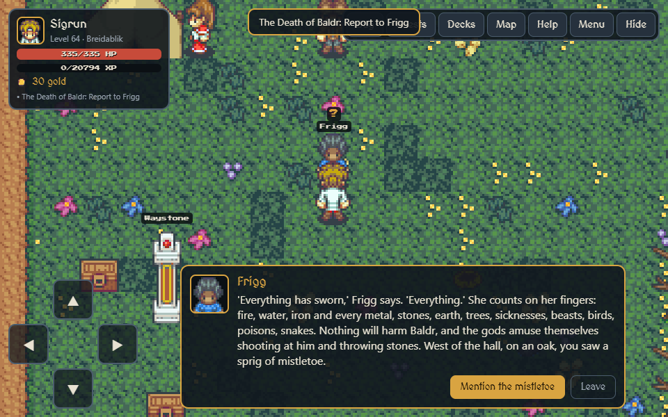

> 'Everything has sworn,' Frigg says. 'Everything.' She counts on her fingers: fire, water, iron and every metal, stones, earth, trees, sicknesses, beasts, birds, poisons, snakes. Nothing will harm Baldr, and the gods amuse themselves shooting at him and throwing stones. West of the hall, on an oak, you saw a sprig of mistletoe.

Then press "Mention the mistletoe".

**5. Warn Frigg about the mistletoe**

Where: Frigg, in Breidablik. Stay where you are. *Tell Frigg what you saw on the oak. She will answer as she always does.*

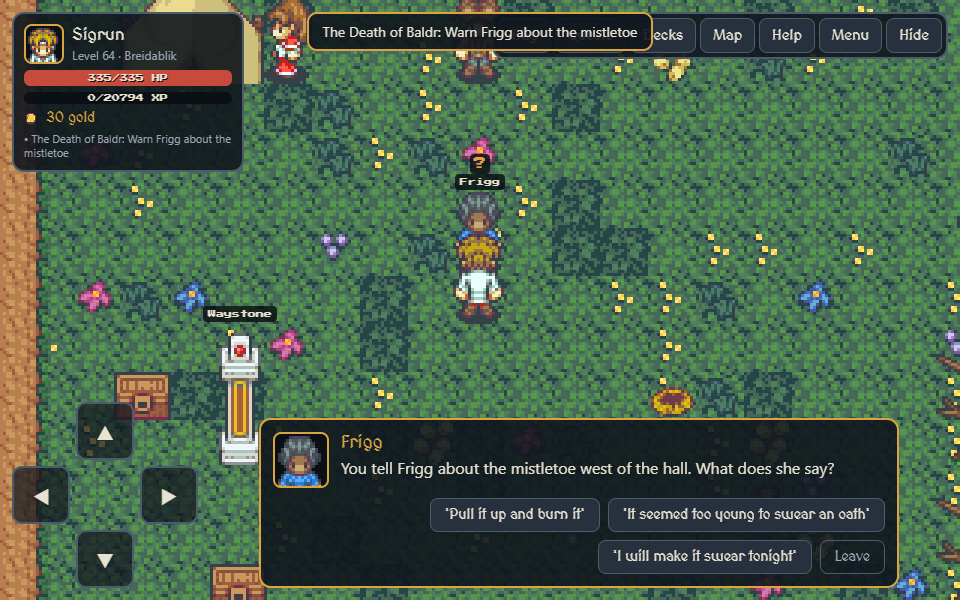

> You tell Frigg about the mistletoe west of the hall. What does she say?

- 'Pull it up and burn it'
- 'It seemed too young to swear an oath'
- 'I will make it swear tonight'

The answer

'It seemed too young to swear an oath'.

> 'Too young,' she says, and smiles, and turns back to the game. It is her story too. It goes as it goes.

**6. The old woman asks about the game**

Where: An old woman, in Breidablik. About 20 steps west of Frigg. *An old woman west of the hall is asking Frigg questions. Watch her eyes.*

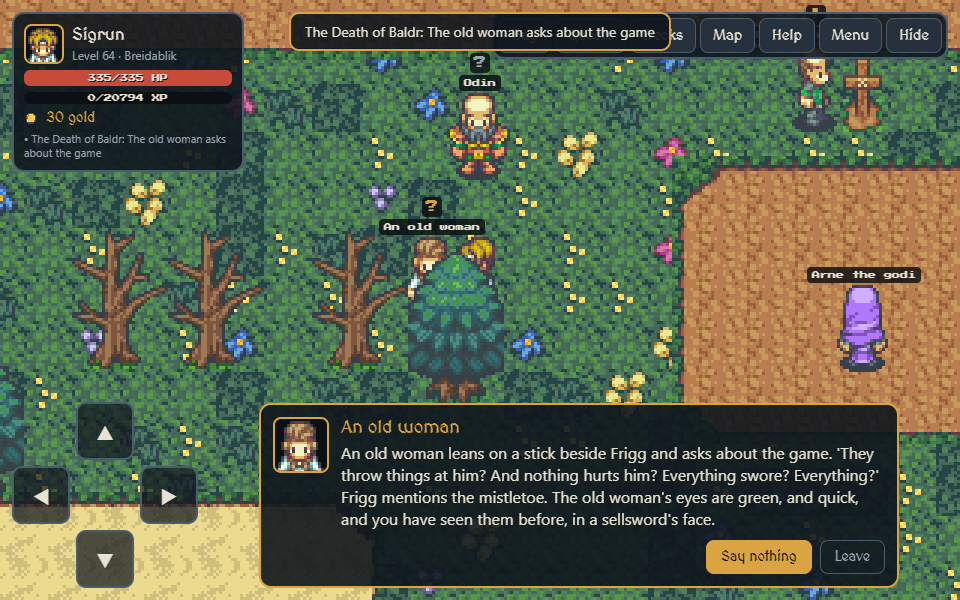

> An old woman leans on a stick beside Frigg and asks about the game. 'They throw things at him? And nothing hurts him? Everything swore? Everything?' Frigg mentions the mistletoe. The old woman's eyes are green, and quick, and you have seen them before, in a sellsword's face.

Then press "Say nothing".

**7. Reach Höðr**

Where: Höðr, the blind god, in Breidablik. About 9 steps south-east of an old woman. *Höðr stands south of the hall with something in his hand. Hurry.*

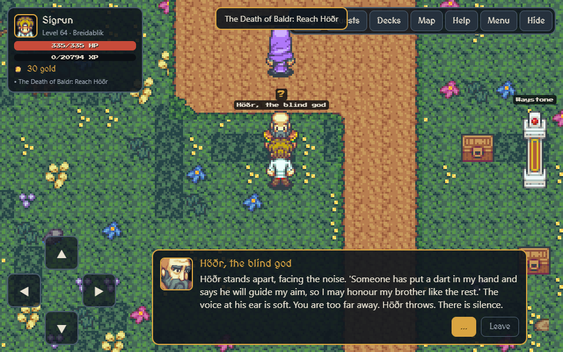

> Höðr stands apart, facing the noise. 'Someone has put a dart in my hand and says he will guide my aim, so I may honour my brother like the rest.' The voice at his ear is soft. You are too far away. Höðr throws. There is silence.

Then press "...".

**8. Ride with Hermóðr to Gjallarbrú, the bridge to Helheim**

Where: Móðguðr, keeper of Gjallarbrú, in Helheim. About 80 steps north of Höðr, the blind god. *Helheim is the island south of Grjótúnagarðar. The bridge over the river Gjöll is guarded by Móðguðr.*

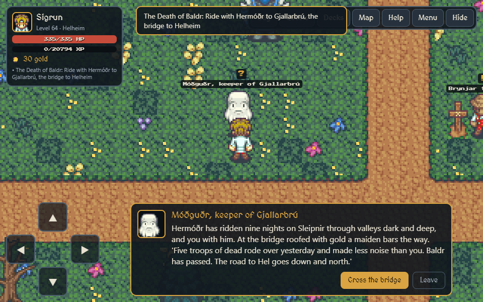

> Hermóðr has ridden nine nights on Sleipnir through valleys dark and deep, and you with him. At the bridge roofed with gold a maiden bars the way. 'Five troops of dead rode over yesterday and made less noise than you. Baldr has passed. The road to Hel goes down and north.'

Then press "Cross the bridge".

**9. Audience with Hel**

Where: Hel, in Helheim. About 6 steps south-east of Móðguðr, keeper of Gjallarbrú. *Hel sits in the middle of her island. Hermóðr has jumped the gate; you follow.*

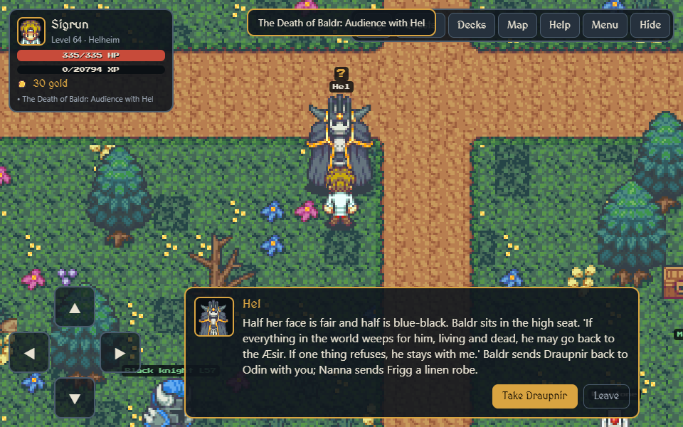

> Half her face is fair and half is blue-black. Baldr sits in the high seat. 'If everything in the world weeps for him, living and dead, he may go back to the Æsir. If one thing refuses, he stays with me.' Baldr sends Draupnir back to Odin with you; Nanna sends Frigg a linen robe.

Then press "Take Draupnir".

**10. Find the one thing that will not weep, in the cave under Frosthaug**

Where: Þökk, a giantess, in Thokk's Cave, the cave in Frosthaug. Go down into the cave. Its door is about 80 steps south-west of Hel. *Everything weeps but something in the cave under Frosthaug, north-west of Helheim.*

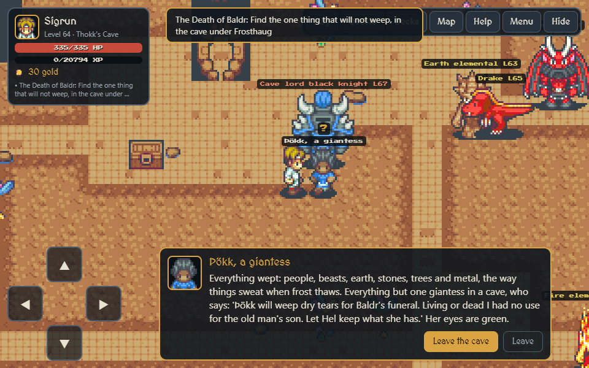

> Everything wept: people, beasts, earth, stones, trees and metal, the way things sweat when frost thaws. Everything but one giantess in a cave, who says: 'Þökk will weep dry tears for Baldr's funeral. Living or dead I had no use for the old man's son. Let Hel keep what she has.' Her eyes are green.

Then press "Leave the cave".

**11. Name Þökk**

Where: Odin, in Breidablik. About 70 steps east of Þökk, a giantess. *I want to know who Þökk was. You have seen those eyes three times.*

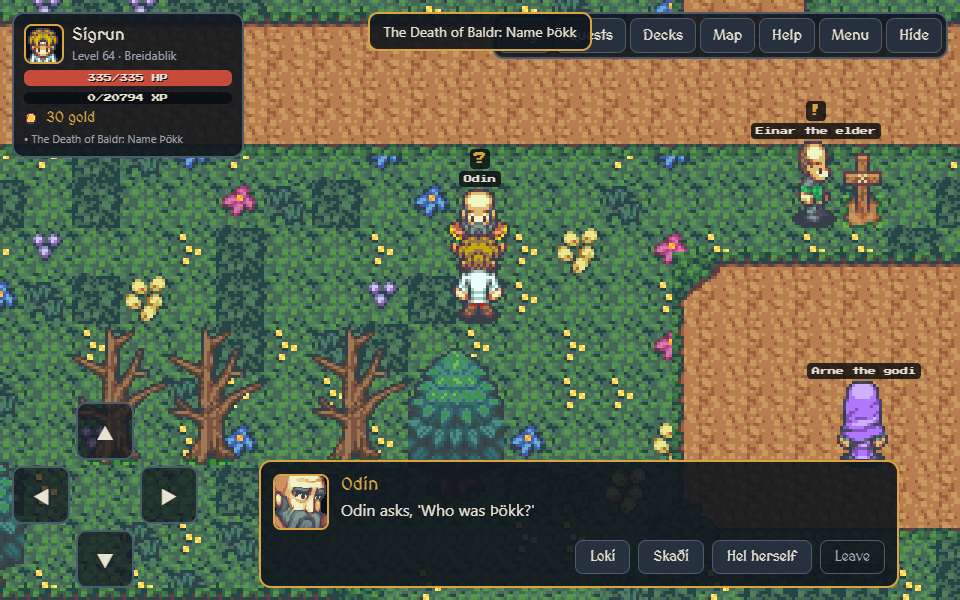

> Odin asks, 'Who was Þökk?'

- Loki
- Skaði
- Hel herself

The answer

Loki.

> 'Loki. The old woman was Loki. The soft voice at Höðr's ear was Loki. The gods know it now, and Loki knows they know.'

**12. Baldr's funeral**

Where: Frigg, in Breidablik. About 20 steps east of Odin. *The ship is on the shore and everyone is there. Frigg is waiting for you.*

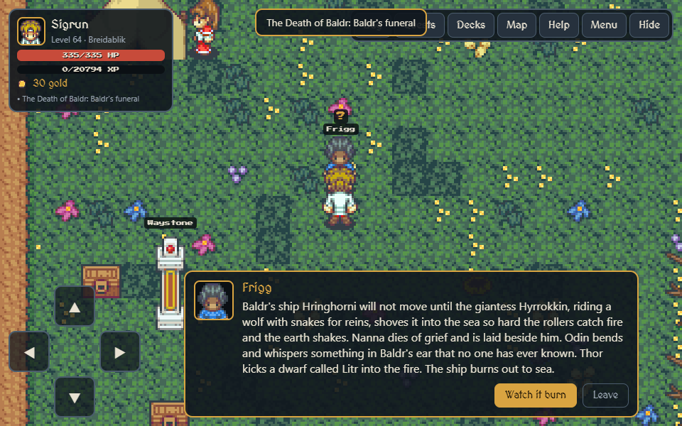

> Baldr's ship Hringhorni will not move until the giantess Hyrrokkin, riding a wolf with snakes for reins, shoves it into the sea so hard the rollers catch fire and the earth shakes. Nanna dies of grief and is laid beside him. Odin bends and whispers something in Baldr's ear that no one has ever known. Thor kicks a dwarf called Litr into the fire. The ship burns out to sea.

Then press "Watch it burn".

**13. Retell the story to Odin**

Where: Odin, in Breidablik. About 20 steps west of Frigg. *Tell it, skald, and I will listen the way I listened to the völva.*

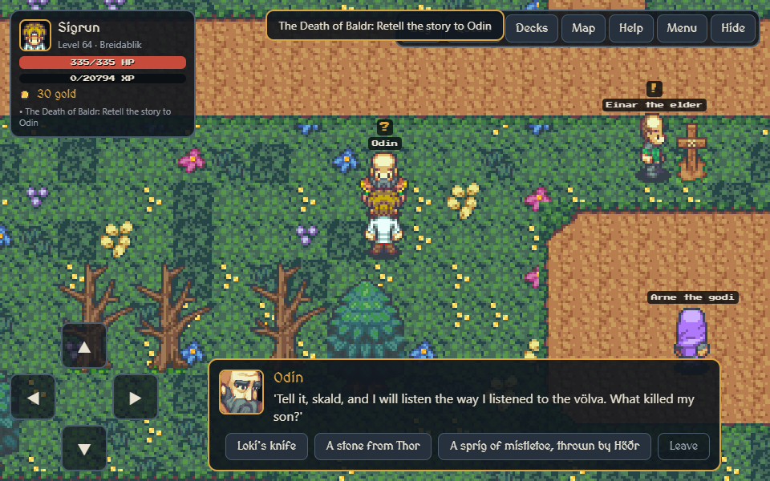

> 'Tell it, skald, and I will listen the way I listened to the völva. What killed my son?'

- Loki's knife
- A stone from Thor
- A sprig of mistletoe, thrown by Höðr

The answer

A sprig of mistletoe, thrown by Höðr.

> 'Mistletoe. Too young to swear. Váli will be born to avenge him, and will, one night old. And Baldr will come back, after the end. Remember that part.'

> Baldr sent Draupnir back from Hel. I laid it on the pyre; I will not wear it again. Wear it for him, and count the rings every ninth night.

Reward: 1684 gold, 29134 XP, the card Baldr, the card Hel, Half-Living, Draupnir.

*Saxo Grammaticus tells it very differently: Baldr and Höðr as rivals for Nanna, killed with a special sword. Mistletoe may be a late, poetic detail; scholars debate it. Source: Prose Edda, Gylfaginning ch. 49; Poetic Edda, Baldrs draumar; Völuspá st. 31–35.*

### Flyting and Fetters

*Level 72 · given by Ægir, the sea giant in Hlesey · after The Death of Baldr · 8 steps*

The gods feast in Ægir's hall and Loki insults every one of them, and every insult is true. Then he runs. This saga is mostly riddles: the flyting is a war of words, and you answer for the gods.

**Taking it up.** Find Ægir, the sea giant, in Hlesey, about 380 steps east of Eikthorp.

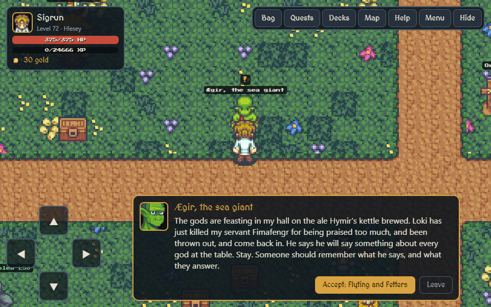

> The gods are feasting in my hall on the ale Hymir's kettle brewed. Loki has just killed my servant Fimafengr for being praised too much, and been thrown out, and come back in. He says he will say something about every god at the table. Stay. Someone should remember what he says, and what they answer.

**1. The flyting: answer Loki with Odin's words**

Where: Loki, at the feast, in Hlesey. About 13 steps east of Ægir, the sea giant. *Loki is flyting at the high table in my hall. Remember the retorts.*

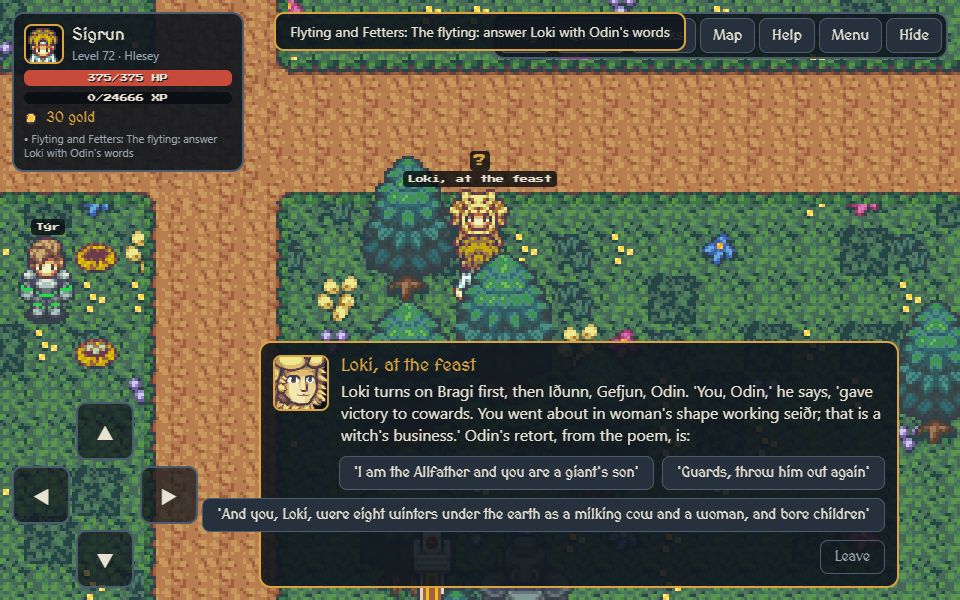

> Loki turns on Bragi first, then Iðunn, Gefjun, Odin. 'You, Odin,' he says, 'gave victory to cowards. You went about in woman's shape working seiðr; that is a witch's business.' Odin's retort, from the poem, is:

- 'I am the Allfather and you are a giant's son'
- 'Guards, throw him out again'
- 'And you, Loki, were eight winters under the earth as a milking cow and a woman, and bore children'

The answer

'And you, Loki, were eight winters under the earth as a milking cow and a woman, and bore children'.

> The hall laughs at both of them, and Loki moves down the table.

**2. The flyting: answer for Njörðr**

Where: Loki, at the feast, in Hlesey. Stay where you are. *Loki is flyting at the high table in my hall. Remember the retorts.*

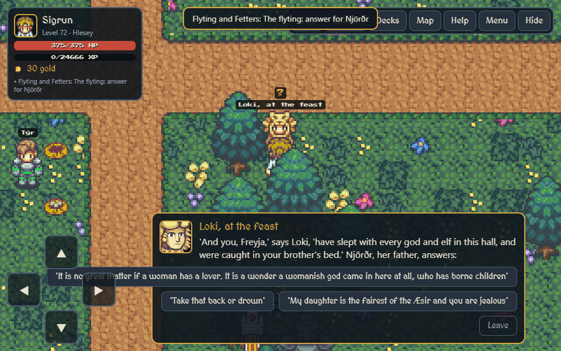

> 'And you, Freyja,' says Loki, 'have slept with every god and elf in this hall, and were caught in your brother's bed.' Njörðr, her father, answers:

- 'It is no great matter if a woman has a lover. It is a wonder a womanish god came in here at all, who has borne children'
- 'Take that back or drown'
- 'My daughter is the fairest of the Æsir and you are jealous'

The answer

'It is no great matter if a woman has a lover. It is a wonder a womanish god came in here at all, who has borne children'.

> Loki tells Njörðr he was sent east as a hostage and the daughters of Hymir used him for a chamber-pot. Njörðr says his son Freyr is worth more than any of Loki's. The hall grows loud.

**3. The flyting: answer for Týr**

Where: Loki, at the feast, in Hlesey. Stay where you are. *Loki is flyting at the high table in my hall. Remember the retorts.*

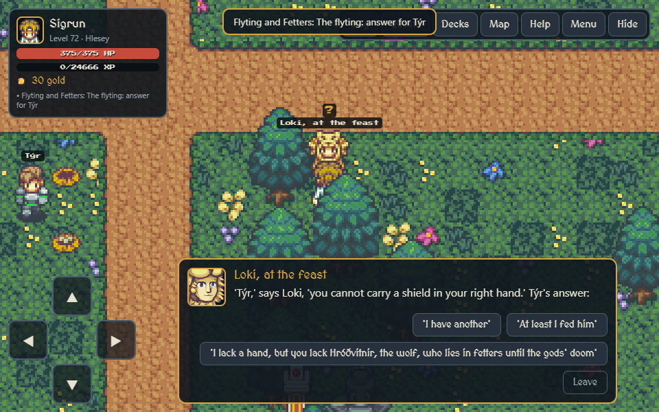

> 'Týr,' says Loki, 'you cannot carry a shield in your right hand.' Týr's answer:

- 'I have another'
- 'At least I fed him'
- 'I lack a hand, but you lack Hróðvitnir, the wolf, who lies in fetters until the gods' doom'

The answer

'I lack a hand, but you lack Hróðvitnir, the wolf, who lies in fetters until the gods' doom'.

> Then Thor comes in from the east with the hammer, and Loki calls him a coward who hid in a glove, and Thor tells him to be quiet four times, and Loki, for once, goes. 'For you alone I go, Thor; I know you strike.'

**4. Follow Thor after Loki**

Where: Thor, in Hlesey. About 10 steps north-west of Loki, at the feast. *Thor is on the north shore, still angry. Loki has fled east to the falls of Fránangr in Grimfell.*

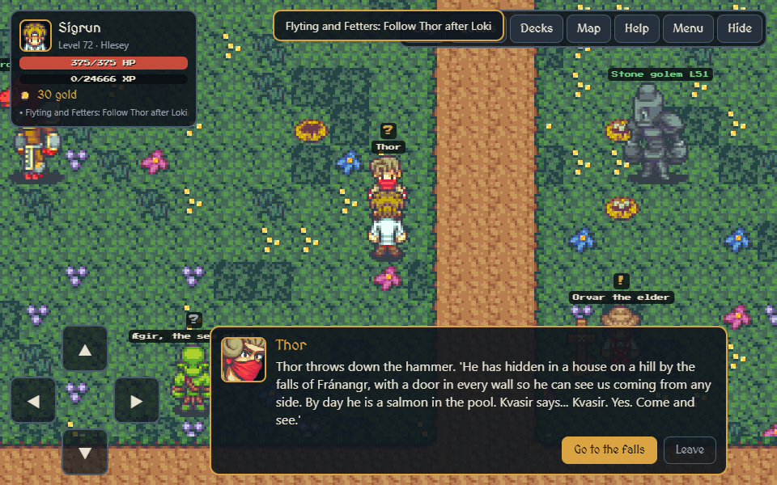

> Thor throws down the hammer. 'He has hidden in a house on a hill by the falls of Fránangr, with a door in every wall so he can see us coming from any side. By day he is a salmon in the pool. Kvasir says... Kvasir. Yes. Come and see.'

Then press "Go to the falls".

**5. Read the ashes in the four-door house in Grimfell**

Where: Kvasir(?), in Grimfell. About 190 steps east of Thor. *The four-door house stands by the falls in Grimfell, far to the east across the ashen hills.*

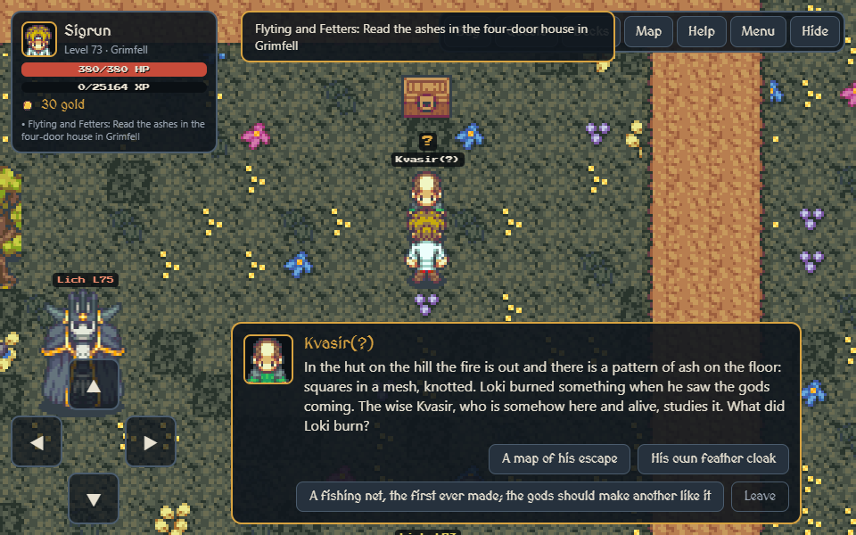

> In the hut on the hill the fire is out and there is a pattern of ash on the floor: squares in a mesh, knotted. Loki burned something when he saw the gods coming. The wise Kvasir, who is somehow here and alive, studies it. What did Loki burn?

- A map of his escape
- His own feather cloak
- A fishing net, the first ever made; the gods should make another like it

The answer

A fishing net, the first ever made; the gods should make another like it.

> The gods knot a net in the pattern of the ashes and drag the falls. Loki leaps it once; the second time Thor wades in the middle; the third time Loki jumps, and Thor catches him by the tail. That is why salmon narrow toward the tail.

**6. Loki is caught**

Where: Thor, in Grimfell. About 12 steps east of Kvasir(?). *Thor is at the falls with a salmon. Go and see.*

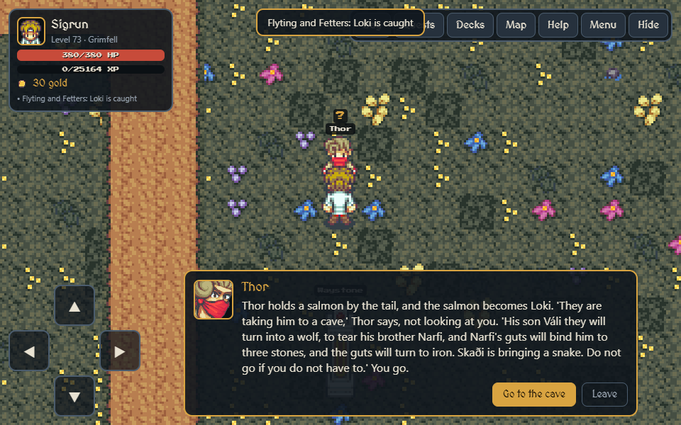

> Thor holds a salmon by the tail, and the salmon becomes Loki. 'They are taking him to a cave,' Thor says, not looking at you. 'His son Váli they will turn into a wolf, to tear his brother Narfi, and Narfi's guts will bind him to three stones, and the guts will turn to iron. Skaði is bringing a snake. Do not go if you do not have to.' You go.

Then press "Go to the cave".

**7. Hold the bowl for Sigyn in the cave under Thurshaug**

Where: Sigyn, in Loki's Cave, the cave in Thurshaug. Go down into the cave. Its door is about 70 steps south-west of Thor. *The cave under Thurshaug, north of Grimfell. Sigyn is there and will be until the end of things.*

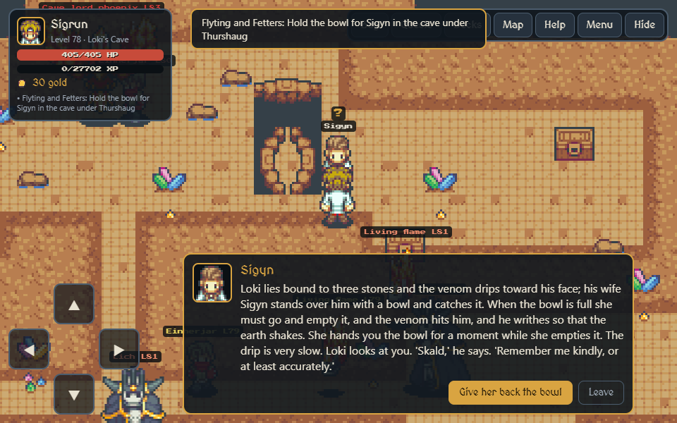

> Loki lies bound to three stones and the venom drips toward his face; his wife Sigyn stands over him with a bowl and catches it. When the bowl is full she must go and empty it, and the venom hits him, and he writhes so that the earth shakes. She hands you the bowl for a moment while she empties it. The drip is very slow. Loki looks at you. 'Skald,' he says. 'Remember me kindly, or at least accurately.'

Then press "Give her back the bowl".

**8. Retell the story to Ægir**

Where: Ægir, the sea giant, in Hlesey. About 160 steps north-west of Sigyn. *Tell it, skald.*

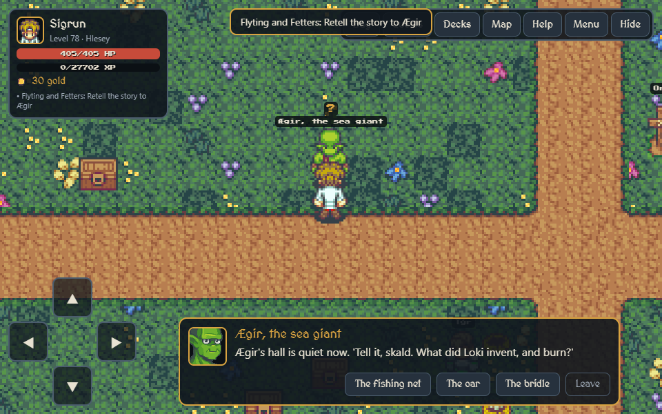

> Ægir's hall is quiet now. 'Tell it, skald. What did Loki invent, and burn?'

- The fishing net
- The oar
- The bridle

The answer

The fishing net.

> 'The net. The gods copied it, and every fisher since. Even in the dark he was clever.'

> The gods took his shoes off before they bound him; the ones that run over sky and sea. Loki would want you to have something of his. He said so. Accurately.

Reward: 1435 gold, 24600 XP, the card Loki, Blood-Brother, Loki's sky-shoes.

*Snorri has Kvasir killed for the mead in one book and alive to read the net's ashes in another; the sources contradict each other and the game keeps both. Flyting was a real poetic tradition. Earthquakes are Loki writhing. Source: Poetic Edda, Lokasenna; Prose Edda, Gylfaginning ch. 50.*

## Act 4: The Doom of the Gods

Levels 80 and up. The far north-east of the map, snow and ash, and the end the Norns have been weaving towards since the first page.

### Ragnarök

*Level 80 · given by Skuld, a Norn in Himinbjorg · after Flyting and Fetters · 15 steps*

Three roosters crow the end of the world. Before the last battle there are two people to hide in a tree and a horn to blow, and then five fights on the plain of Vígríðr, each one a duel the sources already decided. After that, a green world.

**Taking it up.** Find Skuld, a Norn, in Himinbjorg, about 570 steps east of Eikthorp.

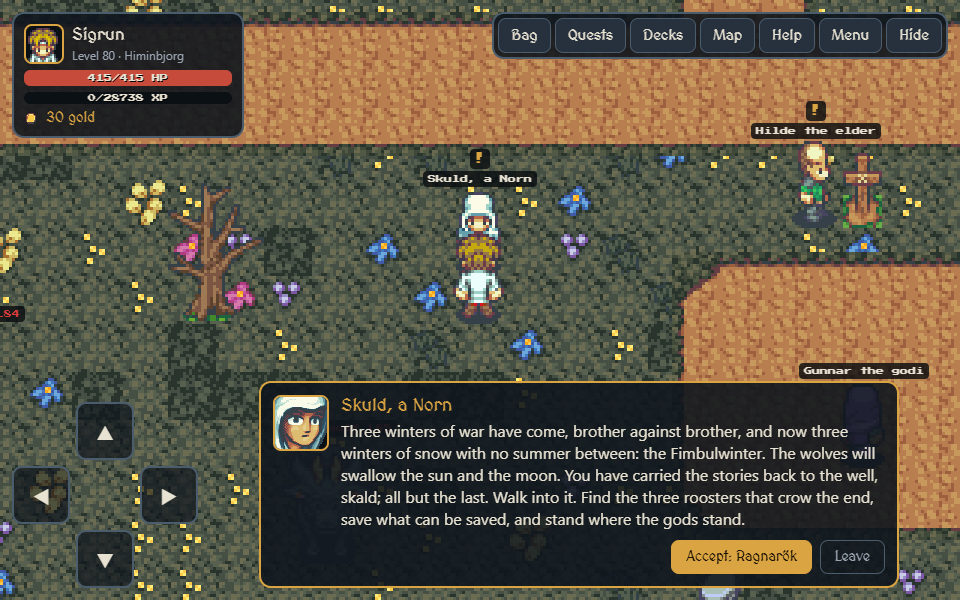

> Three winters of war have come, brother against brother, and now three winters of snow with no summer between: the Fimbulwinter. The wolves will swallow the sun and the moon. You have carried the stories back to the well, skald; all but the last. Walk into it. Find the three roosters that crow the end, save what can be saved, and stand where the gods stand.

**1. Hear Fjalarr crow in the gallows-wood of Draugvang**

Where: Fjalarr, the fair-red rooster, in Draugvang. About 120 steps south-west of Skuld, a Norn. *Fjalarr crows in the gallows-wood south-west of Himinbjörg, in Draugvang.*

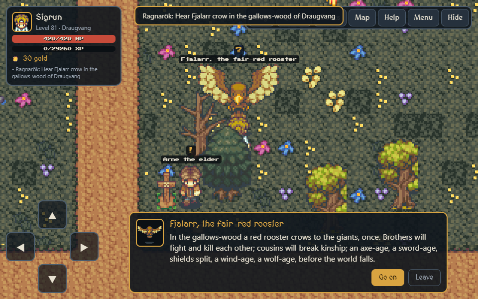

> In the gallows-wood a red rooster crows to the giants, once. Brothers will fight and kill each other; cousins will break kinship; an axe-age, a sword-age, shields split, a wind-age, a wolf-age, before the world falls.

Then press "Go on".

**2. Hear Gullinkambi crow at Himinbjörg**

Where: Gullinkambi, the golden rooster, in Himinbjorg. About 130 steps north-east of Fjalarr, the fair-red rooster. *Gullinkambi is east of the hall, crowing the einherjar awake.*

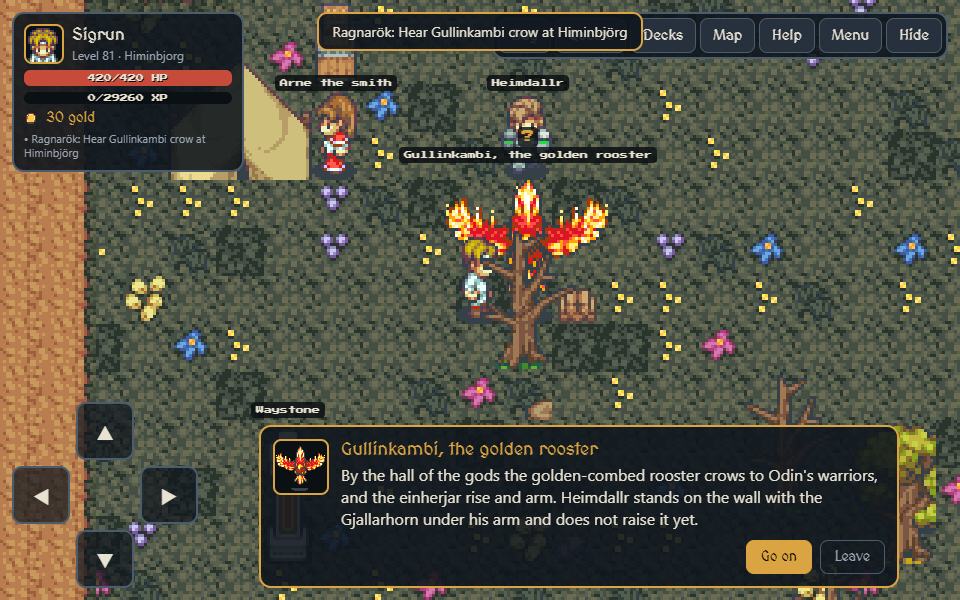

> By the hall of the gods the golden-combed rooster crows to Odin's warriors, and the einherjar rise and arm. Heimdallr stands on the wall with the Gjallarhorn under his arm and does not raise it yet.

Then press "Go on".

**3. Hear the soot-red rooster in Askskog**

Where: A soot-red rooster, in Askskog. About 80 steps south-west of Gullinkambi, the golden rooster. *The third rooster crows below the earth, in Askskog, north of Himinbjörg.*

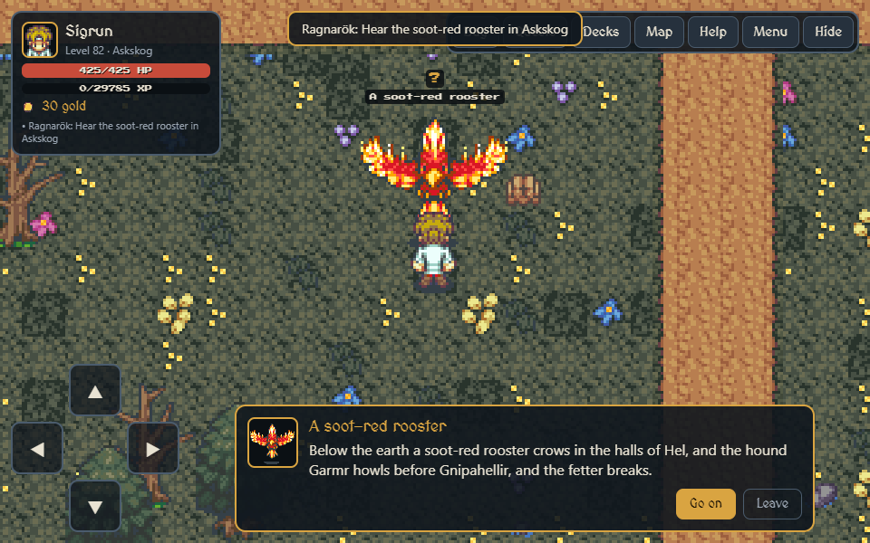

> Below the earth a soot-red rooster crows in the halls of Hel, and the hound Garmr howls before Gnipahellir, and the fetter breaks.

Then press "Go on".

**4. Find Líf and Lífþrasir in the snow**

Where: Líf and Lífþrasir, in Askskog. About 12 steps east of a soot-red rooster. *Two people are hiding in the snow in Askskog. They matter more than any god.*

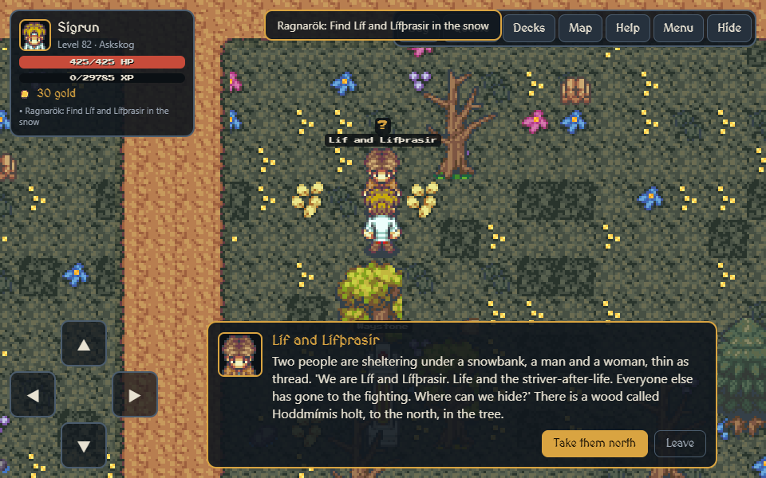

> Two people are sheltering under a snowbank, a man and a woman, thin as thread. 'We are Líf and Lífþrasir. Life and the striver-after-life. Everyone else has gone to the fighting. Where can we hide?' There is a wood called Hoddmímis holt, to the north, in the tree.

Then press "Take them north".

**5. Bring Líf and Lífþrasir to Hoddmímis holt**

Where: Líf and Lífþrasir, in the holt, in Hoddmimis Holt. About 70 steps south of Líf and Lífþrasir. *Hoddmímis holt is the hamlet north of Askskog, in the roots of the tree. Bring them there.*

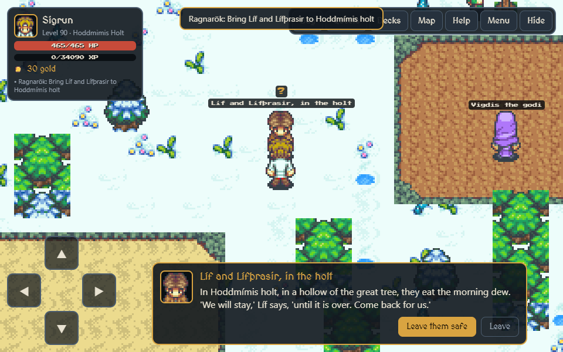

> In Hoddmímis holt, in a hollow of the great tree, they eat the morning dew. 'We will stay,' Líf says, 'until it is over. Come back for us.'

Then press "Leave them safe".

**6. Mímir's last counsel**

Where: Mímir's head, in Hoddmimis Holt. About 20 steps east of Líf and Lífþrasir, in the holt. *Odin is east of the holt speaking with Mímir's head. Do not interrupt.*

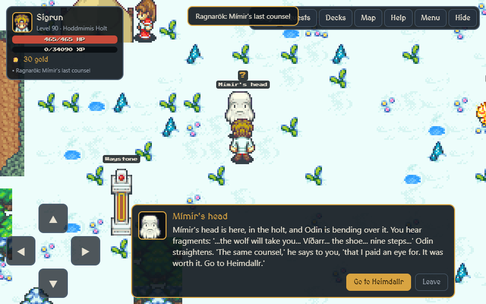

> Mímir's head is here, in the holt, and Odin is bending over it. You hear fragments: '...the wolf will take you... Víðarr... the shoe... nine steps...' Odin straightens. 'The same counsel,' he says to you, 'that I paid an eye for. It was worth it. Go to Heimdallr.'

Then press "Go to Heimdallr".

**7. Blow the Gjallarhorn with Heimdallr**

Where: Heimdallr, in Himinbjorg. About 130 steps north-east of Mímir's head. *Heimdallr is on the wall of Himinbjörg with the horn. It is time.*

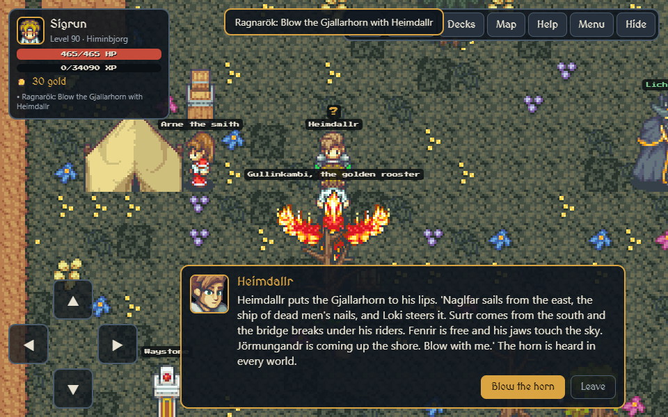

> Heimdallr puts the Gjallarhorn to his lips. 'Naglfar sails from the east, the ship of dead men's nails, and Loki steers it. Surtr comes from the south and the bridge breaks under his riders. Fenrir is free and his jaws touch the sky. Jörmungandr is coming up the shore. Blow with me.' The horn is heard in every world.

Then press "Blow the horn".

**8. Vígríðr: Týr and Garmr**

Where: Garmr, hound of Hel, level 96, in Vigrid. About 120 steps south of Heimdallr. *The plain of Vígríðr lies south-east, a hundred leagues each way. Týr fights the hound Garmr in its north-west. Stand with him; they kill each other.*

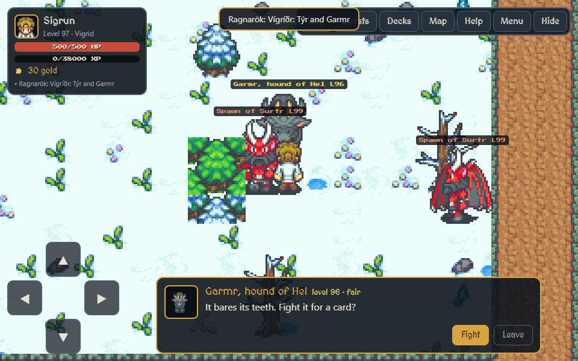

A fight of Bindrune against Garmr, hound of Hel, level 96. This foe is only here while this step of the story is playing. Walk into it when you are ready.

**9. Vígríðr: Heimdallr and Loki**

Where: Loki, unbound, level 97, in Vigrid. About 16 steps east of Garmr, hound of Hel. *Heimdallr and Loki meet in the north-east of the plain. Each kills the other. Stand with Heimdallr.*

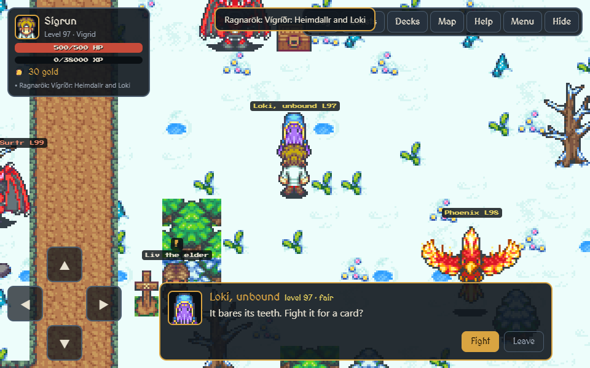

A fight of Bindrune against Loki, unbound, level 97. This foe is only here while this step of the story is playing. Walk into it when you are ready.

**10. Vígríðr: Thor and the serpent**

Where: Jörmungandr, risen, level 98, in Vigrid. About 16 steps south-west of Loki, unbound. *Thor kills the serpent in the south-west of the plain, walks nine steps from it, and falls from the venom. Stand with him for the nine steps.*

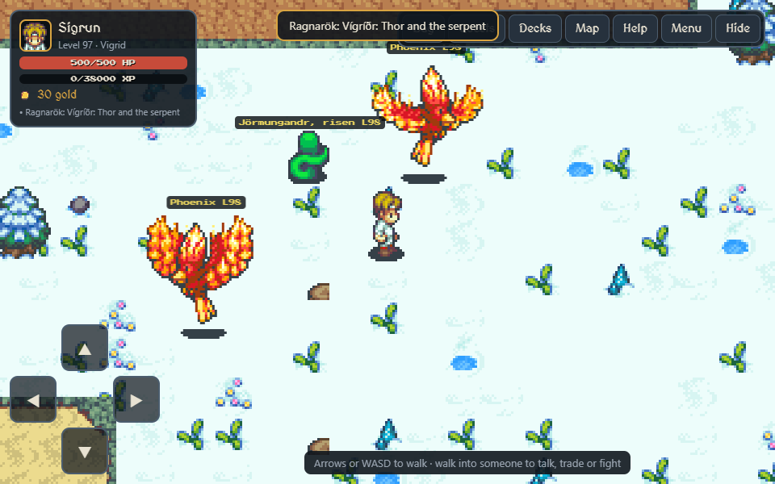

A fight of Bindrune against Jörmungandr, risen, level 98. This foe is only here while this step of the story is playing. Walk into it when you are ready.

**11. Vígríðr: Odin, the wolf, and Víðarr**

Where: Fenrir, unbound, level 98, in Vigrid. About 16 steps east of Jörmungandr, risen. *The wolf swallows Odin in the south-east of the plain. Víðarr steps on its lower jaw with the shoe made of every scrap of leather ever thrown away and tears its mouth apart. Stand with Víðarr.*

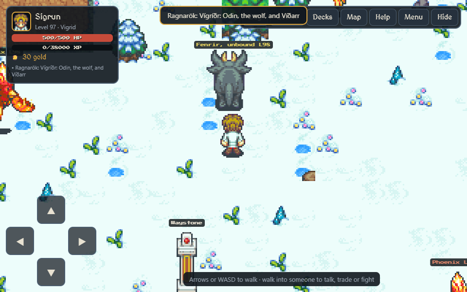

A fight of Bindrune against Fenrir, unbound, level 98. This foe is only here while this step of the story is playing. Walk into it when you are ready.

**12. Vígríðr: Freyr and Surtr**

Where: Surtr of the flaming sword, level 99, in Vigrid. About 8 steps west of Fenrir, unbound. *Freyr fights Surtr with an antler at the south of the plain, because he gave his sword to Skírnir for Gerðr. He falls. Surtr flings fire over the world. Stand with Freyr anyway.*

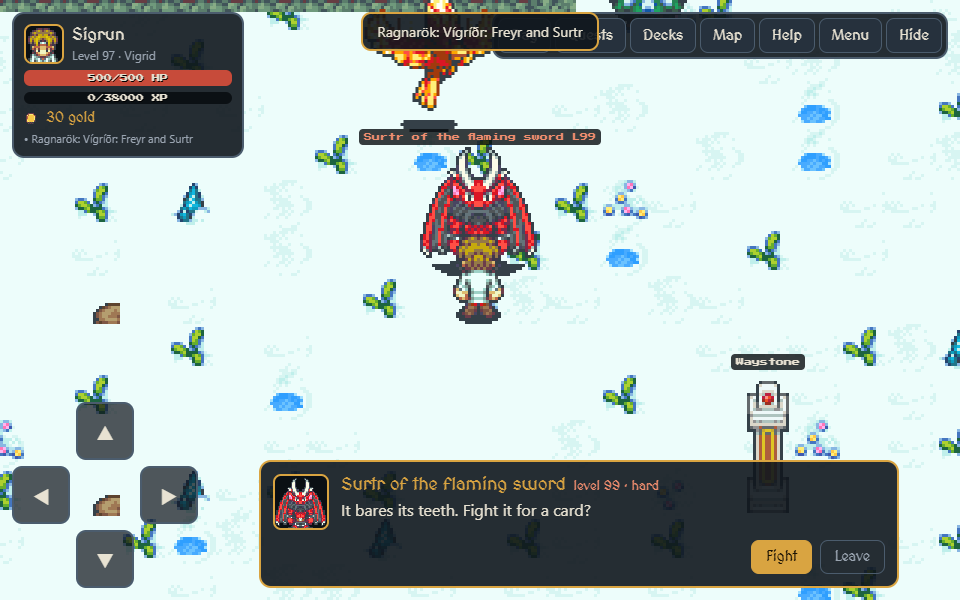

A fight of Bindrune against Surtr of the flaming sword, level 99. This foe is only here while this step of the story is playing. Walk into it when you are ready.

**13. Walk the green world**

Where: Skuld, a Norn, in Vigrid. About 5 steps north-west of Surtr of the flaming sword. *The fire is out. Skuld is waiting on the plain.*

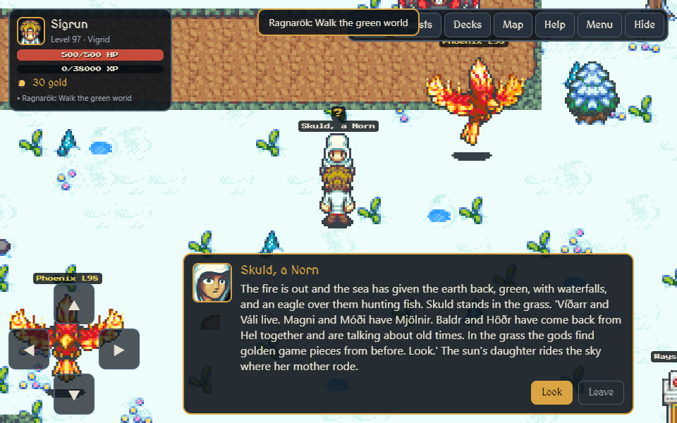

> The fire is out and the sea has given the earth back, green, with waterfalls, and an eagle over them hunting fish. Skuld stands in the grass. 'Víðarr and Váli live. Magni and Móði have Mjölnir. Baldr and Höðr have come back from Hel together and are talking about old times. In the grass the gods find golden game pieces from before. Look.' The sun's daughter rides the sky where her mother rode.

Then press "Look".

**14. Baldr and Höðr, together**

Where: Baldr and Höðr, come back, in Vigrid. About 8 steps east of Skuld, a Norn. *Baldr and Höðr are on the green plain. Speak with them.*

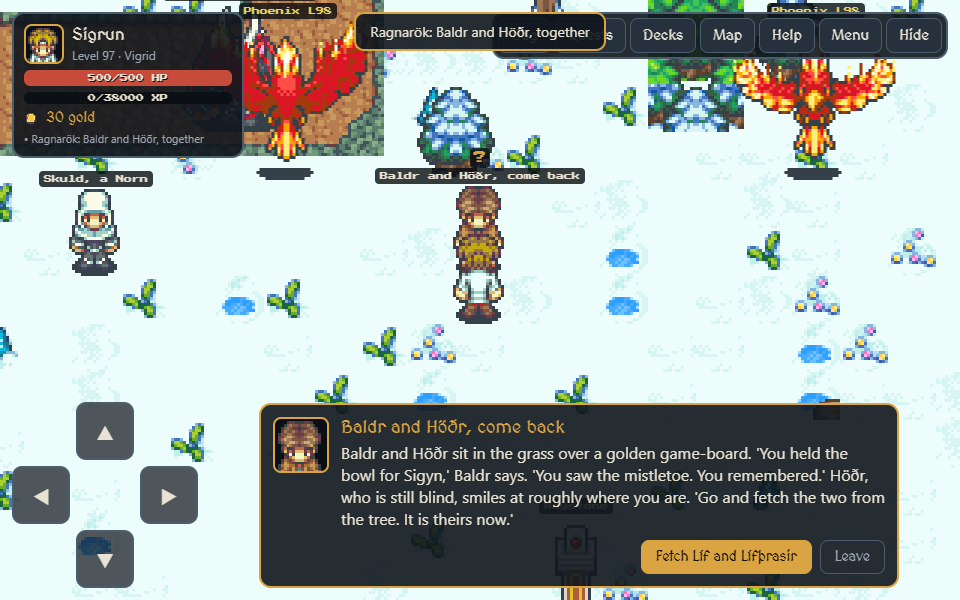

> Baldr and Höðr sit in the grass over a golden game-board. 'You held the bowl for Sigyn,' Baldr says. 'You saw the mistletoe. You remembered.' Höðr, who is still blind, smiles at roughly where you are. 'Go and fetch the two from the tree. It is theirs now.'

Then press "Fetch Líf and Lífþrasir".

**15. Retell the last story to Skuld**

Where: Skuld, a Norn, in Himinbjorg. About 130 steps north of Baldr and Höðr, come back. *Tell the last one back, and the thread is whole.*

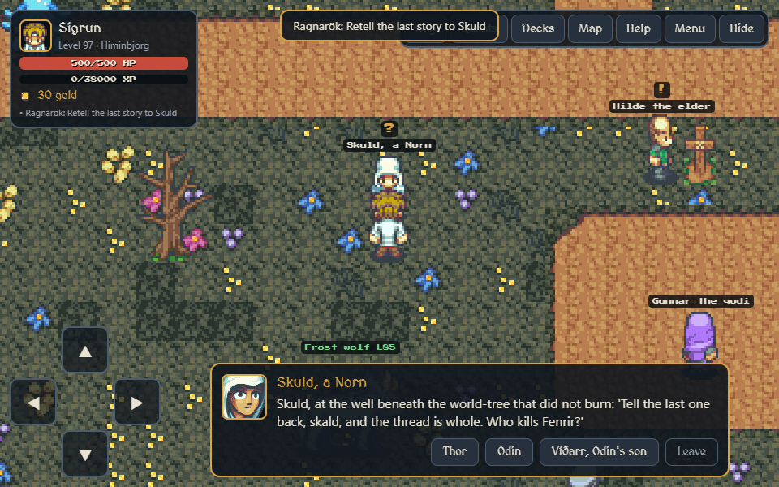

> Skuld, at the well beneath the world-tree that did not burn: 'Tell the last one back, skald, and the thread is whole. Who kills Fenrir?'

- Thor
- Odin
- Víðarr, Odin's son

The answer

Víðarr, Odin's son.

> 'Víðarr, the silent one, with the shoe. Thor walked nine steps. Odin was swallowed. Líf and Lífþrasir fill the world again. All of it is remembered; the weave holds. Go home, skald. Tell it at the fire.'

> The last thread is woven. Take the amulet of the tree that outlived the fire, and the likeness of the one who was swallowed and the one who burned. Now go and tell all of it, from the well to the green grass, to anyone who will listen.

Reward: 2546 gold, 52790 XP, the card Odin Alföðr, the card Surtr, Flame of the End, Amulet of Yggdrasil.

*Whether the reborn world shows Christian influence (a 'mighty one' from above in one stanza) is debated. Each duel ends as the sources say; the skald's part in them is the game's invention. Source: Poetic Edda, Völuspá st. 44–66, Vafþrúðnismál; Prose Edda, Gylfaginning ch. 51–53.*

## The side sagas

Five stories off the main road. Each opens once the main saga it hangs from is done (the rune stones from the very start), and each pays a god's card.

### The Rune Stones of Midgard

*Level 1 · given by Ulf the skald in Eikthorp · 5 steps*

Not a myth but the north speaking for itself: five rune stones stand in Midgard, from the meadows near home to the ice at the end of the world. You can read the first on day one; the last waits at Himinbjörg, near the end of the game.

**Taking it up.** Find Ulf the skald in Eikthorp.

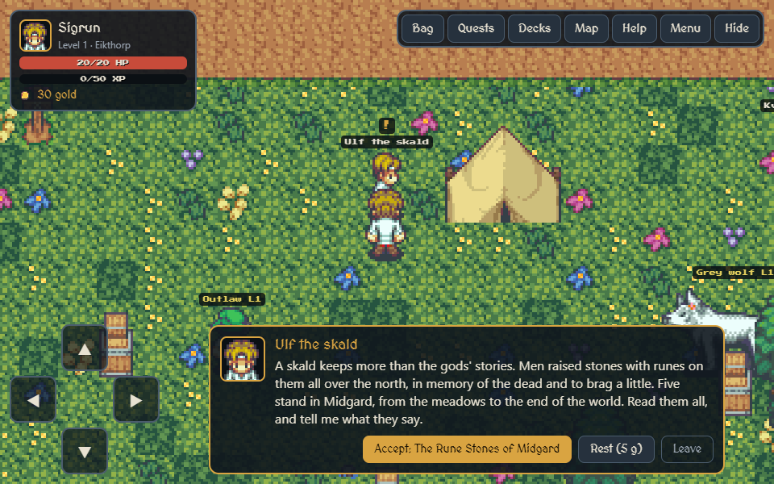

> A skald keeps more than the gods' stories. Men raised stones with runes on them all over the north, in memory of the dead and to brag a little. Five stand in Midgard, from the meadows to the end of the world. Read them all, and tell me what they say.

**1. Read the rune stone in Ashgrove Meadows**

Where: Rune stone, in Ashgrove Meadows. About 70 steps north-east of Ulf the skald. *The first stone stands in the north of the meadows, east of the village.*

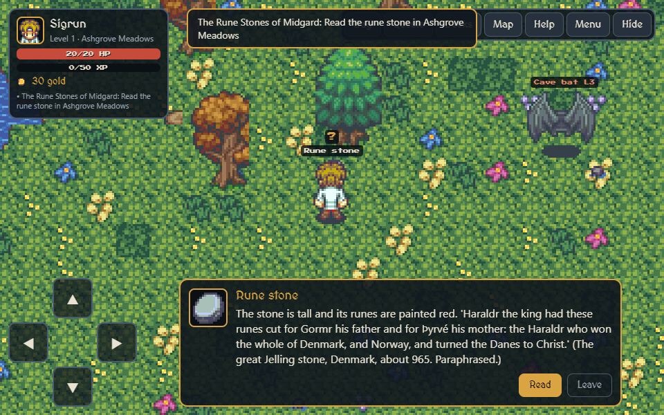

> The stone is tall and its runes are painted red. 'Haraldr the king had these runes cut for Gormr his father and for Þyrvé his mother: the Haraldr who won the whole of Denmark, and Norway, and turned the Danes to Christ.' (The great Jelling stone, Denmark, about 965. Paraphrased.)

Then press "Read".

**2. Read the rune stone in Askmark**

Where: Rune stone, in Askmark. About 130 steps south of the last one. *The second stone is in Askmark, south of the fens.*

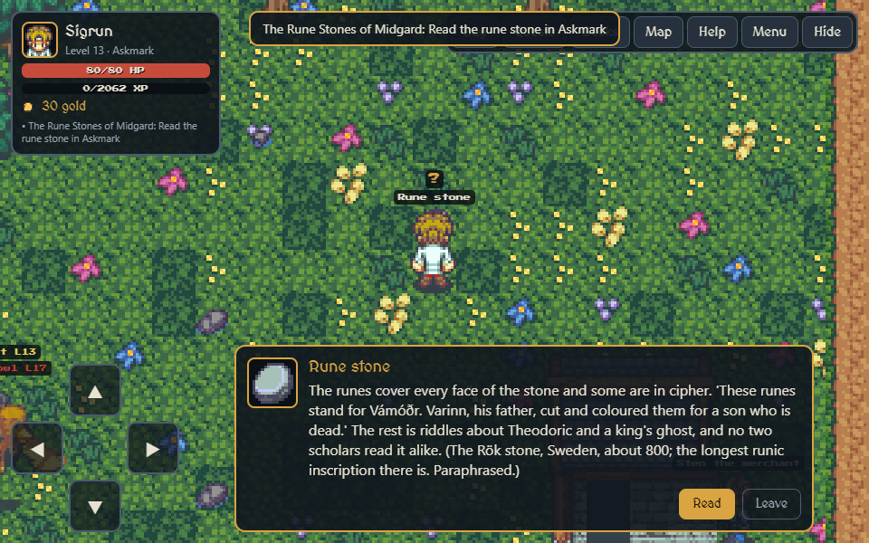

> The runes cover every face of the stone and some are in cipher. 'These runes stand for Vámóðr. Varinn, his father, cut and coloured them for a son who is dead.' The rest is riddles about Theodoric and a king's ghost, and no two scholars read it alike. (The Rök stone, Sweden, about 800; the longest runic inscription there is. Paraphrased.)

Then press "Read".

**3. Read the rune carving in Helmark**

Where: Rune stone, in Helmark. About 90 steps south-east of the last one. *The third is carved on a rock in Helmark, south of the hamlet.*

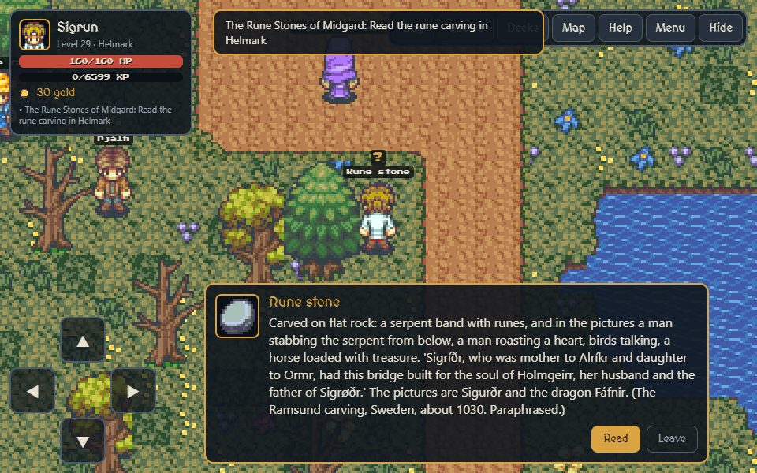

> Carved on flat rock: a serpent band with runes, and in the pictures a man stabbing the serpent from below, a man roasting a heart, birds talking, a horse loaded with treasure. 'Sigríðr, who was mother to Alríkr and daughter to Ormr, had this bridge built for the soul of Holmgeirr, her husband and the father of Sigrøðr.' The pictures are Sigurðr and the dragon Fáfnir. (The Ramsund carving, Sweden, about 1030. Paraphrased.)

Then press "Read".

**4. Read the rune stone in Askvang**

Where: Rune stone, in Askvang. About 120 steps east of the last one. *The fourth is in Askvang, in the fen country.*

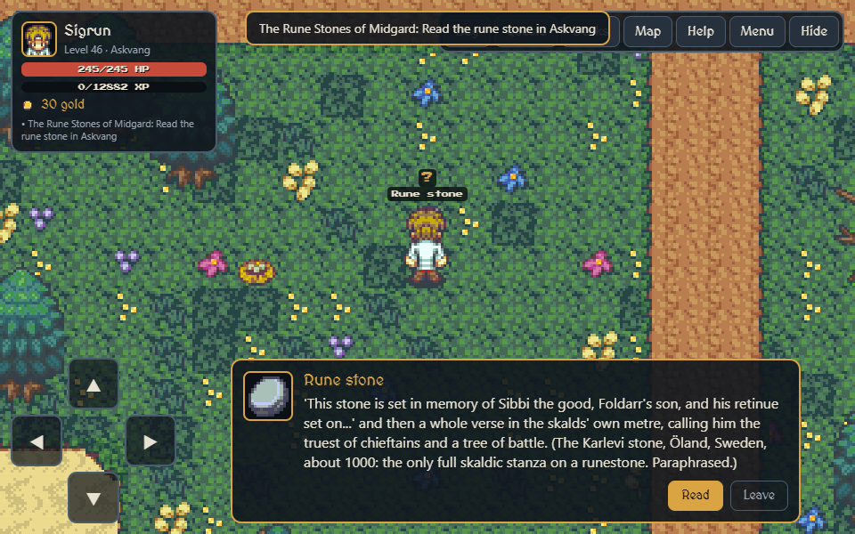

> 'This stone is set in memory of Sibbi the good, Foldarr's son, and his retinue set on...' and then a whole verse in the skalds' own metre, calling him the truest of chieftains and a tree of battle. (The Karlevi stone, Öland, Sweden, about 1000: the only full skaldic stanza on a runestone. Paraphrased.)

Then press "Read".

**5. Read the rune stone at Himinbjörg**

Where: Rune stone, in Himinbjorg. About 260 steps east of the last one. *The last stone is at the end of the world, in Himinbjörg, where the frost begins.*

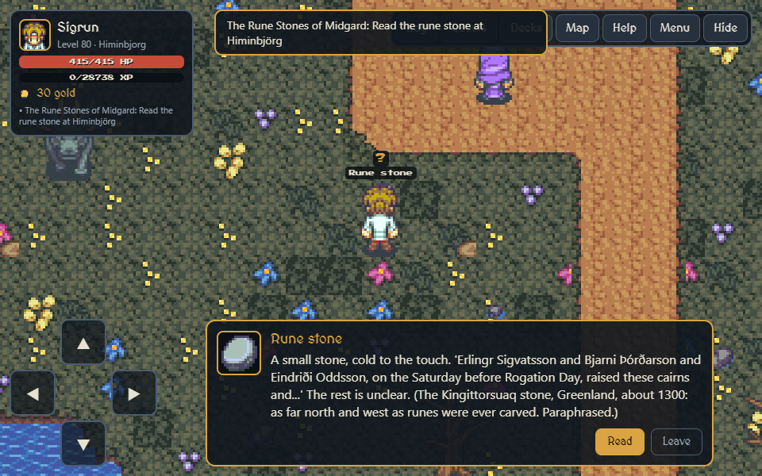

> A small stone, cold to the touch. 'Erlingr Sigvatsson and Bjarni Þórðarson and Eindriði Oddsson, on the Saturday before Rogation Day, raised these cairns and...' The rest is unclear. (The Kingittorsuaq stone, Greenland, about 1300: as far north and west as runes were ever carved. Paraphrased.)

Then press "Read".

**Return to Ulf the skald**

About 560 steps west of Rune stone.

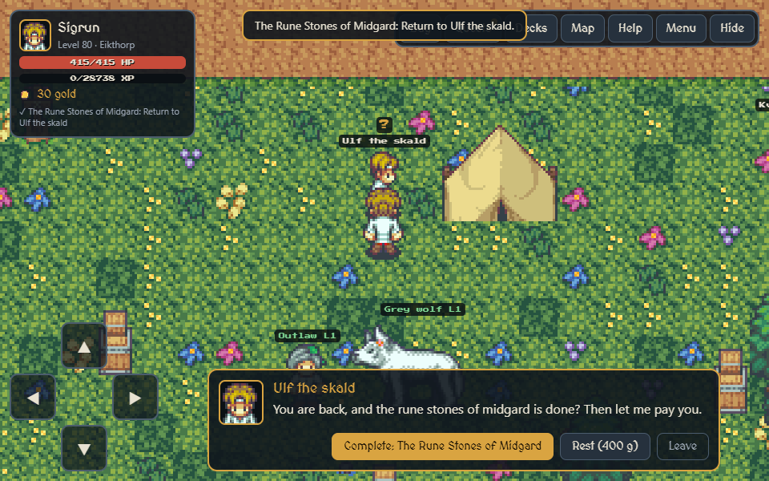

> Five stones, five voices, and not one of them about a god. That is the north too. A valkyrie for a skald who walks.

Reward: 710 gold, 8735 XP, the card Valkyrie Chooser.

*Runestones are the Norse speaking for themselves, not through a Christian Icelander two centuries later. Their placement in Midgard is the game's invention. Source: Real Viking-age inscriptions: Jelling (DR 42), Rök (Ög 136), Ramsund (Sö 101), Karlevi (Öl 1), Kingittorsuaq (GR 1).*

### The War of the Æsir and Vanir

*Level 21 · given by Njörðr in Vanaheim · after The Hanged God · 6 steps*

The first war in the world began over a woman the Æsir burned three times and could not kill. Njörðr, a hostage of the peace, tells how it went, and what happened to the hostages the Æsir sent the other way.

**Taking it up.** Find Njörðr in Vanaheim, about 200 steps south of Eikthorp.

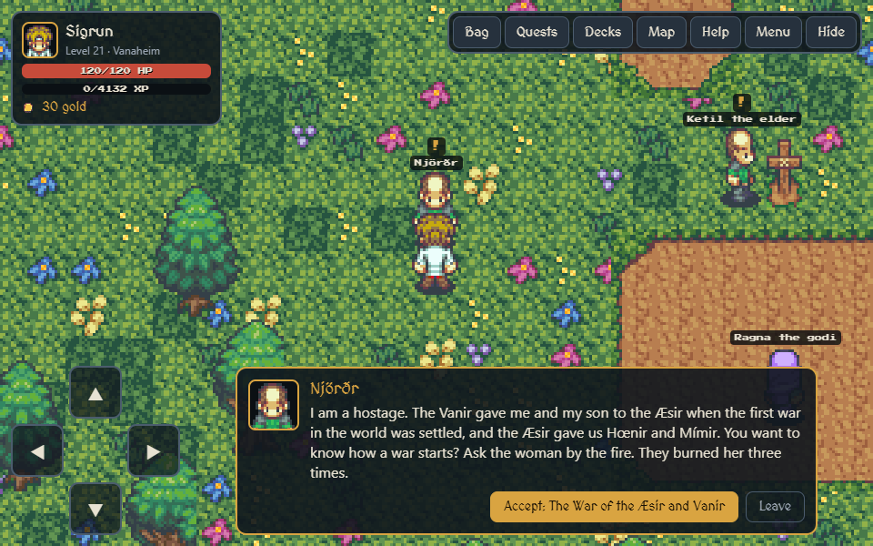

> I am a hostage. The Vanir gave me and my son to the Æsir when the first war in the world was settled, and the Æsir gave us Hœnir and Mímir. You want to know how a war starts? Ask the woman by the fire. They burned her three times.

**1. Hear Gullveig's story**

Where: Gullveig, called Heiðr, in Vanaheim. About 4 steps south of Njörðr. *Gullveig sits by the fire west of the hamlet. She has been burned three times and is in no hurry.*

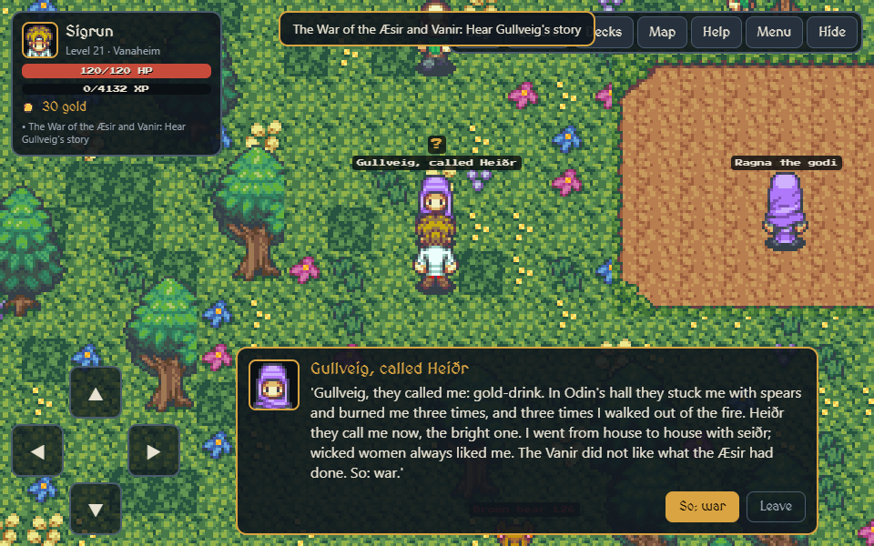

> 'Gullveig, they called me: gold-drink. In Odin's hall they stuck me with spears and burned me three times, and three times I walked out of the fire. Heiðr they call me now, the bright one. I went from house to house with seiðr; wicked women always liked me. The Vanir did not like what the Æsir had done. So: war.'

Then press "So: war".

**2. The first war in the world: fight 4 foes in Vanaheim**

Where: Vanaheim. About 8 steps south of Gullveig, called Heiðr. *The fighting goes on all over Vanaheim. Four of them, and then the gods will talk.*

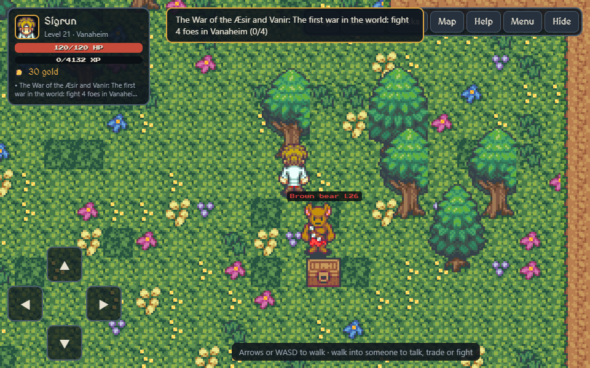

Win 4 fights against anything that roams Vanaheim.

**3. What did Odin cast over the host?**

Where: Njörðr, in Vanaheim. About 12 steps north of where you fought. *Come and tell me how the war began.*

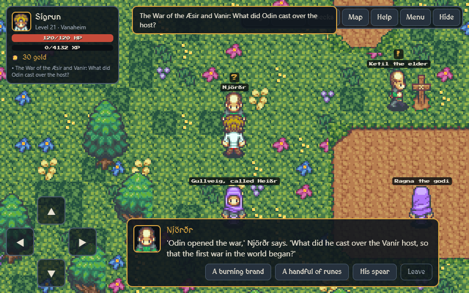

> 'Odin opened the war,' Njörðr says. 'What did he cast over the Vanir host, so that the first war in the world began?'

- A burning brand
- A handful of runes
- His spear

The answer

His spear.

> 'His spear. Gungnir, the spear that never misses; and the Vanir broke the wall of Asgard anyway, trampling the field. It ended in a truce, and hostages.'

**4. Meet Hœnir, the other hostage**

Where: Hœnir, in Vanaheim. About 20 steps east of Njörðr. *Hœnir is east of the hamlet, deciding nothing.*

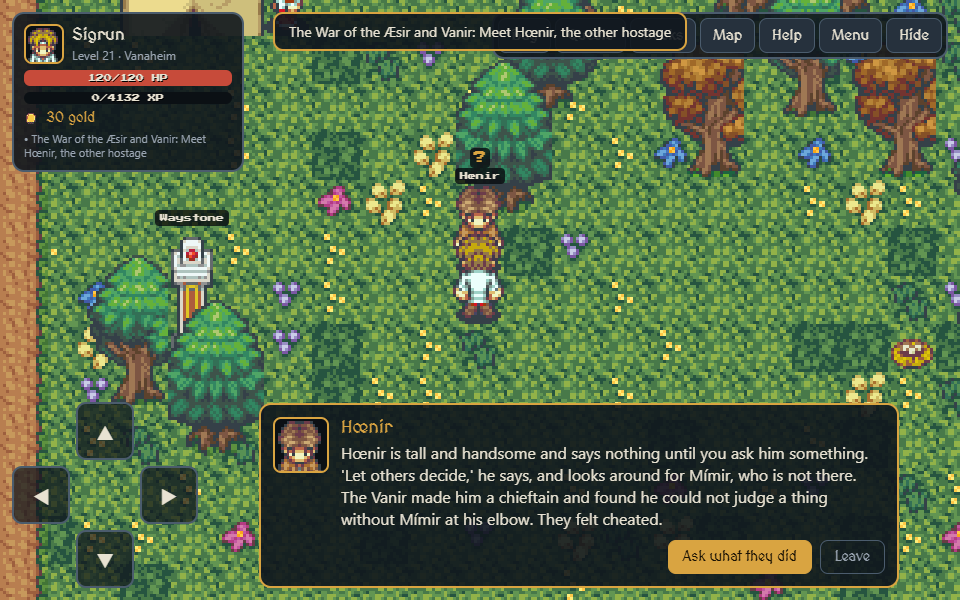

> Hœnir is tall and handsome and says nothing until you ask him something. 'Let others decide,' he says, and looks around for Mímir, who is not there. The Vanir made him a chieftain and found he could not judge a thing without Mímir at his elbow. They felt cheated.

Then press "Ask what they did".

**5. What did the Vanir do to Mímir?**

Where: Njörðr, in Vanaheim. About 20 steps west of Hœnir. *You have met Hœnir. Now ask me about Mímir.*

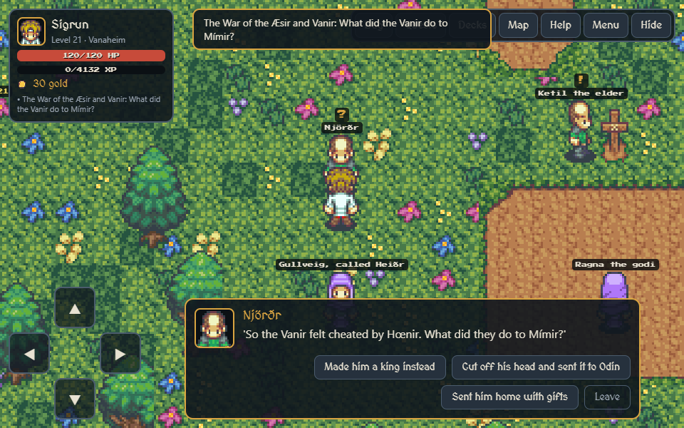

> 'So the Vanir felt cheated by Hœnir. What did they do to Mímir?'

- Made him a king instead
- Cut off his head and sent it to Odin
- Sent him home with gifts

The answer

Cut off his head and sent it to Odin.

> 'Odin smeared the head with herbs and sang over it, and it talks to him still. You have met it. That is how Mímir came to be a head in a well.'

**6. Retell the story to Njörðr**

Where: Njörðr, in Vanaheim. Stay where you are. *Tell it back.*

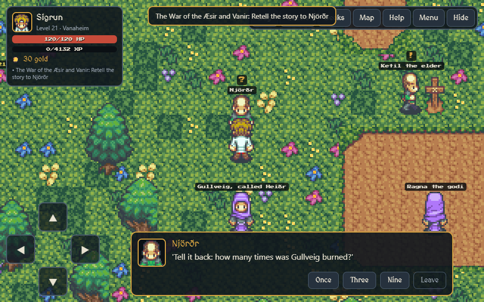

> 'Tell it back: how many times was Gullveig burned?'

- Once
- Three
- Nine

The answer

Three.

> 'Three, and three times reborn. The Æsir and the Vanir then mingled their spittle in a vat as a peace-token; from that came Kvasir, whom you have heard of. Well told.'

> The peace holds; my son Freyr and I are Æsir now, more or less. Odin's spear for a story of Odin's spear.

Reward: 416 gold, 3678 XP, the card Gungnir.

*Völuspá's stanzas here are dense and much debated. The truce-spittle explains Kvasir, and the beheading explains why Mímir is a head in a well. Source: Poetic Edda, Völuspá st. 21–24; Heimskringla, Ynglinga saga ch. 4.*

### The Otter's Ransom

*Level 22 · given by Hreiðmarr in Eldmose · after The Dwarves' Wager · 5 steps*

Three gods killed an otter that was a man's son, and now they owe his weight in gold and more. Loki goes to fetch it from a dwarf who swims as a pike, and the dwarf curses the last ring he gives up.

**Taking it up.** Find Hreiðmarr in Eldmose, about 190 steps south-east of Eikthorp.

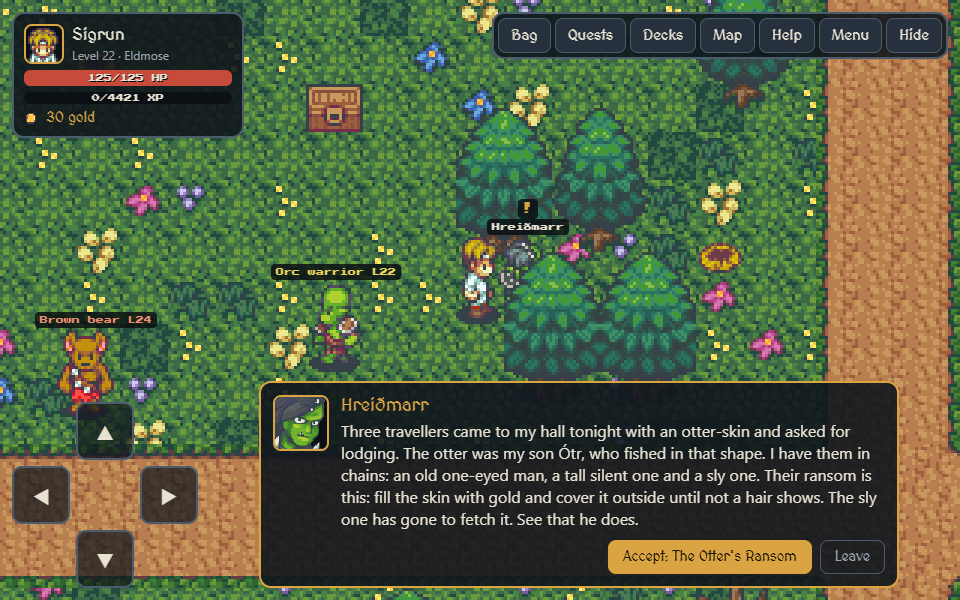

> Three travellers came to my hall tonight with an otter-skin and asked for lodging. The otter was my son Ótr, who fished in that shape. I have them in chains: an old one-eyed man, a tall silent one and a sly one. Their ransom is this: fill the skin with gold and cover it outside until not a hair shows. The sly one has gone to fetch it. See that he does.

**1. Speak with Loki about the ransom**

Where: Loki, in chains (or not), in Eldmose. About 10 steps south of Hreiðmarr. *Loki is south of the hall, not in chains any more. He has a plan involving a dwarf.*

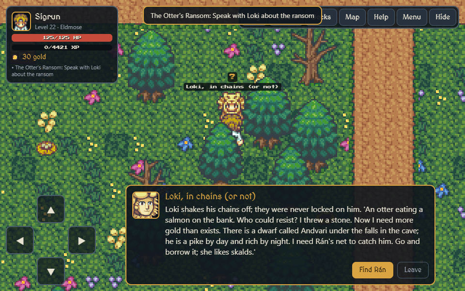

> Loki shakes his chains off; they were never locked on him. 'An otter eating a salmon on the bank. Who could resist? I threw a stone. Now I need more gold than exists. There is a dwarf called Andvari under the falls in the cave; he is a pike by day and rich by night. I need Rán's net to catch him. Go and borrow it; she likes skalds.'

Then press "Find Rán".

**2. Borrow Rán's net**

Where: Rán, of the sea, in Eldmose. About 12 steps east of Loki, in chains (or not). *Rán stands by the water east of the hall with her net. Ask nicely.*

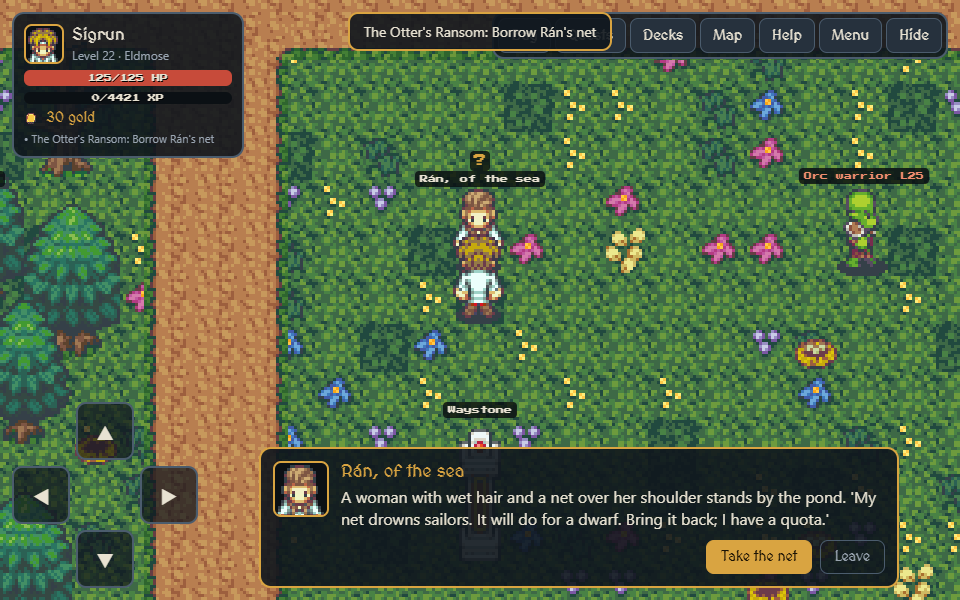

> A woman with wet hair and a net over her shoulder stands by the pond. 'My net drowns sailors. It will do for a dwarf. Bring it back; I have a quota.'

Then press "Take the net".

**3. Catch Andvari in the falls under Eldmose**

Where: Andvari the dwarf, level 28, in Andvarafors, the cave in Eldmose. Go down into the cave. Its door is about 14 steps south-east of Rán, of the sea. *The cave under Eldmose is Andvarafors. Andvari is a pike in the deepest pool; net him and he will have to be a dwarf.*

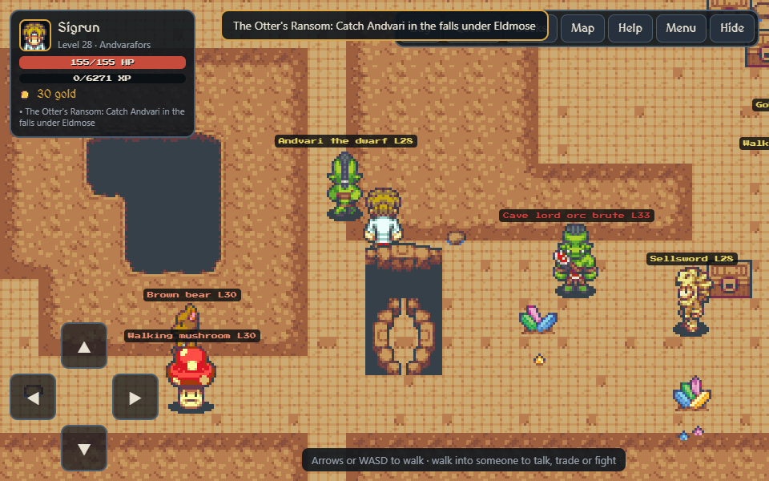

A fight of Bindrune against Andvari the dwarf, level 28. This foe is only here while this step of the story is playing. Walk into it when you are ready.

**4. Andvari's curse**

Where: Andvari, netted, in Andvarafors, the cave in Eldmose. About 7 steps east of Andvari the dwarf. *Andvari has been netted and the gold is coming out. Listen to what he says over the ring.*

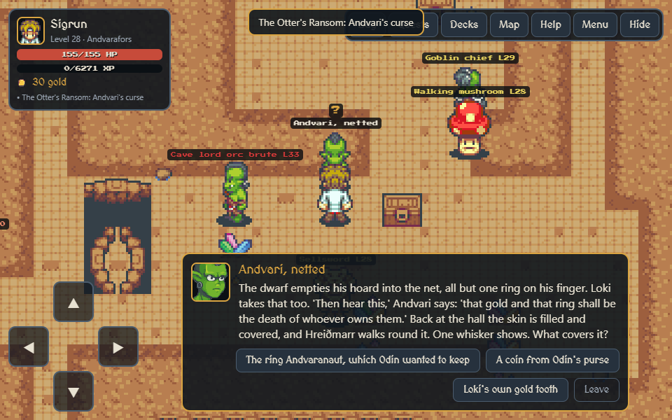

> The dwarf empties his hoard into the net, all but one ring on his finger. Loki takes that too. 'Then hear this,' Andvari says: 'that gold and that ring shall be the death of whoever owns them.' Back at the hall the skin is filled and covered, and Hreiðmarr walks round it. One whisker shows. What covers it?

- The ring Andvaranaut, which Odin wanted to keep
- A coin from Odin's purse
- Loki's own gold tooth

The answer

The ring Andvaranaut, which Odin wanted to keep.

> Odin lays the ring on the whisker. The ransom is paid, and the curse goes with it: Hreiðmarr's son Fáfnir will kill him for it and lie on the gold as a dragon, and a boy called Sigurðr will come for the dragon. That is another story.

**5. Retell the story to Hreiðmarr**

Where: Hreiðmarr, in Eldmose. About 20 steps north-west of Andvari, netted. *Tell it back. And keep your voice down; my sons are listening.*

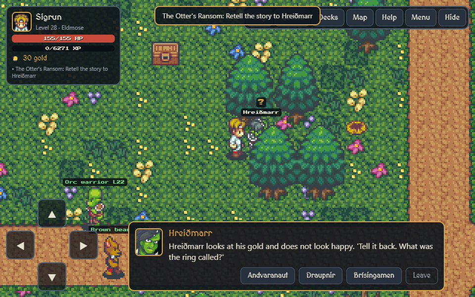

> Hreiðmarr looks at his gold and does not look happy. 'Tell it back. What was the ring called?'

- Andvaranaut
- Draupnir
- Brísingamen

The answer

Andvaranaut.

> 'Andvaranaut, Andvari's gift. Take it. I mean it; take it away from here.' He does not tell you why. You know why.

> Gold is gold. Take the ring and go, and if my sons ask, you never saw it.

Reward: 414 gold, 3725 XP, the card Fáfnir, Andvaranaut.

*Andvari's ring is the ancestor of every cursed ring in later stories, Wagner's included. Hreiðmarr giving it away is the game's invention; in the sources it kills him. Source: Prose Edda, Skáldskaparmál (G39–42); Poetic Edda, Reginsmál; Völsunga saga.*

### Freyr's Longing

*Level 38 · given by Skírnir in Alfheim · after The Stolen Apples · 5 steps*

Freyr sat in a seat that was not his and saw a giant's daughter, and has not spoken since. His servant rides through fire to woo her for him. It costs Freyr his sword, which matters a great deal later.

**Taking it up.** Find Skírnir in Alfheim, about 380 steps east of Eikthorp.

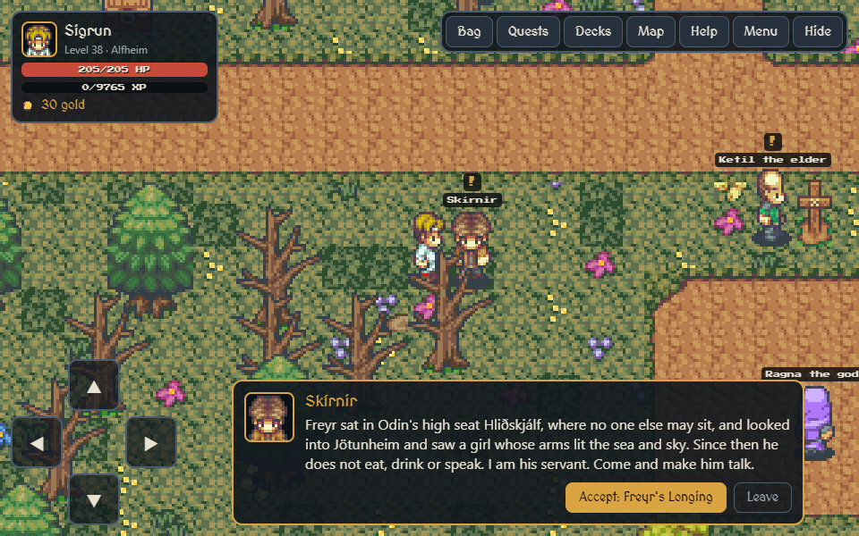

> Freyr sat in Odin's high seat Hliðskjálf, where no one else may sit, and looked into Jötunheim and saw a girl whose arms lit the sea and sky. Since then he does not eat, drink or speak. I am his servant. Come and make him talk.

**1. Make Freyr speak**

Where: Freyr, in Alfheim. About 4 steps south of Skírnir. *Freyr is west of the hall not speaking. I want you there when he does.*

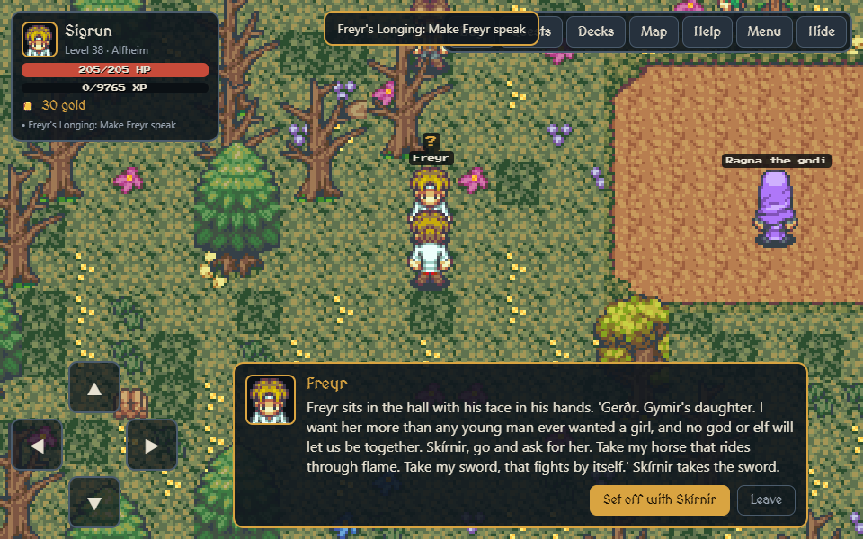

> Freyr sits in the hall with his face in his hands. 'Gerðr. Gymir's daughter. I want her more than any young man ever wanted a girl, and no god or elf will let us be together. Skírnir, go and ask for her. Take my horse that rides through flame. Take my sword, that fights by itself.' Skírnir takes the sword.

Then press "Set off with Skírnir".

**2. Ride through the flickering flame past Gymir's hounds: defeat 2 foes in Gymisgard**

Where: Gymisgard. About 30 steps south of Freyr. *Gymir's yard is in Gymisgard, east of Alfheim, behind flame and hounds. Get past two of them.*

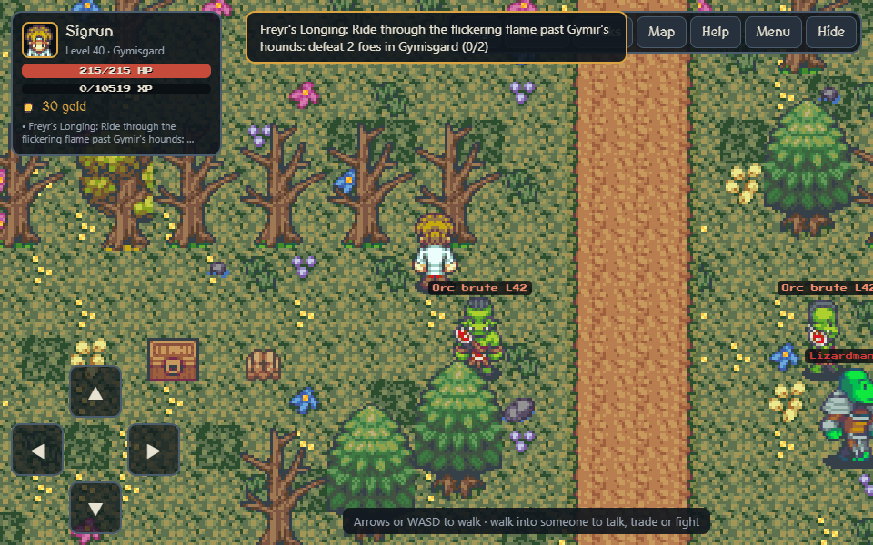

Win 2 fights against anything that roams Gymisgard.

**3. Woo Gerðr for Freyr**

Where: Gerðr, Gymir's daughter, in Gymisgard. About 40 steps south of where you fought. *Gerðr is in her father's yard in Gymisgard. Skírnir has gifts, and worse than gifts.*

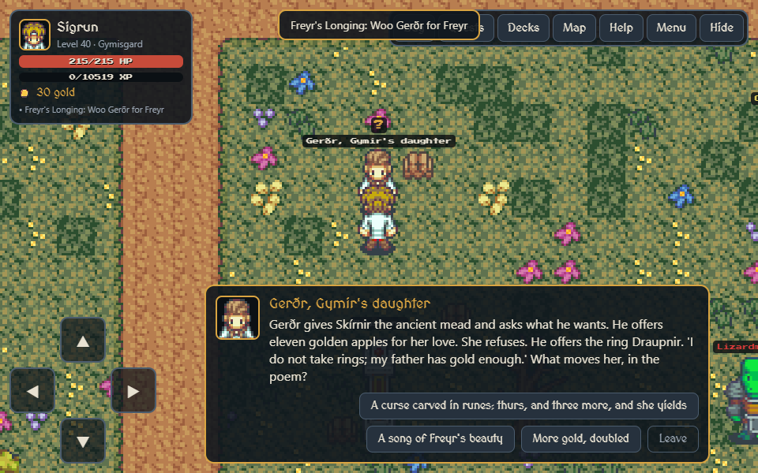

> Gerðr gives Skírnir the ancient mead and asks what he wants. He offers eleven golden apples for her love. She refuses. He offers the ring Draupnir. 'I do not take rings; my father has gold enough.' What moves her, in the poem?

- A curse carved in runes: thurs, and three more, and she yields
- A song of Freyr's beauty
- More gold, doubled

The answer

A curse carved in runes: thurs, and three more, and she yields.

> Skírnir shows her the sword, then the taming wand, and carves the rune þurs, and threatens her with loneliness and a three-headed giant for a husband. She yields, and names the grove Barri, and nine nights hence. The poem is harsh; the game leaves the worst of it in the poem.

**4. Bring Freyr the answer**

Where: Freyr, in Alfheim. About 60 steps north of Gerðr, Gymir's daughter. *Freyr is waiting in the hall. Tell him: Barri, nine nights.*

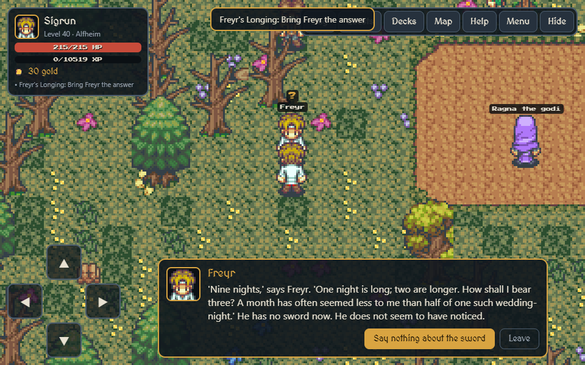

> 'Nine nights,' says Freyr. 'One night is long; two are longer. How shall I bear three? A month has often seemed less to me than half of one such wedding-night.' He has no sword now. He does not seem to have noticed.

Then press "Say nothing about the sword".

**5. Retell the story to Skírnir**

Where: Skírnir, in Alfheim. About 4 steps north of Freyr. *Tell it back.*

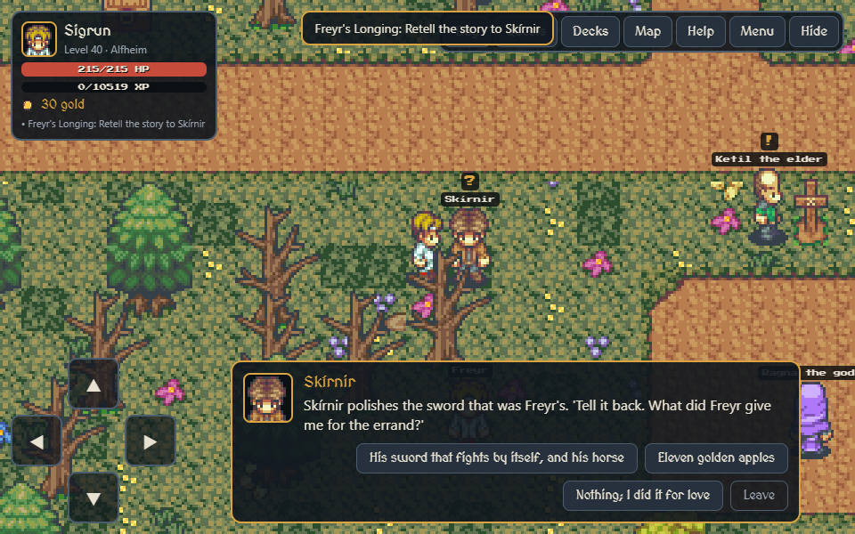

> Skírnir polishes the sword that was Freyr's. 'Tell it back. What did Freyr give me for the errand?'

- His sword that fights by itself, and his horse
- Eleven golden apples
- Nothing; I did it for love

The answer

His sword that fights by itself, and his horse.

> 'The sword. He will miss it one day, at the end of things, when Surtr comes. Remember that I have it.'

> Barri, nine nights. Freyr will live. Whether he will live through what is coming with an antler in his hand is another matter.

Reward: 636 gold, 7363 XP, the card Freyr of the Harvest.

*Because Freyr gave his sword away, he fights Surtr at Ragnarök with an antler and dies. Skírnir's threats to Gerðr are harsh in the poem; the game keeps them off-screen. Source: Poetic Edda, Skírnismál; Prose Edda, Gylfaginning ch. 37.*

### Riddles of the Wise Giant

*Level 65 · given by Vafþrúðnir, the wise giant in Helvang · after The Death of Baldr · 6 steps*

A wisdom contest with a giant, heads wagered. Six questions from the old poem; the last is the one Odin used to win, and nobody but Odin knows the answer. Nothing to walk to and nothing to fight, only a skald's memory.

**Taking it up.** Find Vafþrúðnir, the wise giant, in Helvang, about 380 steps south-east of Eikthorp.

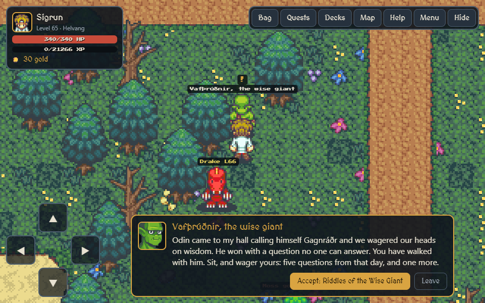

> Odin came to my hall calling himself Gagnráðr and we wagered our heads on wisdom. He won with a question no one can answer. You have walked with him. Sit, and wager yours: five questions from that day, and one more.

**1. The river between giants and gods**

Where: Vafþrúðnir, the wise giant, in Helvang. Stay where you are. *Sit. Answer.*

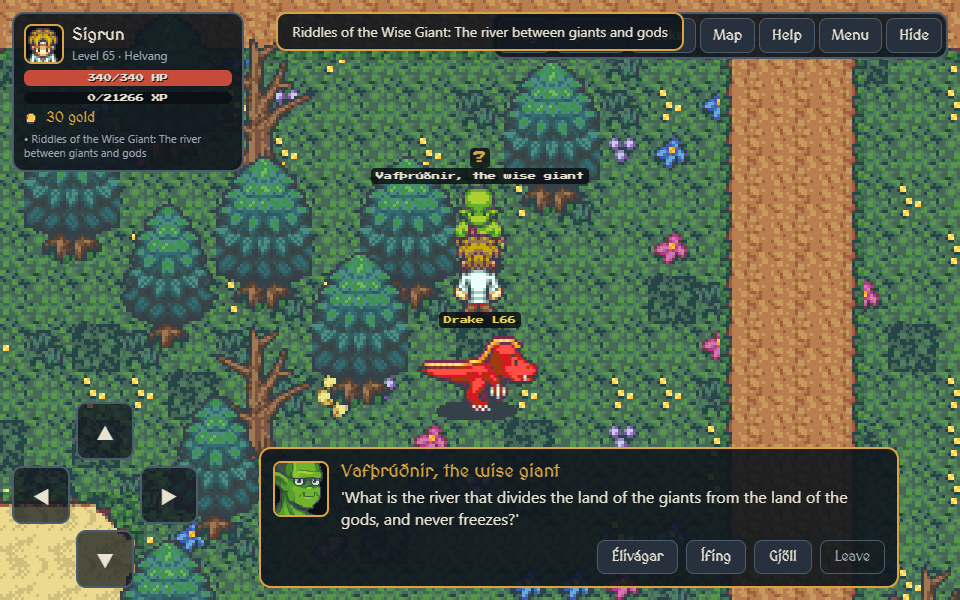

> 'What is the river that divides the land of the giants from the land of the gods, and never freezes?'

- Élivágar
- Ífing
- Gjöll

The answer

Ífing.

> 'Ífing. Open water for ever. Next.'

**2. The plain of the last battle**

Where: Vafþrúðnir, the wise giant, in Helvang. Stay where you are. *Sit. Answer.*

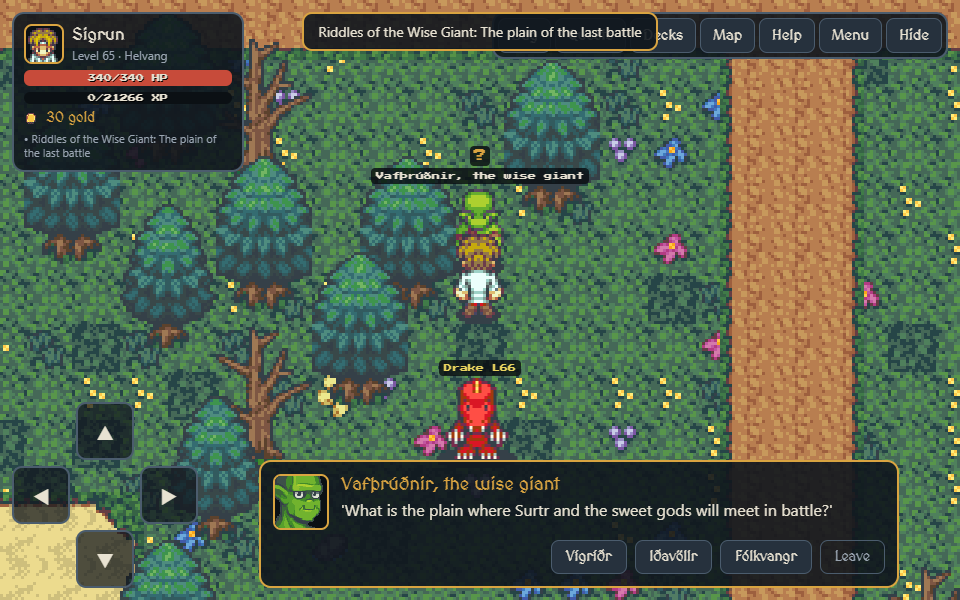

> 'What is the plain where Surtr and the sweet gods will meet in battle?'

- Vígríðr
- Iðavöllr
- Fólkvangr

The answer

Vígríðr.

> 'Vígríðr, a hundred leagues each way. Next.'

**3. Whence the earth and sky**

Where: Vafþrúðnir, the wise giant, in Helvang. Stay where you are. *Sit. Answer.*

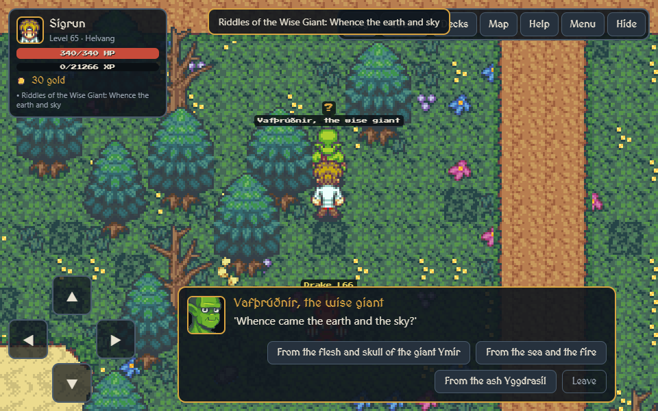

> 'Whence came the earth and the sky?'

- From the flesh and skull of the giant Ymir
- From the sea and the fire
- From the ash Yggdrasil

The answer

From the flesh and skull of the giant Ymir.

> 'From Ymir, whom Odin and his brothers killed: earth of his flesh, mountains of his bones, sky of his skull, sea of his blood. Next.'

**4. Who lives after the Fimbulwinter**

Where: Vafþrúðnir, the wise giant, in Helvang. Stay where you are. *Sit. Answer.*

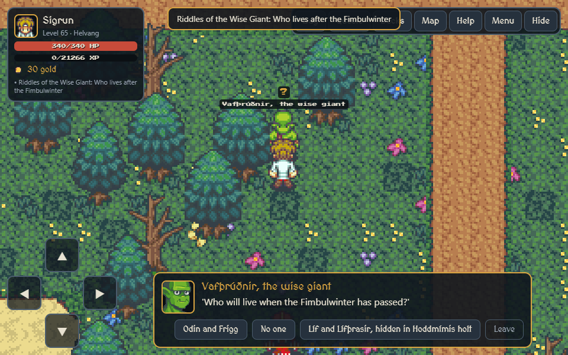

> 'Who will live when the Fimbulwinter has passed?'

- Odin and Frigg
- No one
- Líf and Lífþrasir, hidden in Hoddmímis holt

The answer

Líf and Lífþrasir, hidden in Hoddmímis holt.

> 'Líf and Lífþrasir, on the morning dew. You will meet them. Next.'

**5. Who avenges Odin**

Where: Vafþrúðnir, the wise giant, in Helvang. Stay where you are. *Sit. Answer.*

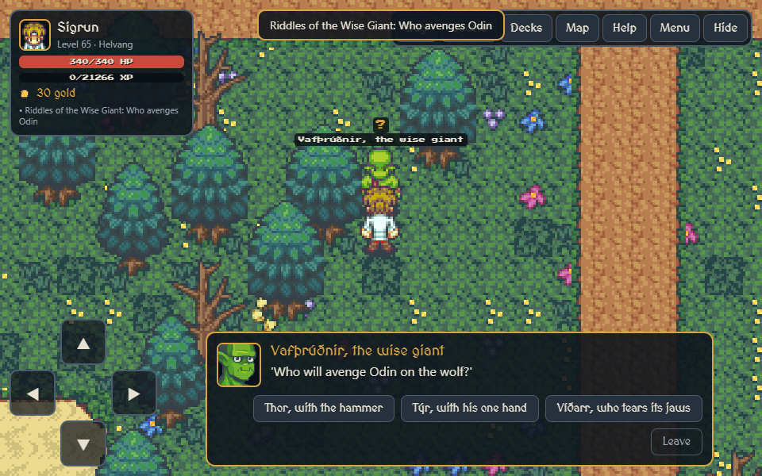

> 'Who will avenge Odin on the wolf?'

- Thor, with the hammer
- Týr, with his one hand
- Víðarr, who tears its jaws

The answer

Víðarr, who tears its jaws.

> 'Víðarr. And now the question Odin asked me, that lost me my head:'

**6. The unanswerable question**

Where: Vafþrúðnir, the wise giant, in Helvang. Stay where you are. *One more.*

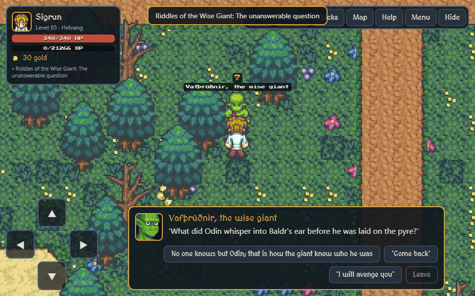

> 'What did Odin whisper into Baldr's ear before he was laid on the pyre?'

- No one knows but Odin; that is how the giant knew who he was
- 'Come back'
- 'I will avenge you'

The answer

No one knows but Odin; that is how the giant knew who he was.

> 'No one knows. Only Odin. When he asked me, I knew him, and I knew I had lost. You have answered better than I did; keep your head, skald.'

> You keep your head, and take Odin's ravens with it: thought and memory, which is all a skald is.

Reward: 1136 gold, 17709 XP, the card Huginn, the card Muninn.

*Odin wins wisdom contests with the one unanswerable question; it is asked again in Heiðreks saga. The giant sparing the loser is the game's invention. Source: Poetic Edda, Vafþrúðnismál.*

## Village work

The everyday jobs of the hand-built lands: wolves, slimes, a letter, a boar, a hoard. Short, close to home, and good for the first levels.

### Wolves at the gate

*Level 1 · given by Elder Halvard in Eikthorp · 1 step*

**Taking it up.** Find Elder Halvard in Eikthorp.

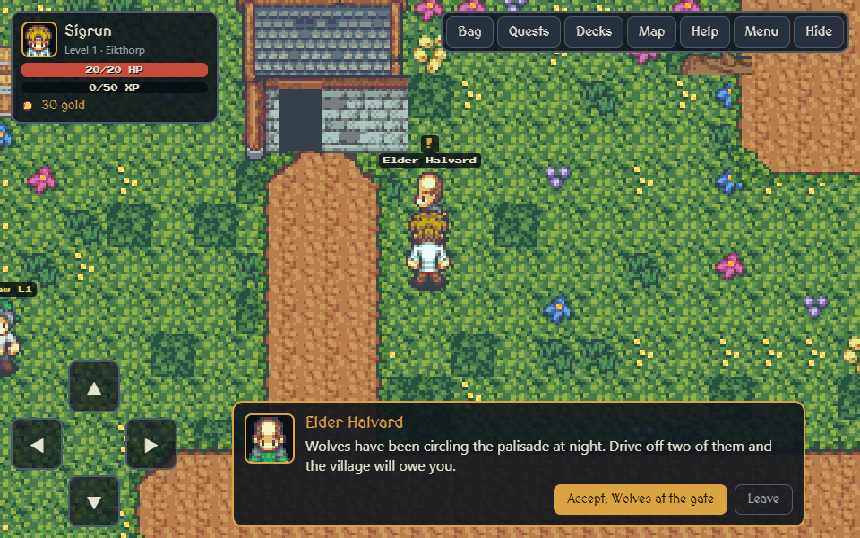

> Wolves have been circling the palisade at night. Drive off two of them and the village will owe you.

**1. Defeat Grey wolf**

Where: Eikthorp. About 40 steps north-east of Elder Halvard. *The wolves are still out there. Look for them on the edge of the village.*

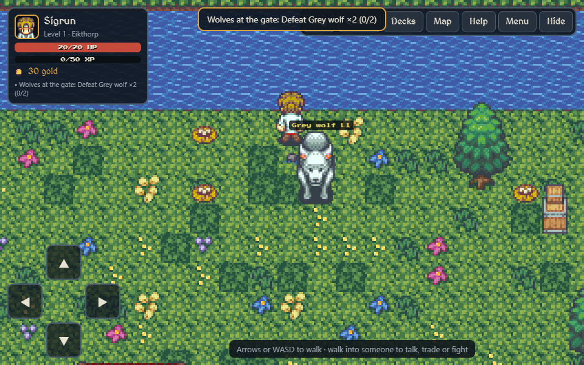

Win 2 fights against grey wolfs.

Grey wolfs roam here; walk into one to fight it.

**Return to Elder Halvard**

About 40 steps south-west of where you fought.

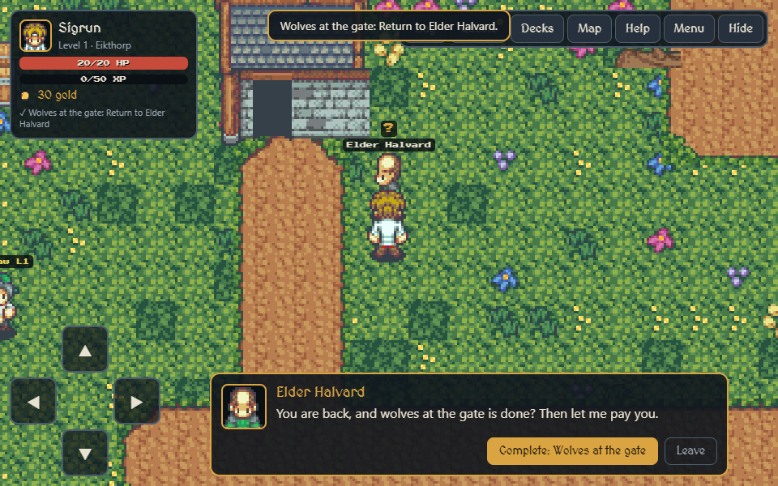

> The children can sleep again. Take this, with the village's thanks.

Reward: 40 gold, 30 XP.

### Scout the meadows

*Level 1 · given by Elder Halvard in Eikthorp · after Wolves at the gate · 1 step*

**Taking it up.** Find Elder Halvard in Eikthorp.

> Follow the east road past the gate guard into Ashgrove Meadows and tell me what you find.

**1. Walk into Ashgrove Meadows.**

Where: Ashgrove Meadows. About 80 steps east of Elder Halvard. *East, past the gate. The meadows begin where the trees thin out.*

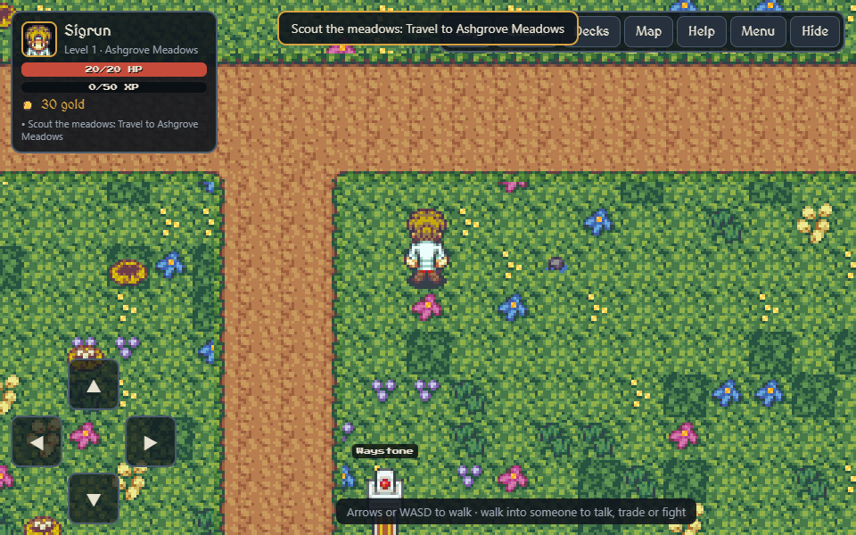

Walk into Ashgrove Meadows.

**Return to Elder Halvard**

About 80 steps west of Ashgrove Meadows.

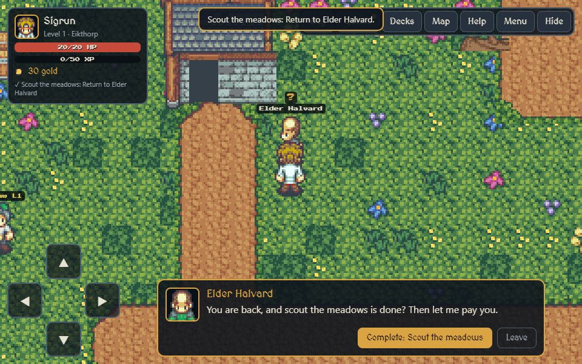

> Slimes, you say? Bjorn will want to hear that. Here, a card from my own youth.

Reward: 25 gold, 40 XP, the card Karl.

### A letter for Ulflund

*Level 3 · given by Astrid the trader in Eikthorp · 1 step*

**Taking it up.** Find Astrid the trader in Eikthorp.

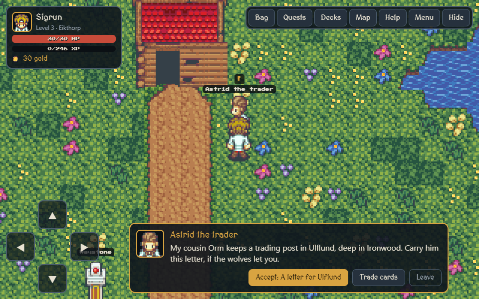

> My cousin Orm keeps a trading post in Ulflund, deep in Ironwood. Carry him this letter, if the wolves let you.

**1. Deliver Astrid's letter to Orm in Ulflund**

Where: Orm the merchant, in Ironwood. About 110 steps east of Astrid the trader. *Orm's post is in Ulflund, north of the Ironwood road.*

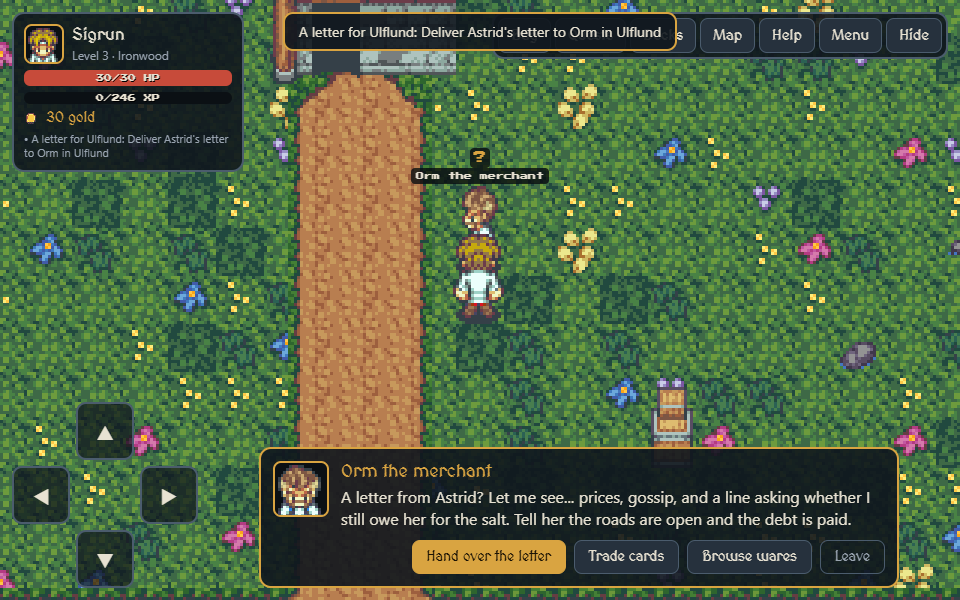

> A letter from Astrid? Let me see... prices, gossip, and a line asking whether I still owe her for the salt. Tell her the roads are open and the debt is paid.

Then press "Hand over the letter".

**Return to Astrid the trader**

About 110 steps west of Orm the merchant.

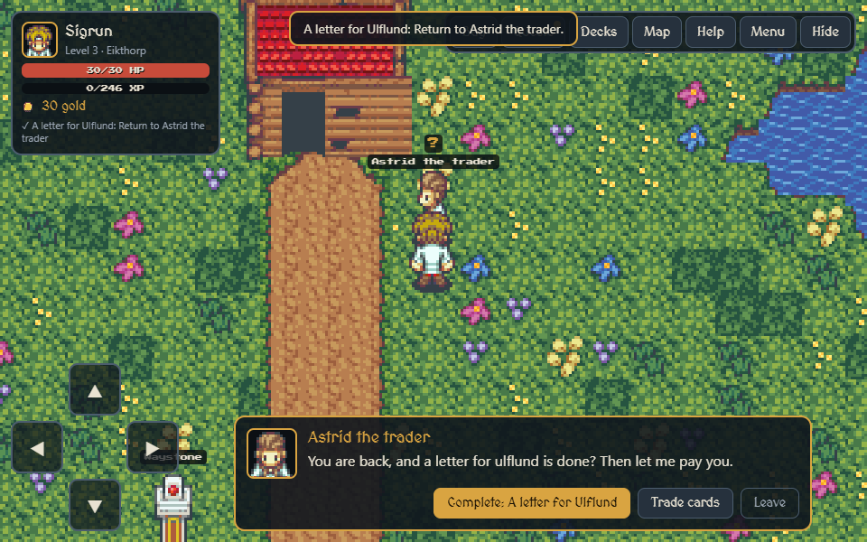

> Orm sent word back already? Then here is your fee, and my thanks.

Reward: 60 gold, 80 XP.

### Slime harvest

*Level 1 · given by Bjorn the farmer in Ashgrove Meadows · 1 step*

**Taking it up.** Find Bjorn the farmer in Ashgrove Meadows, about 60 steps east of Eikthorp.

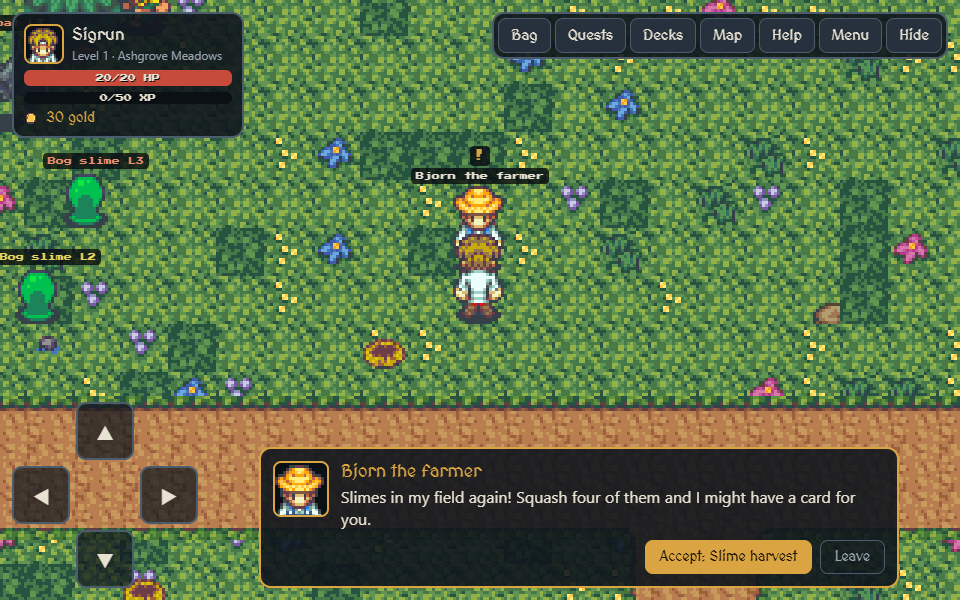

> Slimes in my field again! Squash four of them and I might have a card for you.

**1. Defeat Bog slime**

Where: Ashgrove Meadows. About 8 steps west of Bjorn the farmer. *Four slimes. They ooze about the meadows, you cannot miss them.*

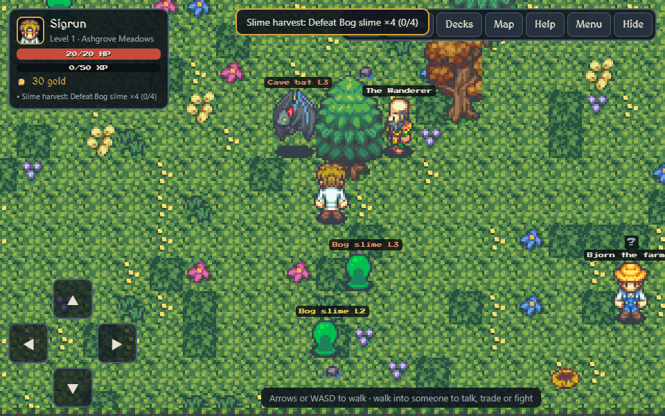

Win 4 fights against bog slimes.

Bog slimes roam here; walk into one to fight it.

**Return to Bjorn the farmer**

About 8 steps east of where you fought.

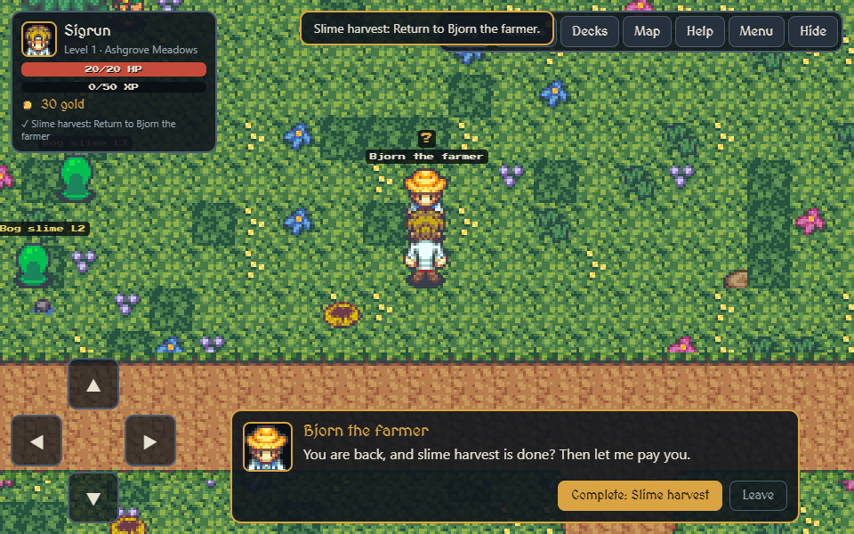

> Ha! The field is clear. A shieldmaiden for a slime-squasher, fair trade.

Reward: 45 gold, 60 XP, the card Shieldmaiden of the Wall.

### Bats in the barn

*Level 2 · given by Bjorn the farmer in Ashgrove Meadows · after Slime harvest · 1 step*

**Taking it up.** Find Bjorn the farmer in Ashgrove Meadows, about 60 steps east of Eikthorp.

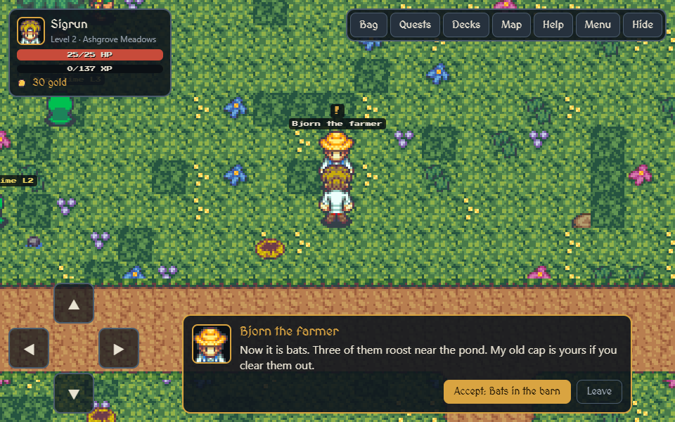

> Now it is bats. Three of them roost near the pond. My old cap is yours if you clear them out.

**1. Defeat Cave bat**

Where: Ashgrove Meadows. About 7 steps west of Bjorn the farmer. *Three bats, near the pond. Bring a torch, or just an axe.*

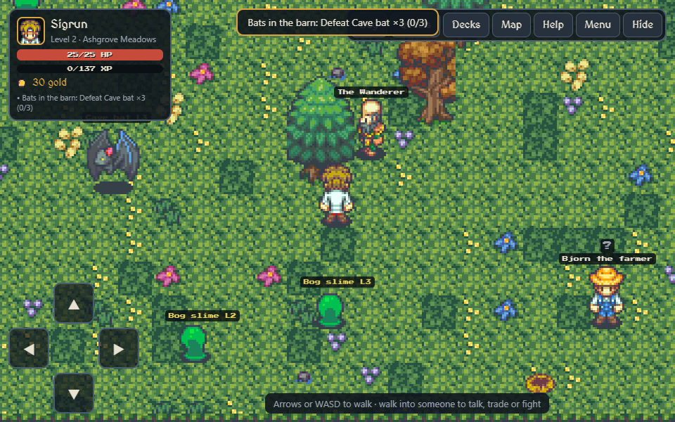

Win 3 fights against cave bats.

Cave bats roam here; walk into one to fight it.

**Return to Bjorn the farmer**

About 7 steps east of where you fought.

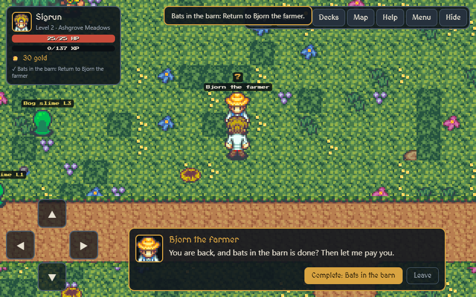

> Quiet nights at last. The cap is yours, it kept my head warm for twenty winters.

Reward: 60 gold, 80 XP, Leather cap.

### Boar hunt

*Level 3 · given by Leif the hunter in Ironwood · 1 step*

**Taking it up.** Find Leif the hunter in Ironwood, about 110 steps east of Eikthorp.

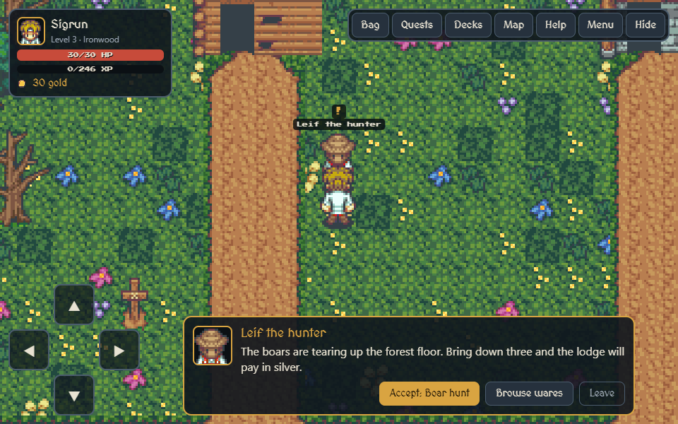

> The boars are tearing up the forest floor. Bring down three and the lodge will pay in silver.

**1. Defeat Wild boar**

Where: Ironwood. About 14 steps north-east of Leif the hunter. *Three boars. They root among the pines south of the road.*

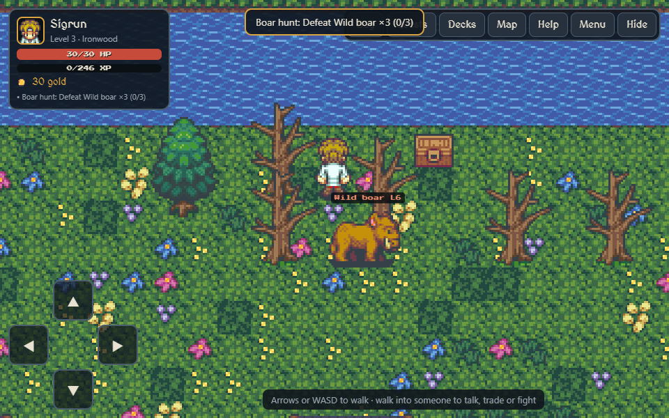

Win 3 fights against wild boars.

Wild boars roam here; walk into one to fight it.

**Return to Leif the hunter**

About 14 steps south-west of where you fought.

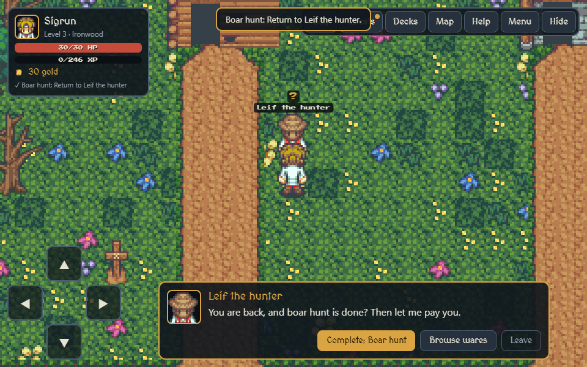

> Clean kills. You hunt well for a villager. Here is the silver.

Reward: 90 gold, 150 XP.

### The old elk

*Level 4 · given by Leif the hunter in Ironwood · after Boar hunt · 1 step*

**Taking it up.** Find Leif the hunter in Ironwood, about 110 steps east of Eikthorp.

> Two great elk have led the herd away from my snares. Take them and my hunting spear is yours.

**1. Defeat Elk**

Where: Ironwood. About 20 steps south of Leif the hunter. *The elk graze in the clearings. Watch their antlers.*

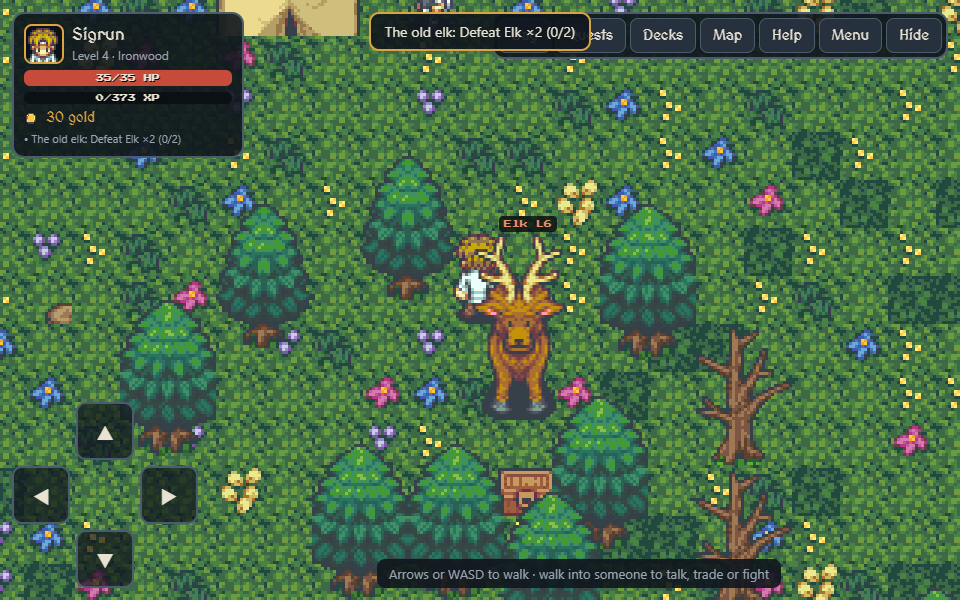

Win 2 fights against elks.

Elks roam here; walk into one to fight it.

**Return to Leif the hunter**

About 20 steps north of where you fought.

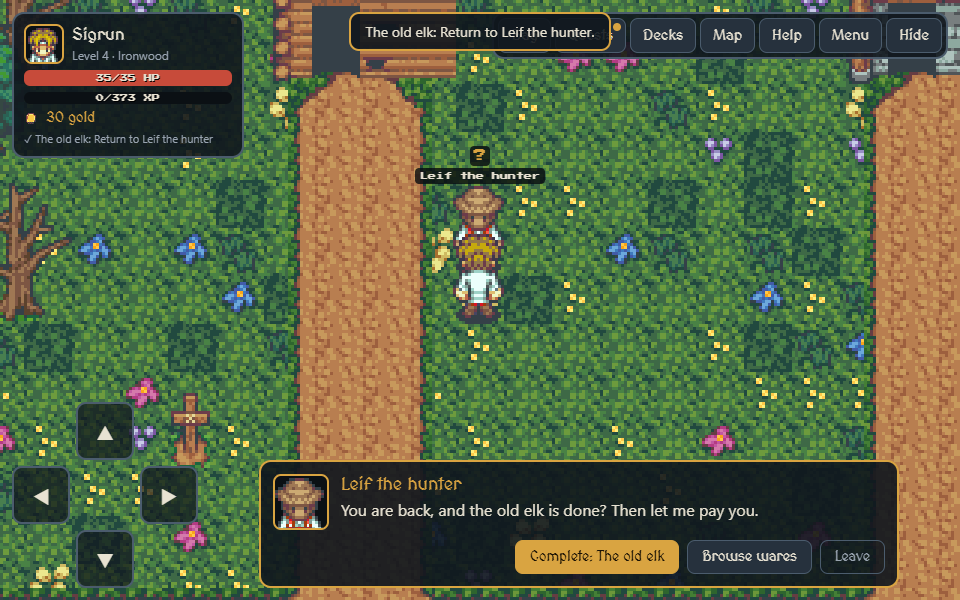

> The herd will come back now. The spear has served me well; let it serve you.

Reward: 120 gold, 200 XP, Hunting spear.

### The restless dead

*Level 5 · given by Ragnhild the gravekeeper in Barrow Hills · 1 step*

**Taking it up.** Find Ragnhild the gravekeeper in Barrow Hills, about 60 steps south of Eikthorp.

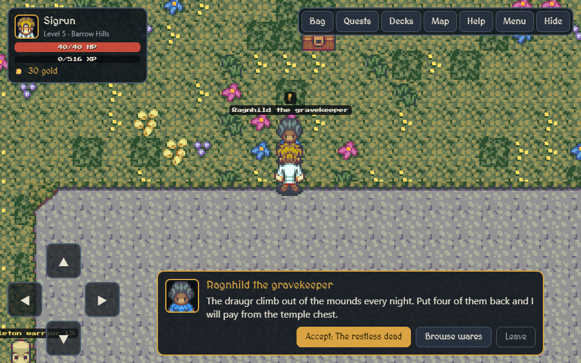

> The draugr climb out of the mounds every night. Put four of them back and I will pay from the temple chest.

**1. Defeat Barrow draugr**

Where: Barrow Hills. About 15 steps north-west of Ragnhild the gravekeeper. *Four draugr. They wander the ruins and the hillside.*

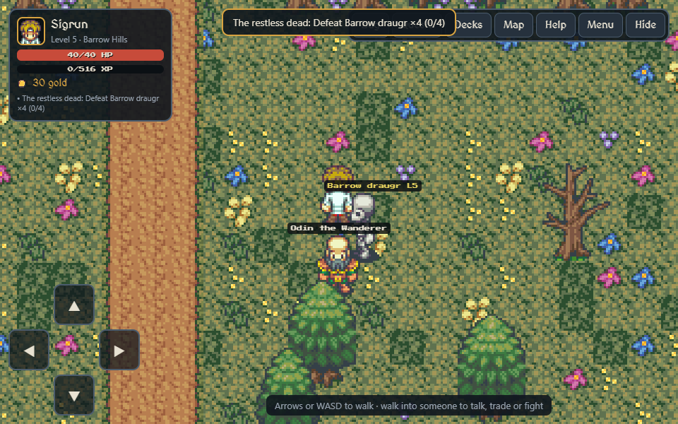

Win 4 fights against barrow draugrs.

Barrow draugrs roam here; walk into one to fight it.

**Return to Ragnhild the gravekeeper**

About 15 steps south-east of where you fought.

> Four fewer dead walking. The temple thanks you, and so do I.

Reward: 150 gold, 300 XP.

### The wight's hoard

*Level 6 · given by Ragnhild the gravekeeper in Barrow Hills · after The restless dead · 1 step*

**Taking it up.** Find Ragnhild the gravekeeper in Barrow Hills, about 60 steps south of Eikthorp.

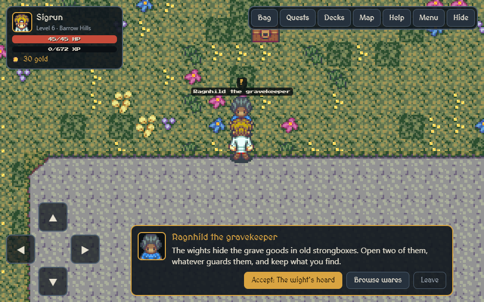

> The wights hide the grave goods in old strongboxes. Open two of them, whatever guards them, and keep what you find.

**1. Open 2 strongboxes in Barrow Hills.**

Where: Barrow Hills. About 4 steps north of Ragnhild the gravekeeper. *Two strongboxes in the barrows. Something always guards them.*

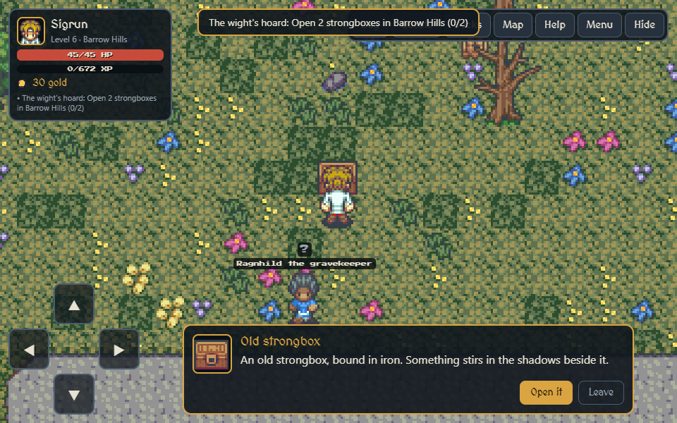

Open 2 strongboxes in Barrow Hills.

**Return to Ragnhild the gravekeeper**

About 4 steps south of the strongbox.

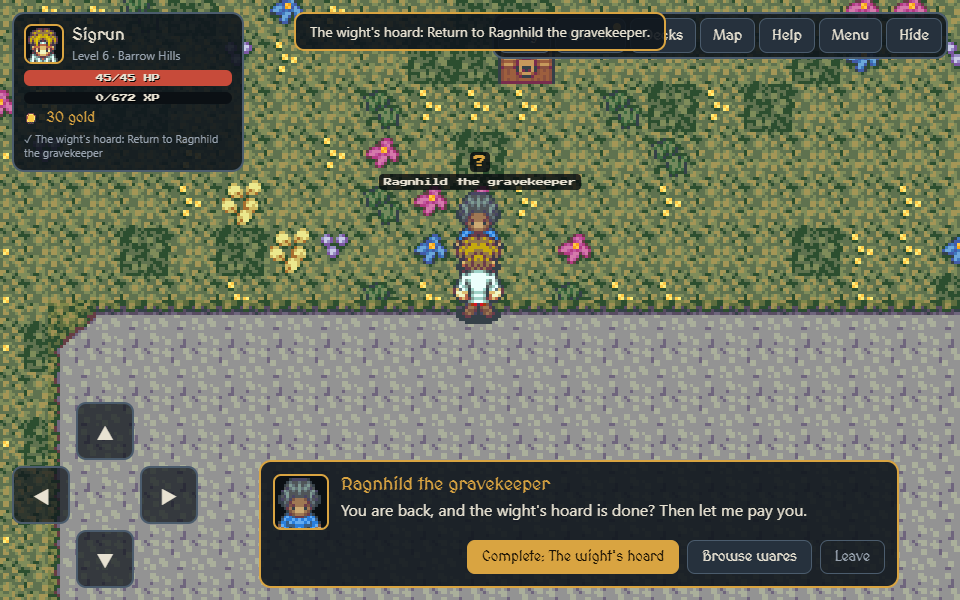

> You opened them and lived. Odin's raven for the brave.

Reward: 200 gold, 350 XP, the card Huginn.

### Troll toll

*Level 8 · given by Kettil the hermit in Jotun Fens · 1 step*

**Taking it up.** Find Kettil the hermit in Jotun Fens, about 70 steps south-east of Eikthorp.

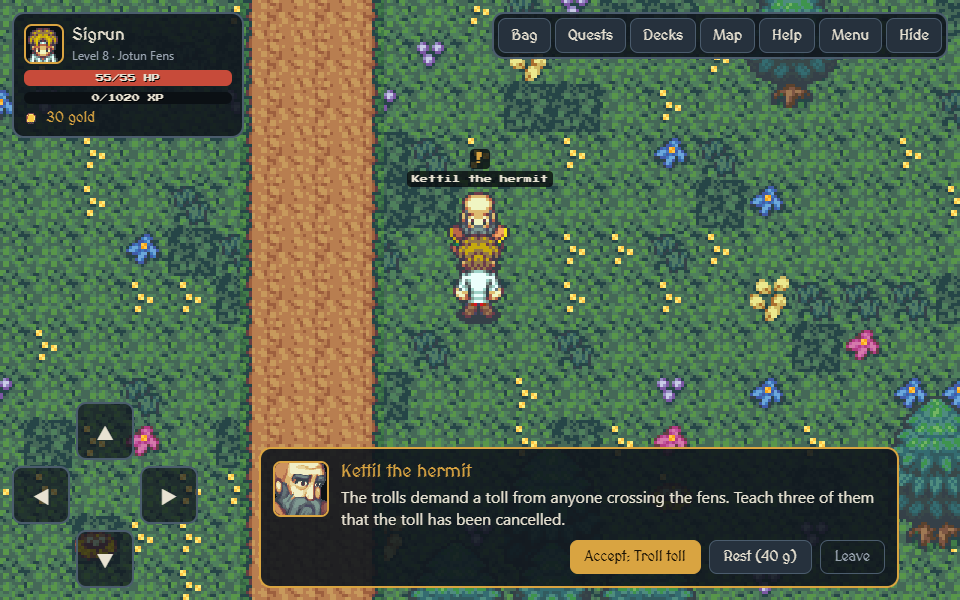

> The trolls demand a toll from anyone crossing the fens. Teach three of them that the toll has been cancelled.

**1. Defeat Fen troll**

Where: Jotun Fens. About 15 steps west of Kettil the hermit. *Three trolls. They squat by the water and the sand.*

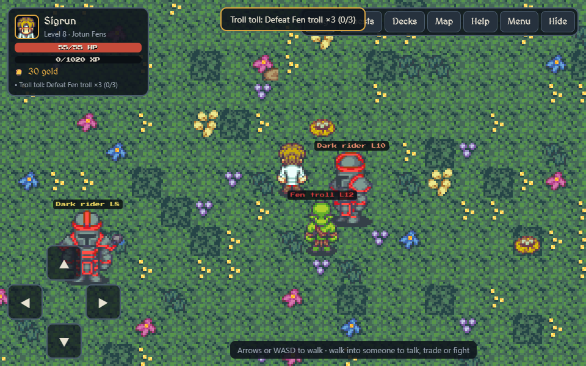

Win 3 fights against fen trolls.

Fen trolls roam here; walk into one to fight it.

**Return to Kettil the hermit**

About 15 steps east of where you fought.

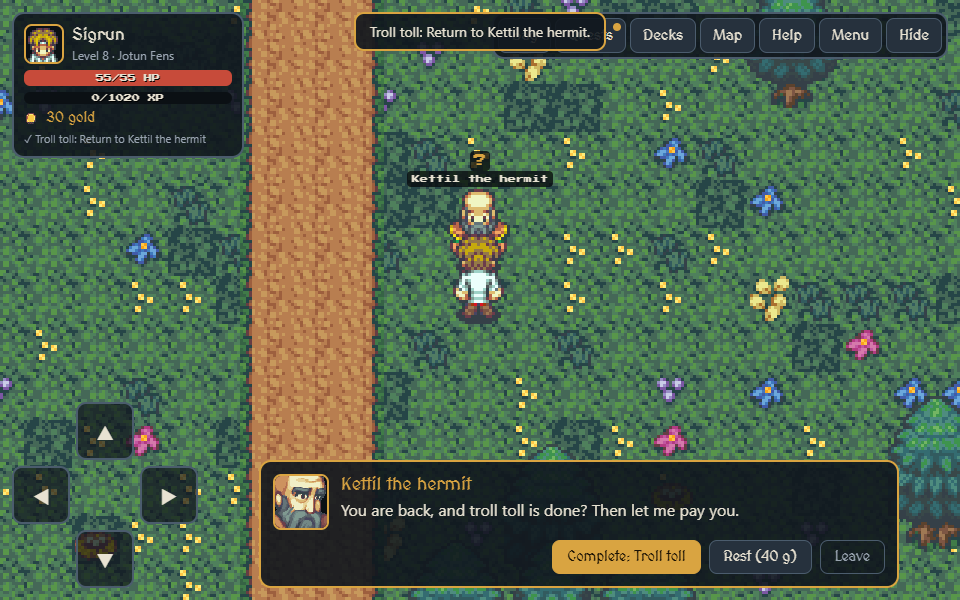

> The fens are a little safer. Here, gold the trolls will never see.

Reward: 300 gold, 600 XP.

### The dark riders

*Level 10 · given by Kettil the hermit in Jotun Fens · after Troll toll · 1 step*

**Taking it up.** Find Kettil the hermit in Jotun Fens, about 70 steps south-east of Eikthorp.

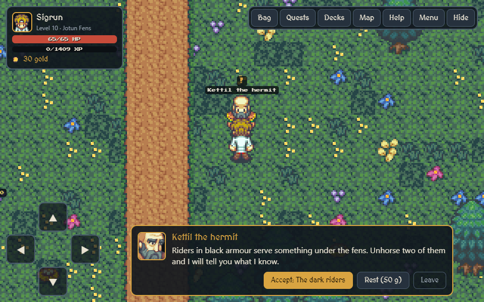

> Riders in black armour serve something under the fens. Unhorse two of them and I will tell you what I know.

**1. Defeat Dark rider**

Where: Jotun Fens. About 14 steps west of Kettil the hermit. *Two riders. They patrol the deep fens, near the sand flats.*

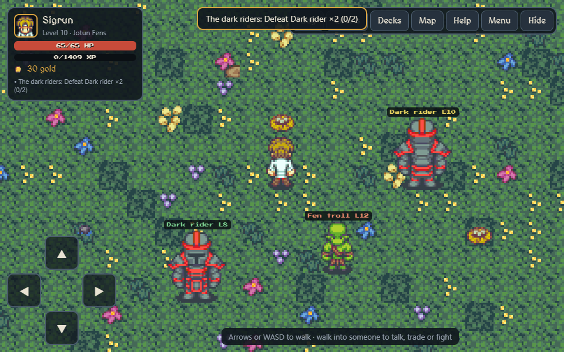

Win 2 fights against dark riders.

Dark riders roam here; walk into one to fight it.

**Return to Kettil the hermit**

About 14 steps east of where you fought.

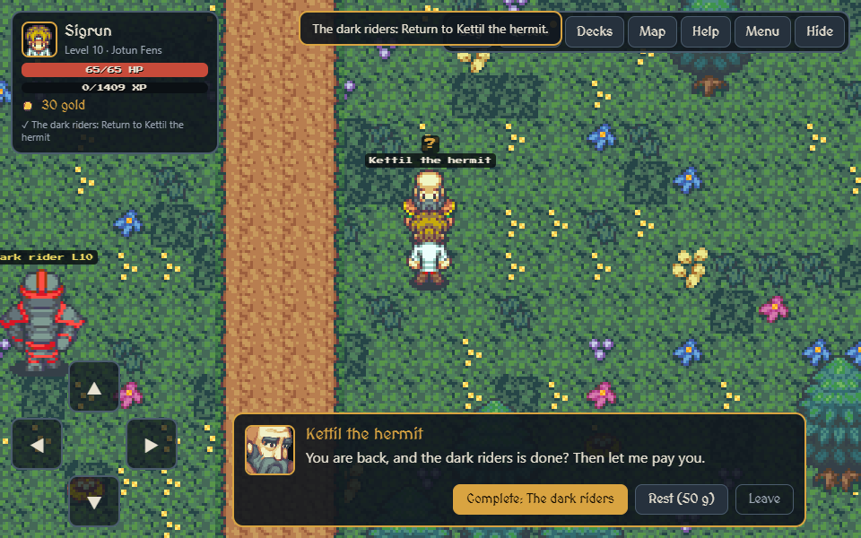

> You have earned the truth, and a valkyrie's favour. Come back when you are stronger for the rest.

Reward: 500 gold, 1000 XP, the card Valkyrie Chooser.

## The hamlets

Every generated land with a hamlet has an elder with two jobs: cull the land's commonest beast, then open its old strongbox, which pays a card as well. They are the same everywhere, so here they are as one table. The bearing is from Eikthorp.

| Land | Levels | Elder | Where | Cull | Strongbox card |
| --- | --- | --- | --- | --- | --- |
| Nidavellir | 12 to 17 | Vigdis the elder | about 190 steps east | 4 × Bandit | Huscarl |
| Jarnskog | 21 to 26 | Einar the elder | about 260 steps east | 4 × Orc warrior | Huscarl |
| Solhaug | 29 to 34 | Frida the elder | about 330 steps east | 4 × Orc warrior | Huscarl |
| Alfheim | 38 to 43 | Ketil the elder | about 380 steps east | 4 × Orc brute | Huginn |
| Elivagar | 46 to 51 | Ragna the elder | about 450 steps east | 4 × Minotaur | Huginn |
| Grjotunagard | 55 to 60 | Yngve the elder | about 520 steps east | 4 × Black knight | Valkyrie Chooser |
| Svartfjall | 63 to 68 | Arne the elder | about 570 steps east | 4 × Black knight | Valkyrie Chooser |
| Thrymheim | 14 to 19 | Asta the elder | about 200 steps east | 4 × Bandit | Huscarl |
| Frostnes | 23 to 28 | Birger the elder | about 250 steps east | 4 × Orc warrior | Huscarl |
| Gullskog | 31 to 36 | Hilde the elder | about 330 steps east | 4 × Orc brute | Huginn |
| Gymisgard | 40 to 45 | Magnus the elder | about 390 steps east | 4 × Orc brute | Huginn |
| Jarnholt | 48 to 53 | Tova the elder | about 450 steps east | 4 × Minotaur | Huginn |
| Helheim | 57 to 62 | Brynjar the elder | about 520 steps east | 4 × Black knight | Valkyrie Chooser |
| Alfberg | 65 to 70 | Dagny the elder | about 580 steps east | 4 × Black knight | Valkyrie Chooser |
| Helvik | 13 to 18 | Ingvar the elder | about 130 steps south | 4 × Bandit | Huscarl |
| Ormstrand | 13 to 18 | Nanna the elder | about 130 steps south-east | 4 × Bandit | Huscarl |
| Askmark | 13 to 18 | Ulla the elder | about 140 steps south-east | 4 × Bandit | Huscarl |
| Eldmose | 22 to 27 | Dis the elder | about 200 steps south-east | 4 × Orc warrior | Huscarl |
| Nottvang | 30 to 35 | Eirik the elder | about 260 steps south-east | 4 × Orc brute | Huginn |
| Thursnes | 39 to 44 | Jorunn the elder | about 320 steps south-east | 4 × Orc brute | Huginn |
| Hlesey | 47 to 52 | Orvar the elder | about 390 steps east | 4 × Minotaur | Huginn |
| Frosthaug | 56 to 61 | Vigdis the elder | about 450 steps east | 4 × Black knight | Valkyrie Chooser |
| Breidablik | 64 to 69 | Einar the elder | about 510 steps east | 4 × Black knight | Valkyrie Chooser |
| Grimfell | 73 to 78 | Frida the elder | about 580 steps east | 4 × Lich | Mountain-Kin |
| Vanaheim | 21 to 26 | Ketil the elder | about 200 steps south | 4 × Orc warrior | Huscarl |
| Draugvik | 21 to 26 | Ragna the elder | about 200 steps south | 4 × Orc warrior | Huscarl |
| Isastrand | 21 to 26 | Yngve the elder | about 200 steps south-east | 4 × Orc warrior | Huscarl |
| Helmark | 29 to 34 | Arne the elder | about 200 steps south-east | 4 × Orc warrior | Huscarl |
| Ormmose | 38 to 43 | Gunnar the elder | about 260 steps south-east | 4 × Orc brute | Huginn |
| Askvang | 46 to 51 | Liv the elder | about 330 steps south-east | 4 × Minotaur | Huginn |
| Eldnes | 55 to 60 | Sten the elder | about 380 steps south-east | 4 × Black knight | Valkyrie Chooser |
| Nottskog | 63 to 68 | Asta the elder | about 450 steps south-east | 4 × Black knight | Valkyrie Chooser |
| Thurshaug | 72 to 77 | Birger the elder | about 520 steps east | 4 × Lich | Mountain-Kin |
| Himinbjorg | 80 to 85 | Hilde the elder | about 570 steps east | 4 × Lich | Mountain-Kin |
| Bjorney | 31 to 36 | Magnus the elder | about 260 steps south | 4 × Orc brute | Huginn |
| Runelund | 31 to 36 | Tova the elder | about 270 steps south | 4 × Orc brute | Huginn |
| Lyngvi | 31 to 36 | Brynjar the elder | about 260 steps south-east | 4 × Orc brute | Huginn |
| Vindstrand | 40 to 45 | Dagny the elder | about 260 steps south-east | 4 × Orc brute | Huginn |
| Draugmark | 48 to 53 | Ingvar the elder | about 270 steps south-east | 4 × Minotaur | Huginn |
| Isamose | 57 to 62 | Nanna the elder | about 330 steps south-east | 4 × Black knight | Valkyrie Chooser |
| Helvang | 65 to 70 | Ulla the elder | about 390 steps south-east | 4 × Black knight | Valkyrie Chooser |
| Ormnes | 74 to 79 | Dis the elder | about 450 steps south-east | 4 × Lich | Mountain-Kin |
| Askskog | 82 to 87 | Eirik the elder | about 520 steps south-east | 4 × Phoenix | Mountain-Kin |
| Eldhaug | 91 to 96 | Jorunn the elder | about 580 steps south-east | 4 × Phoenix | Fenrir |
| Svarthals | 39 to 44 | Orvar the elder | about 320 steps south | 4 × Orc brute | Huginn |
| Hargey | 39 to 44 | Vigdis the elder | about 320 steps south | 4 × Orc brute | Huginn |
| Myrlund | 39 to 44 | Einar the elder | about 330 steps south | 4 × Orc brute | Huginn |
| Bjornvik | 47 to 52 | Frida the elder | about 320 steps south-east | 4 × Minotaur | Huginn |
| Runestrand | 56 to 61 | Ketil the elder | about 320 steps south-east | 4 × Black knight | Valkyrie Chooser |
| Skarnmark | 64 to 69 | Ragna the elder | about 330 steps south-east | 4 × Black knight | Valkyrie Chooser |
| Vindmose | 73 to 78 | Yngve the elder | about 390 steps south-east | 4 × Lich | Mountain-Kin |
| Draugvang | 81 to 86 | Arne the elder | about 450 steps south-east | 4 × Phoenix | Mountain-Kin |
| Hoddmimis Holt | 90 to 95 | Gunnar the elder | about 510 steps south-east | 4 × Phoenix | Fenrir |
| Vigrid | 97 to 99 | Liv the elder | about 580 steps south-east | 4 × Phoenix | Fenrir |
